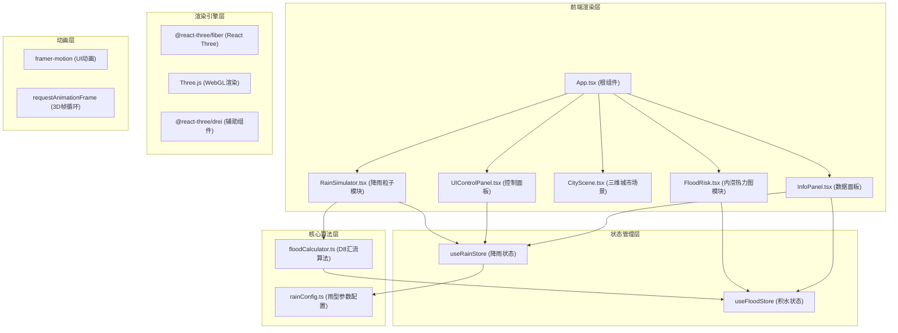

## 1. 架构设计



## 2. 技术说明

- 前端框架：React@18 + TypeScript@5 + Vite@5
- 3D渲染：Three.js + @react-three/fiber + @react-three/drei
- 状态管理：Zustand（轻量store，分离降雨和积水两个store）
- 动画：framer-motion（UI过渡动画）、requestAnimationFrame（粒子与热力图帧驱动）
- 工具库：lodash（throttle节流UI更新）
- 初始化方式：Vite react-ts 模板

## 3. 路由定义

| 路由 | 用途 |
|-------|---------|
| / | 主场景页面，包含完整三维模拟与UI控件 |

## 4. 数据模型

### 4.1 降雨状态模型

```typescript
type RainType = 'frontal' | 'convective' | 'typhoon';

interface RainParticleConfig {
  count: number;
  speed: number;
  angle: number;
  color: string;
  size: number;
}

interface RainState {
  currentType: RainType;
  intensity: number;
  config: RainParticleConfig;
  setRainType: (type: RainType) => void;
  setIntensity: (v: number) => void;
}
```

### 4.2 积水状态模型

```typescript
interface GridCell {
  x: number;
  y: number;
  elevation: number;
  waterDepth: number;
  riskLevel: number;
}

interface FloodEvent {
  timestamp: number;
  level: 'warning' | 'danger';
  cellCount: number;
}

interface FloodState {
  grid: GridCell[][];
  avgDepth: number;
  highRiskCount: number;
  rainfall: number;
  events: FloodEvent[];
  updateGrid: (intensity: number, delta: number) => void;
  addEvent: (e: FloodEvent) => void;
}
```

### 4.3 雨型配置参数

| 雨型 | 粒子数 | 速度 | 角度 | 颜色 | 大小 | 背景色 |
|------|--------|------|------|------|------|--------|
| 锋面雨 | 800 | 60 | 0° | #A0B8FF | 0.15 | #D3D3D3 |
| 对流雨 | 3000 | 120 | 5° | #FF9966 | 0.20 | #A09B6F |
| 台风雨 | 6000 | 200 | 25° | #66E0E0 | 0.12 | #2F4F4F |

## 5. 文件结构与调用关系

```
src/
├── main.tsx                     # 入口，初始化RainStore/FloodStore
├── App.tsx                      # 根组件，组合场景与UI
├── store/
│   ├── useRainStore.ts          # Zustand store: 降雨状态
│   └── useFloodStore.ts         # Zustand store: 积水状态
├── modules/
│   ├── rain-simulator/
│   │   ├── RainSimulator.tsx    # 粒子系统渲染（调用rainConfig, useRainStore, useFloodStore.updateGrid）
│   │   └── rainConfig.ts        # 三种雨型参数定义（被RainSimulator调用）
│   ├── flood-risk/
│   │   ├── FloodRisk.tsx        # 热力图网格渲染（调用useFloodStore, floodCalculator）
│   │   └── floodCalculator.ts   # D8汇流算法（被FloodRisk每帧调用）
│   └── city/
│       └── CityScene.tsx        # 城市模型渲染（建筑、地面、树木）
├── components/
│   ├── UIControlPanel.tsx       # 雨型按钮+强度滑块（调用useRainStore）
│   └── InfoPanel.tsx            # 数据面板+事件日志（读取useRainStore/useFloodStore）
└── types/
    └── index.ts                 # 全局类型定义
```

**数据流向**：
1. `UIControlPanel` → `setRainType/setIntensity` → `useRainStore` → `RainSimulator` 更新粒子
2. `RainSimulator` 每帧 → 调用 `useFloodStore.updateGrid(intensity, delta)`
3. `updateGrid` 内部 → 调用 `floodCalculator.calculate()` 更新网格积水深度
4. `FloodRisk` 订阅 `useFloodStore.grid` → 每帧更新热力图颜色/透明度
5. `InfoPanel` 订阅两个store → lodash.throttle(10fps) 渲染指标与日志

## 6. 性能优化策略

| 模块 | 优化手段 | 目标 |
|------|---------|------|
| 雨滴粒子 | BufferGeometry + Points，复用position数组，逐元素更新Y坐标 | ≥45fps |
| 热力图网格 | PlaneGeometry顶点色批量更新，避免逐网格材质重建 | ≤2ms/帧 |
| UI更新 | lodash.throttle(100ms) 限制数据面板刷新频率 | 10fps UI更新 |
| 建筑模型 | 随机窗格纹理使用CanvasTexture生成并缓存，避免重复创建 | 减少GPU开销 |
| 阴影 | ShadowMap仅对建筑投射，地面接收，关闭树木阴影 | 降低渲染负担 |
