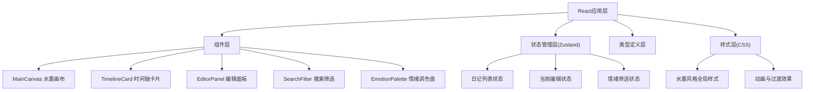

## 1. 架构设计



## 2. 技术描述

- **前端框架**：React@18 + TypeScript@5
- **构建工具**：Vite@5 + @vitejs/plugin-react
- **状态管理**：Zustand@4
- **动画库**：Framer Motion@11
- **唯一标识**：uuid@9
- **开发模式**：纯前端应用，无后端，数据存储于浏览器内存
- **本地存储**：localStorage持久化

## 3. 文件结构

```
project/
├── package.json          # 项目依赖配置
├── index.html          # 应用入口HTML
├── tsconfig.json      # TypeScript配置
├── vite.config.js      # Vite构建配置
└── src/
    ├── main.tsx        # 应用入口
    ├── App.tsx         # 根组件
    ├── styles.css      # 全局水墨风格样式
    ├── types.ts      # 类型定义
    ├── store.ts      # Zustand状态管理
    └── components/
        ├── MainCanvas.tsx       # 主画布组件
        ├── TimelineCard.tsx   # 时间轴卡片组件
        └── DiaryEditor.tsx     # 日记编辑组件
        └── TimelineView.tsx  # 时间轴视图组件
```

## 4. 数据模型

### 4.1 核心类型定义

```typescript
type EmotionType = 'calm' | 'joy' | 'sadness' | 'anger' | 'peace';

interface InkPoint {
  x: number;
  y: number;
  pressure: number;
  velocity: number;
  timestamp: number;
  color: string;
  size: number;
  opacity: number;
}

interface DiaryEntry {
  id: string;
  date: string;
  content: string;
  emotion: EmotionType;
  inkPoints: InkPoint[];
  thumbnail: string;
  createdAt: number;
}
```

## 5. 核心实现要点

### 5.1 水墨渲染算法
- 基于速度和压力计算墨迹浓淡
- 使用Canvas 2D上下文绘制
- requestAnimationFrame优化渲染性能
- 墨迹随机微调色混入

### 5.2 性能优化
- 批量渲染，≤50ms延迟目标
- 离屏Canvas缩略图生成
- 防抖优化连续涂抹帧速率控制

### 5.3 响应式布局
- CSS媒体查询适配移动端
- Flex/Grid布局自适应
- 触控事件与鼠标事件统一处理
