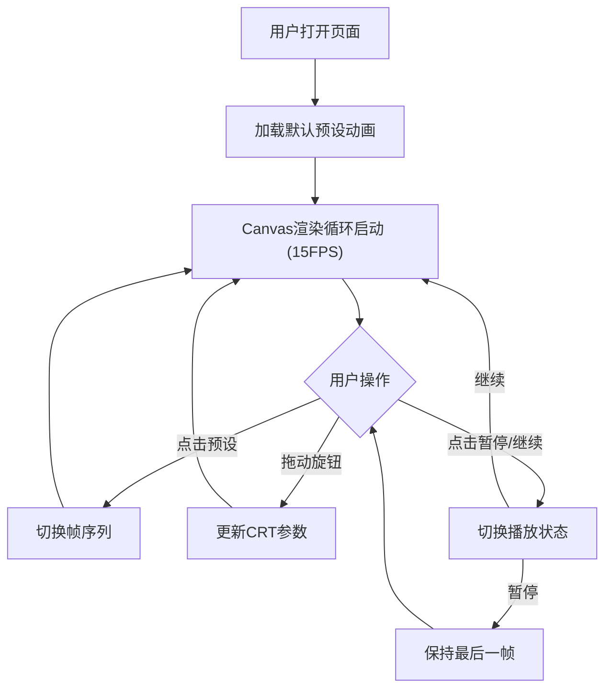

## 1. 产品概述

CRT复古显示器模拟器——一个Web应用，在模拟的老式CRT显示器屏幕上播放ASCII字符动画，带有扫描线、像素抖动、色差偏移和荧光粉余晖效果，用户通过旋钮实时调节失真参数，体验操纵真实复古显示器的感受。

- 目标用户：数字艺术家、复古计算机爱好者、视觉特效开发者
- 核心价值：通过Web技术高度还原CRT显示器的视觉质感，提供沉浸式的复古美学体验

## 2. 核心功能

### 2.1 功能模块

1. **CRT屏幕渲染**：Canvas逐字符绘制ASCII帧，叠加扫描线、像素抖动、色差偏移、余晖拖尾
2. **旋钮控制面板**：三个圆形旋钮分别控制扫描线密度、色差强度、余晖持续时间
3. **预设选择面板**：左侧面板列出预设ASCII动画，点击加载并循环播放
4. **动画播放控制**：自动循环播放（15FPS），暂停/继续功能

### 2.2 页面详情

| 页面名称 | 模块名称 | 功能描述 |
|---------|---------|---------|
| 主页面 | CRT屏幕区域 | 占视口中央70%，4:3宽高比，米色塑料外壳边框，Canvas渲染ASCII帧+CRT效果 |
| 主页面 | 旋钮控制面板 | 屏幕下方三个旋钮水平排列，拖动调节参数，实时反映到屏幕 |
| 主页面 | 预设选择面板 | 左侧200px宽暗蓝面板，列出预设名称，点击切换动画 |
| 主页面 | 电源指示灯 | 屏幕四角小圆点，运行时常亮绿色，暂停时闪烁红色 |

## 3. 核心流程

**数据流向**：
- 预设数据 → Zustand Store → App → Screen组件
- 旋钮交互 → Zustand Store → App → Screen组件
- Store存储：当前帧索引、旋钮参数（扫描线/色差/余晖）、预设列表、播放状态

## 4. 用户界面设计

### 4.1 设计风格

- **主色调**：深灰#1E1E1E背景，模拟暗室中的显示器
- **强调色**：亮绿#00FF41（CRT荧光粉经典绿色），用于旋钮指针、指示灯、选中项
- **边框风格**：米色塑料外壳#D4C9B8，20px宽，圆角6px，内阴影模拟凹陷
- **字体**：Courier New monospace，呼应终端/代码美学
- **布局**：居中CRT屏幕，下方旋钮，左侧预设面板

### 4.2 页面设计概览

| 页面名称 | 模块名称 | UI元素 |
|---------|---------|--------|
| 主页面 | CRT屏幕 | Canvas 4:3比例，米色边框20px，内阴影，四角指示灯 |
| 主页面 | 旋钮面板 | 3个圆形旋钮120px直径，深灰外圈#2A2A2A，亮绿指针#00FF41，下方参数名+数值 |
| 主页面 | 预设面板 | 200px宽暗蓝#1A1A2E背景，圆角8px，列表项44px高，悬停高亮#2A2A3E |
| 主页面 | 暂停/继续按钮 | 屏幕右下角或面板底部，绿色运行/红色暂停图标 |

### 4.3 响应式

- 桌面优先设计，视口宽度<768px时：
  - 预设面板折叠为顶部横向滚动条
  - 旋钮缩小为直径80px，保持水平排列
  - CRT屏幕比例保持4:3但自适应缩小

### 4.4 CRT效果规格

| 效果 | 参数 | 实现方式 |
|------|------|---------|
| 扫描线 | 密度0-100，控制对比度 | 每行1px半透明黑色横线，透明度60%，密度参数控制对比度 |
| 像素抖动 | 固定幅度±5% | 每字符亮度帧间随机波动 |
| 色差偏移 | 强度0-100，RGB偏移最大3px | 三通道分离偏移，偏移方向每帧旋转0.5度 |
| 余晖拖尾 | 半衰期0.5-3秒 | 保留前5帧，指数衰减透明度叠加 |
| 动画帧率 | 15FPS | requestAnimationFrame驱动 |
