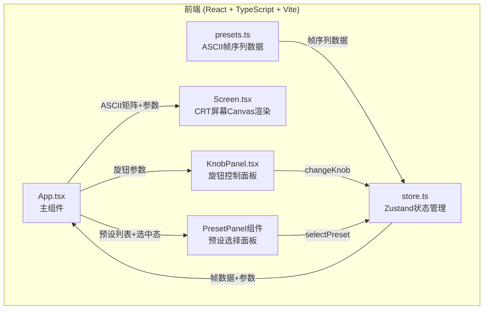

## 1. 架构设计



**数据流向说明**：
1. `presets.ts` 导出静态帧序列数据 → `store.ts` 初始化时加载
2. `store.ts` 管理全局状态：帧索引、旋钮参数、预设选择、播放状态
3. `App.tsx` 从store订阅状态，分发到 `Screen.tsx` 和 `KnobPanel.tsx`
4. `Screen.tsx` 接收ASCII矩阵+参数，Canvas渲染CRT效果
5. `KnobPanel.tsx` 拖动交互 → `store.changeKnob()` → 状态更新 → Screen重渲染
6. 预设面板点击 → `store.selectPreset()` → 加载新帧序列 → 动画重启

## 2. 技术说明

- **前端**：React@18 + TypeScript + Vite
- **初始化工具**：vite-init (react-ts 模板)
- **状态管理**：Zustand
- **动画**：framer-motion (用于UI过渡动画)
- **Canvas渲染**：原生Canvas API + requestAnimationFrame
- **后端**：无（纯前端应用）
- **数据库**：无（静态数据内置）

## 3. 路由定义

| 路由 | 用途 |
|------|------|
| / | 单页应用，包含CRT屏幕、旋钮面板、预设面板 |

## 4. 文件结构

```
├── package.json          # 依赖：react, react-dom, vite, @vitejs/plugin-react, typescript, zustand, framer-motion
├── index.html            # 入口HTML，#root div + viewport meta
├── vite.config.js        # Vite构建配置
├── tsconfig.json         # TypeScript严格模式配置
├── src/
│   ├── App.tsx           # 主组件：组装Screen、KnobPanel、PresetPanel
│   ├── store.ts          # Zustand状态管理
│   ├── main.tsx          # 应用入口
│   ├── components/
│   │   ├── Screen.tsx    # CRT屏幕Canvas渲染组件
│   │   ├── KnobPanel.tsx # 三个旋钮控制面板
│   │   └── PresetPanel.tsx # 预设选择面板
│   └── data/
│       └── presets.ts    # 预设ASCII帧序列数据
```

## 5. 关键实现细节

### 5.1 Canvas渲染管线

```
每帧渲染流程：
1. 不清除Canvas，保留前帧（余晖基础）
2. 绘制前5帧的衰减叠加（指数衰减透明度）
3. 绘制当前帧ASCII字符（考虑色差偏移：RGB三通道分离）
4. 叠加扫描线（水平半透明黑线）
5. 应用像素抖动（每字符亮度随机±5%）
```

### 5.2 Zustand Store 结构

```typescript
interface CRTStore {
  frameIndex: number;
  isPlaying: boolean;
  scanlineDensity: number;    // 0-100
  chromaAberration: number;   // 0-100
  phosphorPersistence: number; // 0-100
  selectedPreset: number;
  presets: PresetData[];
  changeKnob: (param: string, value: number) => void;
  selectPreset: (index: number) => void;
  togglePlay: () => void;
  nextFrame: () => void;
}
```

### 5.3 旋钮交互

- 圆形旋钮，拖动时计算鼠标相对旋钮中心的角度变化
- 角度映射到0-100参数值
- 通过 `store.changeKnob()` 更新参数
- 参数变化即时反映到Canvas渲染

### 5.4 性能约束

- 帧率稳定15FPS（~66.7ms/帧）
- 每次重绘≤50ms
- requestAnimationFrame驱动，非setInterval
- Canvas像素操作优化：避免每帧重绘全部历史帧
