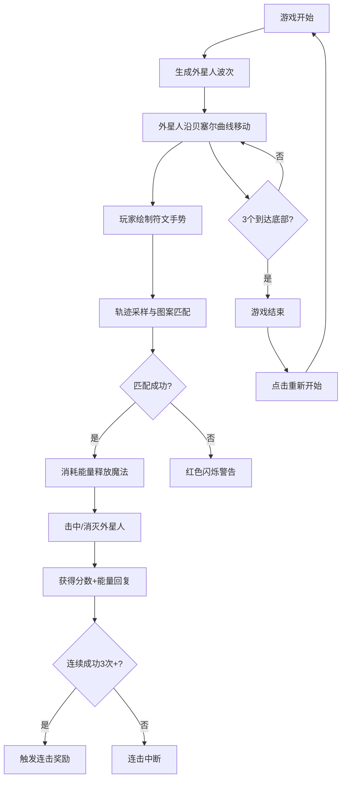

## 1. 产品概述

符文魔法师：像素外星入侵防御游戏，玩家通过手绘符文手势释放魔法抵御外星人波次进攻。

- 解决传统塔防/射击游戏操作单一的问题，融合手绘识别与战斗机制，提升沉浸感与创造力表达
- 目标用户：休闲游戏玩家，喜欢像素风格和创新操作方式的玩家

## 2. 核心功能

### 2.1 用户角色

| 角色 | 注册方式 | 核心权限 |
|------|----------|----------|
| 玩家 | 无需注册 | 进行游戏、查看分数、重新开始 |

### 2.2 功能模块

1. **游戏主界面**：像素游戏画布、符文绘制区域、HUD信息显示
2. **外星人系统**：三种类型外星人波次生成、贝塞尔曲线移动、碰撞检测
3. **符文识别系统**：手势轨迹采样、图案匹配、五种魔法释放
4. **能量系统**：能量条显示、消耗与回复机制
5. **分数系统**：基础分数、连击奖励、游戏结束统计

### 2.3 页面详情

| 页面名称 | 模块名称 | 功能描述 |
|----------|----------|----------|
| 游戏主界面 | 游戏画布 | 渲染像素外星人、弹幕、魔法效果、星光背景 |
| 游戏主界面 | 绘制区域 | 记录玩家手势轨迹、采样点、匹配符文 |
| 游戏主界面 | HUD面板 | 显示能量条、当前分数、连击数、符文样本图标 |
| 游戏主界面 | 游戏结束层 | 显示最终分数、重新开始按钮 |

## 3. 核心流程

玩家进入游戏 -> 外星人波次生成并沿贝塞尔曲线下落 -> 玩家在绘制区绘制符文 -> 系统匹配符文图案 -> 匹配成功释放对应魔法 -> 击杀外星人获得分数和能量 -> 连续施法触发连击奖励 -> 3个外星人到达底部游戏结束 -> 点击重新开始重置游戏

## 4. 用户界面设计

### 4.1 设计风格

- 主色调：暗蓝色 #1A1D2E 背景，像素风格
- 能量条：深灰 #333333 背景，蓝紫渐变 #4A90D9 到 #8E44AD 填充
- 分数显示：白色48px像素字体，1px黑色描边
- 连击数：金色 #FFD700 28px字体
- 绘制区：浅灰 #D3D3D3 背景，十字准星辅助线
- 按钮样式：像素边框，悬停缩放1.05倍，点击缩放0.95倍，0.2秒过渡
- 字体：像素风格字体（使用Press Start 2P或类似像素字体）

### 4.2 页面设计概述

| 页面名称 | 模块名称 | UI元素 |
|----------|----------|--------|
| 游戏主界面 | 游戏区域（上60%） | 暗蓝色背景、星光粒子、三种类型像素外星人、红色弹幕、魔法特效 |
| 游戏主界面 | 绘制区域（下部分） | 400x250px浅灰矩形、十字准星线、灰显状态（能量耗尽时） |
| 游戏主界面 | 左上HUD | 180x20px能量条 |
| 游戏主界面 | 右上HUD | 分数（48px）、连击数（28px金色） |
| 游戏主界面 | 底部 | 4个符文样本图标（40x40px，间距20px，选中金色边框） |
| 游戏结束层 | 半透明遮罩 | rgba(0,0,0,0.7)、最终分数显示、"再试一次"按钮 |

### 4.3 响应性

- Desktop-first设计，适配标准浏览器窗口
- 游戏画布居中显示，最小尺寸800x600px
- 触摸设备支持手势绘制，优化触摸响应

### 4.4 动效设计

- 星光粒子：20颗1x1白色像素点每帧随机闪烁
- 悬停效果：0.2秒颜色和缩放变化（1.05倍）
- 点击效果：0.2秒缩放变化（0.95倍）
- 匹配失败：0.2秒红色闪烁警告
- 连击中断：0.3秒音量降低的扑一声效
- 魔法释放：对应魔法类型的粒子/光效动画
- 游戏结束：遮罩淡入效果

## 5. 性能要求

- 帧率不低于45FPS
- 使用requestAnimationFrame驱动游戏循环
- Canvas 2D渲染所有游戏元素
- 轨迹采样间隔15像素，避免过多计算
