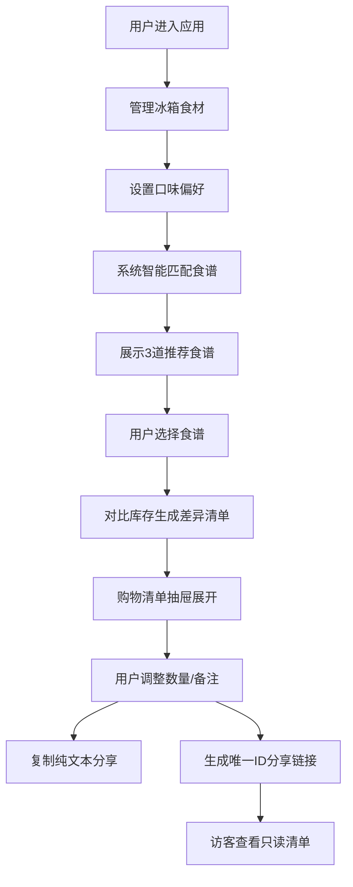

## 1. 产品概述

智能冰箱库存管理与个性化食谱推荐系统，帮助用户管理冰箱食材、智能推荐匹配食谱并生成补货购物清单。
- 目标用户：家庭用户、生鲜电商用户，注重健康饮食和食材管理
- 核心价值：减少食材浪费，简化烹饪决策，一键生成购物清单

## 2. 核心功能

### 2.1 功能模块
1. **冰箱库存管理页面**：食材列表、添加/删除食材、过期提醒、数量调节
2. **食谱推荐页面**：3道智能匹配食谱、匹配度展示、食谱详情
3. **购物清单抽屉**：差异清单生成、数量调节、复制分享、生成分享链接

### 2.2 页面详情
| 页面名称 | 模块名称 | 功能描述 |
|-----------|-------------|---------------------|
| 冰箱管理 | 食材卡片列表 | 按过期时间升序排列，过期红色边框，含删除/加减按钮 |
| 冰箱管理 | 添加食材表单 | 名称、数量、单位、过期日期输入，类别选择 |
| 冰箱管理 | 偏好设置 | 用户口味标签（快手菜/低卡/辣等）多选 |
| 食谱推荐 | 食谱卡片（×3） | 名称、时间、难度星级、匹配度%、悬停上浮效果 |
| 食谱推荐 | 食谱选择 | 点击选中后生成购物清单 |
| 购物清单抽屉 | 差异列表 | 仅展示缺少的食材+数量，支持增减 |
| 购物清单抽屉 | 分享功能 | 复制纯文本、生成分享URL链接 |
| 分享页面 | 只读清单 | 通过链接访问的访客仅查看不可修改 |

## 3. 核心流程

用户进入系统 → 添加/管理冰箱食材 → 设置口味偏好 → 系统推荐3道匹配食谱 → 用户选择食谱 → 自动对比库存生成差异购物清单 → 用户调整数量/备注 → 复制清单或生成分享链接 → 访客通过链接查看只读清单

## 4. 用户界面设计

### 4.1 设计风格
- 主色：#4CAF50（蔬果绿）- 新鲜、健康感
- 辅助色：#FF9800（暖阳橙）- 温暖、食欲感
- 背景色：#F5F5F0（米白）- 干净、厨房感
- 文字色：#333333 - 清晰可读
- 按钮：圆角设计，涟漪点击反馈，绿色主按钮/橙色次按钮
- 字体：现代无衬线字体，标题粗体，正文常规
- 布局：桌面端左右两栏（左400px / 右剩余），移动端顶栏+纵向排列
- 图标：lucide-react 线性图标，简洁现代

### 4.2 页面设计概述
| 页面名称 | 模块名称 | UI 元素 |
|-----------|-------------|-------------|
| 主布局 | 左右两栏 | 左栏400px卡片列表，右栏食谱区，底部抽屉 |
| 冰箱管理 | 食材卡片 | 380×80px，圆角12px，2px浅灰边框，过期变红#E53935 |
| 食谱推荐 | 食谱卡片 | 320px宽，圆角16px，悬停上移4px+阴影加深，0.3s过渡 |
| 购物清单 | 抽屉组件 | 从底部滑出，backdrop-filter:blur(8px)毛玻璃，0.4s动画 |
| 全部组件 | 动画效果 | 食谱卡片 stagger 淡入缩放（0.1s延迟），按钮涟漪 |

### 4.3 响应式设计
- 桌面优先：宽度 ≥768px 采用左右分栏
- 移动端：<768px 侧栏变为顶部导航，卡片改为纵向单列排列
- 触摸优化：按钮最小44×44px，滑动手势支持抽屉展开/收起
