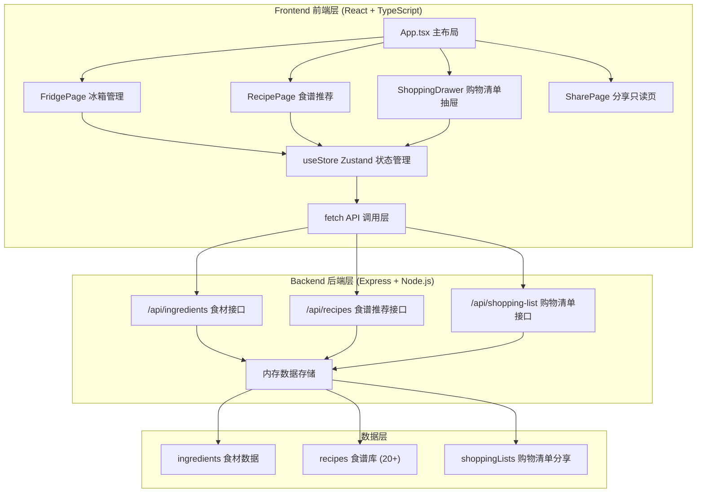
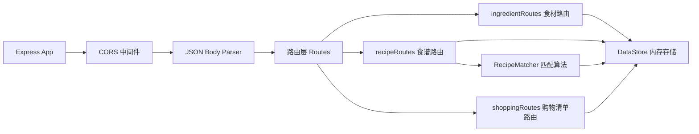
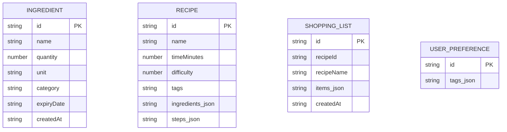

## 1. 架构设计



## 2. 技术描述

- **前端框架**：React 18 + TypeScript 5
- **构建工具**：Vite 5
- **路由**：react-router-dom 6
- **状态管理**：Zustand 4
- **动画库**：framer-motion 11
- **HTTP代理**：Vite 代理 /api/* → http://localhost:4000
- **后端框架**：Express 4 + TypeScript
- **跨域支持**：cors 中间件
- **数据存储**：内存 Map（开发演示用）
- **唯一ID生成**：uuid 9
- **邮件支持（预留）**：nodemailer

## 3. 路由定义

| 前端路由 | 页面组件 | 用途 |
|----------|----------|------|
| `/` | App 主容器 | 冰箱管理 + 食谱推荐 + 购物清单抽屉 |
| `/share/:id` | SharePage | 只读版购物清单分享页面 |

| 后端API | 方法 | 用途 |
|----------|------|------|
| `/api/ingredients` | GET | 获取所有食材列表 |
| `/api/ingredients` | POST | 添加新食材 |
| `/api/ingredients/:id` | PUT | 更新食材数量/信息 |
| `/api/ingredients/:id` | DELETE | 删除食材 |
| `/api/recipes` | POST | 根据库存和偏好推荐3道食谱 |
| `/api/shopping-list` | POST | 生成/保存购物清单，返回分享ID |
| `/api/shopping-list/:id` | GET | 根据分享ID获取只读清单 |

## 4. API 定义

```typescript
// 食材类型
interface Ingredient {
  id: string;
  name: string;
  quantity: number;
  unit: string;
  category: 'vegetable' | 'meat' | 'dairy' | 'grain' | 'seafood' | 'fruit' | 'seasoning' | 'other';
  expiryDate: string; // ISO date
  createdAt: string;
}

// 食谱类型
interface Recipe {
  id: string;
  name: string;
  timeMinutes: number;
  difficulty: 1 | 2 | 3 | 4 | 5;
  tags: string[]; // 'quick' | 'low-calorie' | 'spicy' | ...
  ingredients: { name: string; quantity: number; unit: string; category: string }[];
  steps: string[];
  matchScore?: number; // 0-100 匹配度
}

// 购物清单
interface ShoppingItem {
  name: string;
  quantity: number;
  unit: string;
  category: string;
  note?: string;
}

interface ShoppingList {
  id: string;
  recipeId: string;
  recipeName: string;
  items: ShoppingItem[];
  createdAt: string;
}

// 推荐请求
interface RecommendRequest {
  ingredients: Ingredient[];
  preferences: string[]; // 用户偏好标签
}

// 推荐响应
interface RecommendResponse {
  recipes: Recipe[]; // 3道匹配度最高
}
```

## 5. 后端架构图



## 6. 数据模型

### 6.1 数据模型定义



### 6.2 初始数据
- **食谱库**：预设20+道菜谱，涵盖蔬菜、肉类、海鲜、主食等各类别，覆盖快手菜、低卡、辣、家常等标签
- **初始食材**：5-8条示例食材，包含正常和即将过期的示例数据
- **匹配算法**：基于库存食材覆盖率（权重60%）+ 偏好标签匹配度（权重30%）+ 过期紧急度加成（权重10%）
