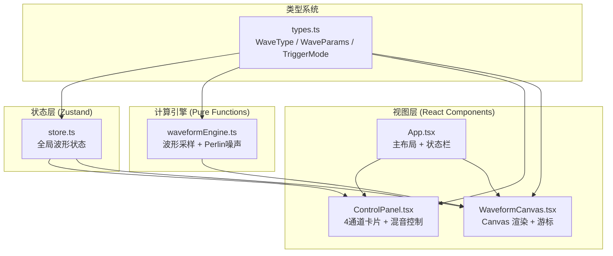

## 1. 架构设计



## 2. 技术栈说明

| 类别 | 技术 | 版本 | 用途 |
|------|------|------|------|
| 框架 | React | 18.x | UI 构建 |
| 语言 | TypeScript | 5.x | 类型安全（严格模式） |
| 构建工具 | Vite | 5.x | HMR + 构建 |
| 状态管理 | Zustand | 4.x | 全局波形参数状态 |
| 动画库 | Framer Motion | 11.x | 面板滑入、微交互 |
| 导出库 | html-to-image | 1.x | Canvas 转 SVG 导出 |
| 渲染 | HTML5 Canvas API | - | 波形高性能绘制 |
| 样式 | 原生 CSS / CSS-in-JS | - | 内联样式 + 全局 CSS 变量 |

## 3. 文件结构

```
auto225/
├── package.json                # 依赖 + 启动脚本
├── vite.config.js              # Vite + React 插件配置
├── tsconfig.json               # TypeScript 严格模式
├── index.html                  # 入口页面（深色背景）
└── src/
    ├── main.tsx                # React 入口
    ├── App.tsx                 # 主布局 + 状态栏 + 响应式
    ├── types.ts                # WaveType 枚举 + WaveParams 等类型
    ├── store.ts                # Zustand 全局状态（4通道+混音+时基+触发）
    ├── components/
    │   ├── ControlPanel.tsx    # 左侧控制面板（卡片+滑块+旋钮）
    │   └── WaveformCanvas.tsx  # Canvas 波形画布 + 游标
    └── utils/
        └── waveformEngine.ts   # 纯函数波形计算（含 Perlin 噪声）
```

## 4. 类型定义（types.ts）

```typescript
export enum WaveType {
  SINE = 'sine',
  SQUARE = 'square',
  TRIANGLE = 'triangle',
  SAWTOOTH = 'sawtooth',
}

export enum TriggerMode {
  AUTO = 'auto',
  NORMAL = 'normal',
  SINGLE = 'single',
}

export interface WaveParams {
  type: WaveType;
  frequency: number;      // 20 ~ 2000 Hz
  amplitude: number;      // 0 ~ 1
  phase: number;          // 0 ~ 360 度
  dutyCycle: number;      // 0 ~ 1（方波占空比）
  noiseLevel: number;     // 0 ~ 1（噪声强度）
  mix: number;            // 0 ~ 1（该通道混音比例）
  enabled: boolean;       // 通道启用开关
}

export interface WavePoint {
  time: number;           // 秒
  voltage: number;        // -1 ~ 1
}

export interface ChannelState {
  ch1: WaveParams;
  ch2: WaveParams;
  ch3: WaveParams;
  ch4: WaveParams;
}

export interface CursorState {
  h1: number;  // 水平游标1 电压值 (-1~1)
  h2: number;  // 水平游标2 电压值
  v1: number;  // 垂直游标1 时间值 (秒)
  v2: number;  // 垂直游标2 时间值
}

export interface StoreState extends ChannelState {
  masterMix: number;          // 总输出比例 0~1
  timeBase: number;           // 时基 ms/div (1~100)
  triggerMode: TriggerMode;
  triggerSource: 'ch1' | 'ch2' | 'ch3' | 'ch4';
  triggerLevel: number;       // 触发电平 -1~1
  sampleRate: number;         // 当前采样率 (1024 或 2048)
  cursors: CursorState;
  showIndividualWaves: boolean;

  // actions
  setChannelParam: <K extends keyof WaveParams>(
    ch: keyof ChannelState, key: K, value: WaveParams[K]
  ) => void;
  setMasterMix: (v: number) => void;
  setTimeBase: (v: number) => void;
  setTriggerMode: (m: TriggerMode) => void;
  setTriggerSource: (s: keyof ChannelState) => void;
  setCursor: (key: keyof CursorState, value: number) => void;
  toggleShowIndividual: () => void;
}
```

## 5. 波形引擎设计（waveformEngine.ts）

核心计算原则：
- **纯函数**：无副作用，输入参数 → 输出点数组
- **Perlin 噪声**：用于 `noiseLevel` 叠加，实现模拟电路噪声效果
- **动态采样率**：任一通道频率 < 200Hz 时，采样点数从 1024 提升至 2048
- **对数频率映射**：20~2000Hz 使用对数分布转换为线性滑块值

```
采样窗口 T  = 10 * (timeBase ms/div) * 10(div)  // 横跨 10 格
采样点数 N  = min_freq < 200 ? 2048 : 1024
采样步长 dt = T / N
```

波形公式：
- **正弦波**：sin(2π·f·t + φ) · A
- **方波**：sign(sin(2π·f·t + φ)) · A（根据 dutyCycle 调整阈值）
- **三角波**：(2/π)·arcsin(sin(2π·f·t + φ)) · A
- **锯齿波**：2·(f·t + φ/360 - floor(0.5 + f·t + φ/360)) · A

## 6. Canvas 渲染管线（WaveformCanvas.tsx）

```
每帧 requestAnimationFrame 回调:
1. 读取 store 最新参数
2. 调用 waveformEngine.generate() 获取合成波形 + 各分波
3. 清屏 fillRect(0,0,w,h)
4. 绘制坐标网格 (drawGrid)
   - 每10px细线0.5px #2A2A3A alpha=0.3
   - 每50px粗线1px   #2A2A3A alpha=0.5
   - 0轴加粗高亮
5. 绘制分波（半透明各通道颜色，线宽1px）
6. 绘制合成波（白色 #FFFFFF，线宽2px）
7. 绘制测量游标（水平线 + 垂直线 + 标签）
8. 处理鼠标事件：
   - mousemove：计算当前像素对应的电压/时间
   - mousedown：捕获游标拖拽
```

## 7. SVG 导出流程

```
点击导出按钮:
  1. 克隆当前 canvas 的像素数据
  2. 使用 html-to-image.toSvg(document.getElementById('canvasWrapper'))
  3. 生成文件名: waveform_YYYYMMDD_HHMMSS.svg
  4. 创建 <a download> 触发浏览器下载
```

## 8. 性能优化策略

| 优化点 | 方案 |
|--------|------|
| 渲染帧率 | requestAnimationFrame 统一驱动，避免独立定时器 |
| 状态订阅 | Zustand selector 精准订阅，避免全量 re-render |
| Canvas 重绘 | 仅在状态改变标记 + rAF 回调时绘制，使用 imageSmoothingEnabled=true |
| 滑块性能 | 使用 CSS transforms 渲染滑块把手，避免 layout thrash |
| 对数计算 | 预计算 log(20) ~ log(2000) 缓存，避免重复 Math.log |
| 浮点精度 | 波形计算用 Float32Array 存储采样点，减少 GC 压力 |

## 9. 响应式与可访问性

- 视口断点 768px：CSS media query + `window.matchMedia`
- 所有交互控件支持 Tab 键聚焦
- 滑块支持键盘方向键调节（细粒度）
- 色彩对比度符合 WCAG AA（深色底 + 高饱和波形色）
```
