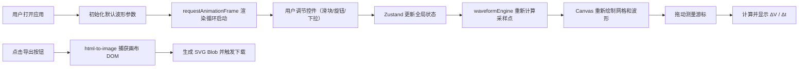

## 1. 产品概述

微型模拟信号波形调试台是一款基于 Web 的虚拟示波器/信号发生器，专为电子工程师、学生和爱好者设计，用于可视化观察和调试多种波形的叠加与变形效果。用户通过直观的旋钮和滑块控件，实时调节四个独立波形通道的参数，即时查看合成波形，并支持导出高质量 SVG 快照。

### 核心价值
- 零安装：纯 Web 应用，浏览器即开即用
- 实时交互：60fps 流畅渲染，控件调节延迟 < 16ms
- 多波形支持：正弦波、方波、三角波、锯齿波四通道独立合成
- 专业测量：电压/时间游标、差值计算、触发控制
- 高质量导出：SVG 矢量格式，适合文档和论文使用

## 2. 核心功能

### 2.1 功能模块总览

| 模块名称 | 核心功能 |
|---------|---------|
| 控制面板 | 四通道波形参数调节（类型、频率、振幅、相位） |
| 混音控制 | 总输出比例 + 各通道独立混音滑块 |
| 时基触发 | 时基缩放（1ms/div ~ 100ms/div）、触发模式（自动/正常/单次） |
| 波形画布 | 1024~2048 点采样渲染、坐标网格、合成波+分波叠加显示 |
| 测量游标 | 水平/垂直游标拖拽、ΔV 和 Δt 实时差值显示 |
| 快照导出 | SVG 格式导出、自动时间戳命名、一键下载 |
| 顶部状态栏 | 采样率显示、触发状态指示 |

### 2.2 页面详情

| 页面/模块 | 子模块 | 功能描述 |
|-----------|--------|---------|
| 主界面 | 顶部状态栏 | 采样率（Sample Rate）动态显示、触发模式/状态指示灯 |
| 主界面 | 导出按钮 | 点击后将当前画布（含网格+波形）转为 SVG 并下载 |
| 主界面 | 左侧控制面板 | 4 张波形通道卡片，每张含类型下拉和三个滑块 |
| 主界面 | 混音区域 | 总输出旋钮（0-100%）+ 4 个通道独立混音滑块 |
| 主界面 | 中央波形画布 | Canvas 实时渲染、光标悬停显示电压/时间坐标 |
| 主界面 | 测量差值区 | 左上角显示游标之间的 ΔV 和 Δt |
| 主界面 | 底部工具栏 | 时基缩放滑块 + 触发模式切换 + 触发源选择 |

### 2.3 波形通道卡片详情

每张卡片包含：
- **波形类型下拉框**：正弦波（红）、方波（蓝）、三角波（绿）、锯齿波（橙）
- **频率滑块**：20~2000Hz，对数分布（非线性刻度），拖拽时显示数值 tooltip
- **振幅滑块**：0~1（线性），实时显示数值
- **相位滑块**：0~360°（线性），实时显示度数

视觉交互：
- 卡片悬停时边框渐变为该通道当前波形类型的主题色，过渡 0.2s
- 滑块轨道高 8px 圆角 4px，背景 #2A2A3A
- 滑块把手圆形直径 20px，使用霓虹蓝渐变 #4FC3F7 → #0288D1
- 点击时按压缩放 transform: scale(0.95)，0.1s 过渡

## 3. 核心流程



## 4. 用户界面设计

### 4.1 设计风格：示波器经典深色科技风

- **主背景**：#0D1117（深空黑）
- **面板背景**：#1A1D2E / rgba(20,20,30,0.85) 半透明
- **主色调（霓虹蓝）**：#4FC3F7（常规）→ #0288D1（激活/渐变终点）
- **警告色**：#FF6B6B
- **波形颜色**：
  - 正弦波：#FF6B6B
  - 方波：#4FC3F7
  - 三角波：#81C784
  - 锯齿波：#FFB74D
  - 合成输出：#FFFFFF

**控件交互**：
- 悬停：背景色微亮（lighten 8%），过渡 0.2s
- 点击：transform: scale(0.95)，过渡 0.1s
- 分割线：#3A3A4A，2px

### 4.2 布局结构

```
┌──────────────────────────────────────────────────────────┐
│  顶部状态栏  [采样率: 1024pts] [触发: AUTO ●]   [导出SVG] │
├──────────┬───────────────────────────────────────────────┤
│          │                                               │
│  左侧    │           中央波形画布 (Canvas)                │
│  控制面板 │          (自适应剩余宽度)                      │
│  固定280px│                                               │
│  (4卡片)  │                                               │
│          │                                               │
│  混音区  │                                               │
│  (旋钮+  │                                               │
│   滑块)   │                                               │
│          │                                               │
├──────────┴───────────────────────────────────────────────┤
│  底部工具栏: [时基缩放] [触发: AUTO│NORMAL│SINGLE] [源:CH1]│
└──────────────────────────────────────────────────────────┘
```

### 4.3 响应式适配

- **桌面端（≥768px）**：左面板固定 + 中央画布 + 底部工具栏，经典示波器布局
- **移动端（<768px）**：
  - 左面板折叠为顶部汉堡菜单，点击展开滑入
  - 底部工具栏按钮切换为图标模式，隐藏文字标签
  - 画布占满视口宽度

### 4.4 动效设计

- **面板入场**：framer-motion，初始 x: -300px → x: 0px，duration 0.5s ease-out
- **按钮悬停**：背景色过渡 0.2s，box-shadow 霓虹光晕
- **画布刷新**：requestAnimationFrame 驱动，60fps 无抖动
- **Tooltip 显示**：滑块拖动时淡入，停止后 500ms 淡出

### 4.5 字体

- 数字显示（采样率、电压、时间）：使用等宽字体如 'JetBrains Mono' 或 'Courier New'
- 界面文字：无衬线字体如 'Segoe UI' 或系统默认
