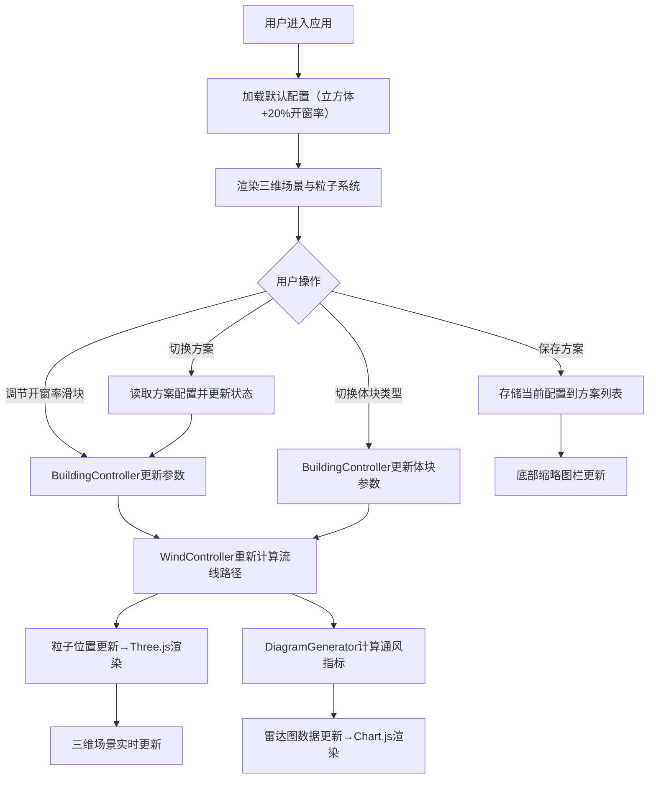

## 1. 产品概述
建筑风环境模拟与开窗方案比选应用，面向建筑系学生和设计人员，用于在三维空间中模拟风穿过不同开窗形态的建筑体块时形成的流线形态，直观对比不同开窗方案对室内通风效率的影响。

- 核心价值：将复杂的计算流体力学（CFD）简化为直观的可视化工具，帮助学生快速理解建筑形态与通风的关系
- 目标用户：建筑系学生、初级设计师、建筑教育工作者
- 市场价值：填补建筑设计教学中简易风环境模拟工具的空白，提升设计决策的科学性

## 2. 核心功能

### 2.1 用户角色
| 角色 | 注册方式 | 核心权限 |
|------|----------|----------|
| 访客用户 | 无需注册 | 完整使用所有模拟、对比、保存功能 |

### 2.2 功能模块
1. **三维场景模块**：建筑体块展示、粒子流线动画、场景交互控制
2. **参数控制模块**：体块类型切换、四向开窗率调节
3. **数据分析模块**：雷达图对比、通风指标计算
4. **方案管理模块**：方案快照保存、方案切换对比

### 2.3 页面详情
| 页面名称 | 模块名称 | 功能描述 |
|-----------|-------------|---------------------|
| 主页面 | 三维场景区域 | 居中显示建筑体块和风粒子系统，支持鼠标拖拽旋转视角 |
| 主页面 | 左侧控制面板 | 四个垂直滑块分别控制南、北、东、西立面开窗率（0%-60%） |
| 主页面 | 右侧分析面板 | 雷达图展示5项通风指标对比，4个方案保存按钮 |
| 主页面 | 底部体块选择栏 | 三个卡片按钮切换立方体、L形体、U形体三种建筑体块 |
| 主页面 | 底部方案缩略图栏 | 展示已保存的方案卡片，点击切换到对应方案 |

## 3. 核心流程
用户进入应用后，默认显示立方体建筑和基准方案（所有立面20%开窗率）。用户可以：
1. 调节四向开窗率滑块，实时观察粒子流线变化和指标更新
2. 切换不同建筑体块类型，体块平滑过渡动画
3. 点击保存按钮，将当前配置保存为方案快照（最多4个）
4. 点击底部方案卡片，快速切换对比不同方案
5. 鼠标悬停雷达图节点，查看具体指标数值

## 4. 用户界面设计

### 4.1 设计风格
- **主色调**：科技蓝 #5E9AFF，用于按钮、激活状态
- **辅助色**：蓝色 #4EA8DE（滑块激活）、红色-蓝色渐变（粒子颜色映射）
- **中性色**：浅灰渐变背景 #F0F0F0→#E0E0E0，半透明白色面板 rgba(255,255,255,0.85)
- **按钮风格**：圆角8px，主色填充，悬停加深#4A85E8，点击0.1s缩放反馈
- **字体**：Inter - 现代无衬线字体，标题16px粗体，正文13px常规
- **布局风格**：三栏布局（左控制面板+中间三维场景+右分析面板），底部工具条
- **图标风格**：简约线性图标，使用lucide-react

### 4.2 页面设计概述
| 页面名称 | 模块名称 | UI元素 |
|-----------|-------------|-------------|
| 主页面 | 三维场景区域 | 浅灰渐变背景，半透明建筑体块（roughness:0.3, metalness:0.1），蓝色光晕边框，带拖尾的彩色粒子 |
| 主页面 | 左侧控制面板 | 宽240px，圆角12px，20px边距，4个垂直滑块（宽220px，间距16px），滑块上方百分比显示 |
| 主页面 | 右侧分析面板 | 宽300px，圆角12px，20px边距，雷达图280px宽居中，浅灰虚线参考线，渐变色数据线，下方4个保存按钮 |
| 主页面 | 底部体块选择 | 三个卡片按钮，图标+文字，选中状态蓝色边框高亮，0.3s切换动画 |
| 主页面 | 底部方案栏 | 最多4个缩略卡片（150×60px，圆角8px，2px灰色边框#AAA），显示体块图标和开窗率概览 |

### 4.3 响应式设计
- Desktop-first设计，针对1200px+宽度优化
- 视口宽度<900px时，面板变为横向布局并堆叠在底部
- 每个面板增加折叠箭头，可展开/收起
- 触摸设备优化：滑块和按钮触摸区域≥44px

### 4.4 3D场景指导
- **环境**：浅灰线性渐变天空，无HDRI，柔和环境光
- **光照**：半球光（天空色#FFFFFF，地面色#E0E0E0，强度0.6）+ 方向光（强度0.8，角度45°）
- **相机**：透视相机，初始位置[8, 6, 8]，看向原点，启用轨道控制器（阻尼系数0.05）
- **建筑体块**：半透明白色MeshStandardMaterial（transparent:true, opacity:0.7, roughness:0.3, metalness:0.1），外立面边缘有发光线条（2px，颜色#88CCFF，强度0.5）
- **粒子系统**：Points材质，AdditiveBlending，大小0.1，顶点颜色，每个粒子带5个点的渐隐拖尾（Line，透明度从1到0）
- **后处理**：轻微 bloom 效果（强度0.3，阈值0.8）增强粒子光晕感

## 5. 性能约束
- 粒子系统动画保持≥30FPS
- 体块切换时模型网格重构≤0.5秒
- 所有用户操作响应延迟≤50毫秒
- 粒子数量动态调整：20-100个，基于总开窗面积
