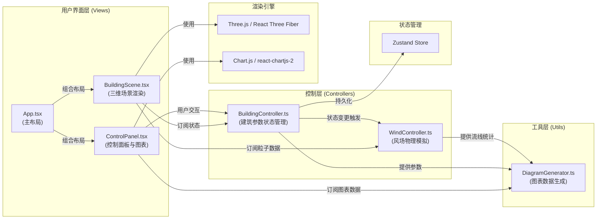
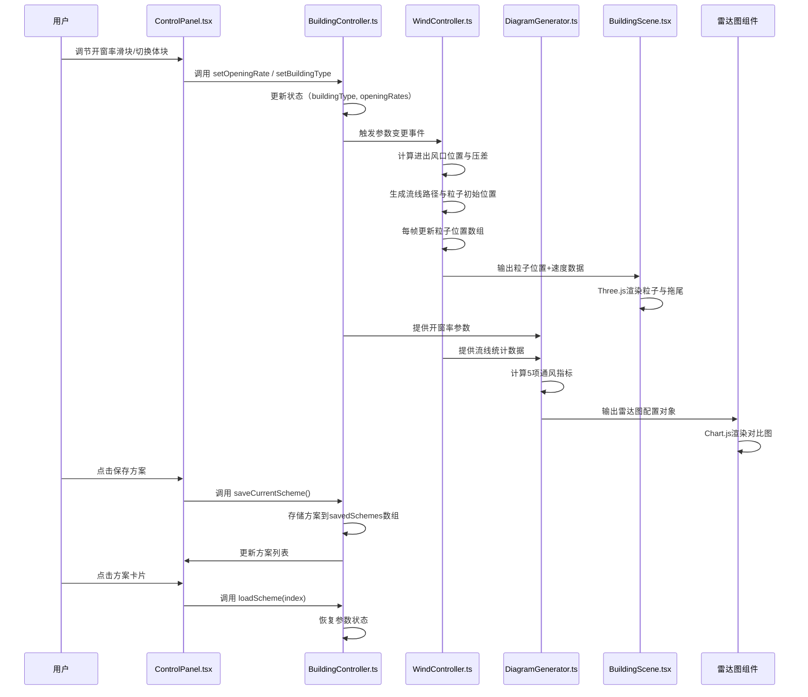

## 1. 架构设计


## 2. 技术描述
- **前端框架**：React@18 + TypeScript@5
- **构建工具**：Vite@5 + @vitejs/plugin-react@4
- **3D渲染**：three@0.160 + @react-three/fiber@8 + @react-three/drei@9
- **图表库**：chart.js@4 + react-chartjs-2@5
- **状态管理**：zustand@4
- **UI组件**：自定义CSS（无UI框架），响应式设计
- **动画**：CSS transitions + Three.js帧动画

## 3. 数据流向图



## 4. 文件结构与调用关系

```
src/
├── controllers/
│   ├── BuildingController.ts    # Zustand store，管理建筑参数
│   │   ├── 状态: buildingType, openingRates, savedSchemes
│   │   ├── 方法: setBuildingType(), setOpeningRate(), saveScheme(), loadScheme()
│   │   └── 被调用: ControlPanel.tsx, WindController.ts, DiagramGenerator.ts
│   └── WindController.ts        # 风场物理模拟类
│       ├── 状态: particles[], flowLines[], statistics
│       ├── 方法: recalculateFlow(), updateParticles(delta)
│       ├── 依赖: BuildingController 状态
│       └── 被调用: BuildingScene.tsx, DiagramGenerator.ts
├── views/
│   ├── BuildingScene.tsx        # R3F三维场景组件
│   │   ├── 子组件: BuildingMesh, ParticleSystem, WindArrows
│   │   ├── 依赖: useFrame, useThree, OrbitControls
│   │   └── 订阅: BuildingController, WindController
│   └── ControlPanel.tsx         # 控制面板组件
│       ├── 子组件: VerticalSlider, RadarChart, SchemeCard
│       ├── 依赖: Chart.js注册
│       └── 调用: BuildingController方法
├── utils/
│   └── DiagramGenerator.ts      # 图表数据生成工具
│       ├── 方法: calculateMetrics(), generateRadarData()
│       ├── 依赖: BuildingController, WindController数据
│       └── 被调用: ControlPanel.tsx
├── types/
│   └── index.ts                 # 全局类型定义
├── App.tsx                      # 应用入口组件
├── main.tsx                     # React入口
└── index.css                    # 全局样式
```

## 5. 数据模型定义

### 5.1 核心类型定义

```typescript
// 建筑体块类型
type BuildingType = 'cube' | 'L-shape' | 'U-shape';

// 四个立面方向
type FacadeDirection = 'south' | 'north' | 'east' | 'west';

// 开窗率状态（0-60%）
interface OpeningRates {
  south: number;
  north: number;
  east: number;
  west: number;
}

// 通风指标
interface VentilationMetrics {
  avgWindSpeed: number;      // 风速均值 (m/s)
  maxWindSpeed: number;      // 最大风速 (m/s)
  turbulenceIntensity: number; // 湍流强度 (0-1)
  deadZoneRatio: number;     // 死角占比 (0-1)
  airChangeRate: number;     // 换气次数 (次/小时)
}

// 粒子数据
interface Particle {
  id: number;
  position: [number, number, number];
  velocity: [number, number, number];
  speed: number;
  trail: [number, number, number][];
  life: number;
}

// 保存的方案
interface SavedScheme {
  id: number;
  name: string;
  buildingType: BuildingType;
  openingRates: OpeningRates;
  createdAt: number;
}

// BuildingController State
interface BuildingState {
  buildingType: BuildingType;
  openingRates: OpeningRates;
  savedSchemes: SavedScheme[];
  setBuildingType: (type: BuildingType) => void;
  setOpeningRate: (direction: FacadeDirection, value: number) => void;
  saveScheme: (name?: string) => void;
  loadScheme: (index: number) => void;
  deleteScheme: (index: number) => void;
}

// WindController State
interface WindState {
  particles: Particle[];
  metrics: VentilationMetrics;
  recalculate: () => void;
  update: (delta: number) => void;
}
```

### 5.2 基准方案配置

```typescript
const BASELINE_SCHEME: SavedScheme = {
  id: -1,
  name: '基准方案',
  buildingType: 'cube',
  openingRates: {
    south: 20,
    north: 20,
    east: 20,
    west: 20
  },
  createdAt: 0
};
```

## 6. 关键算法说明

### 6.1 风场模拟简化算法

```
1. 基于建筑体块类型计算室内空间网格（30×30×20分辨率）
2. 根据迎风面和背风面开窗率计算初始压力场
   - 迎风面压力 = 0.5 × ρ × v² × (1 - 开窗率/100)
   - 背风面压力 = -0.2 × ρ × v²
3. 使用简化的Navier-Stokes方程（无粘、不可压缩）计算速度场
   - 速度梯度 = 压力梯度 / 密度
   - 添加边界条件（墙面无滑移）
4. 粒子追踪：沿速度场积分粒子运动
   - 使用RK4积分提高精度
   - 粒子从迎风面洞口随机生成
   - 碰到墙面或流出背风面后重置
5. 计算通风指标：
   - 风速均值 = 所有粒子速度平均值
   - 湍流强度 = 速度标准差 / 速度均值
   - 死角占比 = 速度<0.2m/s的网格数 / 总网格数
   - 换气次数 = (总流量 × 3600) / 室内体积
```

### 6.2 粒子颜色映射

```
速度范围: 0.5 m/s → 3.0 m/s
颜色映射: 蓝色 (#0066FF) → 青色 → 黄色 → 红色 (#FF3300)
使用HSL插值:
  h = 240 - (speed - 0.5) / (3.0 - 0.5) × 240  // 从蓝到红
  s = 80%
  l = 50% + (speed - 0.5) / 5.0 × 20%  // 高速略亮
```

## 7. 性能优化策略

1. **粒子池复用**：预分配100个粒子对象，循环使用避免GC
2. **TypedArray传递**：粒子位置使用Float32Array直接传递给Three.js
3. **节流计算**：开窗率调节时使用requestAnimationFrame节流重计算
4. **LOD**：粒子拖尾在距离相机较远时减少段数
5. **空间分割**：风场计算使用分块策略，每帧只更新部分区域
6. **WebGL优化**：使用BufferGeometry而非Geometry，禁用未使用的顶点属性
