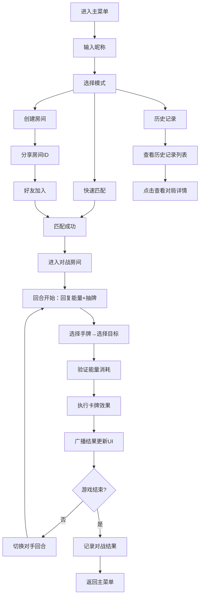

## 1. 产品概述
轻量级卡牌构筑对战原型，用于独立游戏开发者快速验证核心战斗机制和卡牌平衡性。
- 核心目的：提供可快速迭代的卡牌对战模拟器，支持实时双人对战和战斗数据记录
- 目标用户：独立游戏开发者、卡牌游戏设计师
- 产品价值：降低卡牌游戏原型验证成本，快速测试卡牌效果和平衡性

## 2. 核心功能

### 2.1 用户角色
| 角色 | 注册方式 | 核心权限 |
|------|----------|----------|
| 玩家 | 输入昵称即可 | 创建/加入房间、进行对战、查看历史记录 |

### 2.2 功能模块
1. **主菜单页面**：昵称输入、快速匹配、创建房间、历史记录入口
2. **对战房间页面**：实时对战界面、手牌管理、战场区域、状态显示
3. **历史记录页面**：对战记录列表、对局详情查看

### 2.3 页面详情
| 页面名称 | 模块名称 | 功能描述 |
|----------|----------|----------|
| 主菜单 | 昵称输入 | 玩家输入昵称（2-8字符），存储在localStorage |
| 主菜单 | 快速匹配 | 自动匹配或创建房间，匹配成功进入对战 |
| 主菜单 | 创建房间 | 房主设置房间名（最大8汉字），生成房间ID供好友加入 |
| 主菜单 | 历史记录 | 进入历史记录页面查看对战记录 |
| 主菜单 | 粒子背景 | Canvas绘制白色小点缓慢飘移动效 |
| 对战房间 | 玩家状态 | 显示双方头像、昵称、血量条（绿到红渐变）、能量条（蓝色圆点） |
| 对战房间 | 手牌区域 | 弧形排列手牌，悬停上移放大1.1倍弹性动画 |
| 对战房间 | 战场区域 | 中央半透明卡牌放置区，固定网格布局 |
| 对战房间 | 出牌动画 | 卡牌从手牌飞向目标（0.4s ease-in-out），血量条平滑减少（0.3s） |
| 对战房间 | 对战逻辑 | 回合制，每回合回复能量+抽牌，消耗能量出牌 |
| 对战房间 | 聊天/信号 | 基础聊天和操作信号转发 |
| 历史记录 | 记录列表 | 按时间倒序展示对战记录（胜负、卡组、时间） |
| 历史记录 | 详情展开 | 点击记录展开查看剩余血量、回合数、关键出牌序列 |

## 3. 核心流程

玩家进入主菜单输入昵称，可选择快速匹配或创建房间。匹配成功后进入对战房间，双方轮流回合，每回合开始回复能量并抽牌。点击手牌选择目标后出牌，系统验证并执行卡牌效果，广播结果给双方。对战结束后记录结果到localStorage，可在历史记录页面查看。

## 4. 用户界面设计

### 4.1 设计风格
- **主色调**：深色主题，背景#1a1a2e，卡片区域#16213e，按钮#0f3460
- **强调色**：蓝紫色渐变（#667eea → #764ba2）
- **血量条**：绿色（#4ade80）渐变到红色（#ef4444）
- **能量条**：蓝色圆点（#3b82f6），用满表示
- **字体**：使用 Orbitron（标题）+ Noto Sans SC（正文）
- **按钮样式**：圆角8px，悬停蓝紫色渐变边框发光
- **布局风格**：卡片式布局，对战界面左右对称
- **动效**：所有交互带0.3s缓动过渡，卡牌悬停弹性过渡

### 4.2 页面设计概述
| 页面名称 | 模块名称 | UI元素 |
|----------|----------|--------|
| 主菜单 | 中心卡片面板 | 深色半透明卡片，蓝紫色渐变边框，输入框+按钮垂直排列 |
| 主菜单 | 粒子背景 | Canvas白色小点随机飘移，大小不一，缓慢移动 |
| 对战房间 | 顶部状态栏 | 左右两侧玩家信息（头像、昵称、血量条、能量条），中央回合指示 |
| 对战房间 | 战场区域 | 中央半透明网格区域，左右各3个卡牌放置位 |
| 对战房间 | 手牌区域 | 底部弧形排列，每张牌略倾斜（±5°），悬停上移放大 |
| 对战房间 | 出牌动画 | 卡牌飞出轨迹，命中效果，血量条平滑变化 |
| 历史记录 | 记录卡片 | 列表式卡片，显示胜负标识、日期、卡组信息，可展开 |

### 4.3 响应式设计
- **桌面优先**：最小支持1024px宽屏
- **Flex布局**：使用flex确保宽度自适应
- **移动端检测**：屏幕宽度<768px时弹出提示横屏使用的遮罩层
- **触控优化**：移动端按钮最小44px触控区域

### 4.4 性能约束
- WebSocket消息延迟≤200ms
- FPS稳定≥50帧，使用requestAnimationFrame驱动UI更新
- 每帧最多更新一次状态
- 使用对象池管理卡牌DOM元素，避免频繁GC

## 5. 卡牌系统设计

### 5.1 卡牌属性
每张卡牌包含：
- 唯一ID（字符串）
- 名称（字符串）
- 费用（数字，1-3点能量）
- 类型（攻击/恢复/抽牌/debuff）
- 描述（字符串）
- 效果参数（伤害值、恢复量、抽牌数等）

### 5.2 卡牌列表（共10张）
| ID | 名称 | 费用 | 类型 | 效果 |
|----|------|------|------|------|
| card_001 | 火球术 | 2 | 攻击 | 造成8点伤害 |
| card_002 | 快速斩击 | 1 | 攻击 | 造成5点伤害 |
| card_003 | 重击 | 3 | 攻击 | 造成12点伤害 |
| card_004 | 治疗术 | 2 | 恢复 | 恢复5点生命 |
| card_005 | 强效治疗 | 3 | 恢复 | 恢复10点生命 |
| card_006 | 战术思考 | 1 | 抽牌 | 抽1张牌 |
| card_007 | 知识汲取 | 2 | 抽牌 | 抽2张牌 |
| card_008 | 致盲烟雾 | 2 | debuff | 对手下回合少抽1张牌 |
| card_009 | 连击 | 1 | 攻击 | 造成5点伤害，抽1张牌 |
| card_010 | 能量爆发 | 3 | 攻击 | 造成8点伤害，恢复3点生命 |
