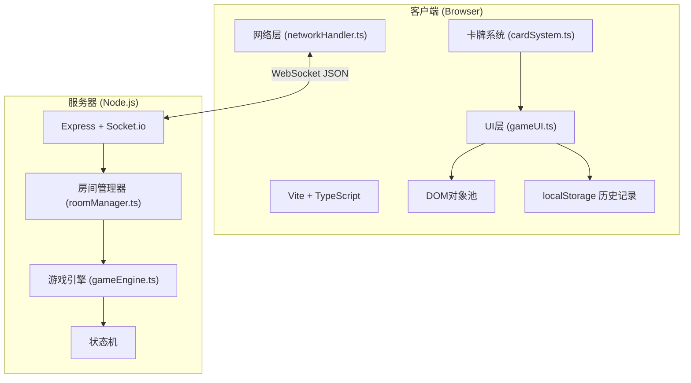
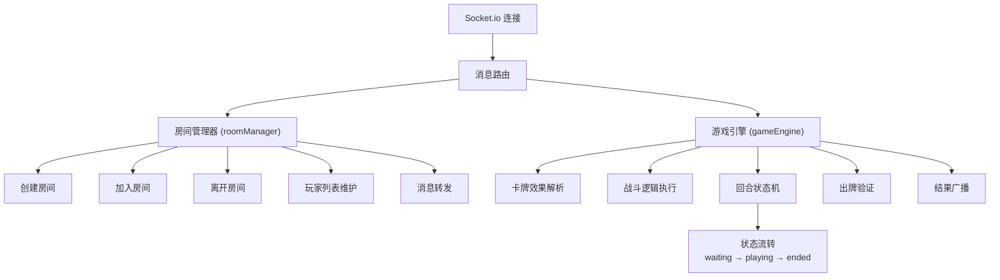

## 1. 架构设计



## 2. 技术描述

- **前端**：TypeScript + Vite，原生DOM操作（无框架），CSS动画
- **后端**：Node.js + Express + Socket.io，TypeScript编译运行
- **通信**：WebSocket实时通信，JSON消息格式，心跳保活机制
- **数据存储**：localStorage存储对战历史记录
- **初始化工具**：npm脚本启动

## 3. 项目结构

```
auto23/
├── package.json
├── vite.config.js
├── tsconfig.json
├── index.html
├── server/
│   ├── gameEngine.ts      # 游戏引擎：战斗逻辑、卡牌效果、回合状态机
│   ├── roomManager.ts     # 房间管理：创建/加入/离开、玩家列表、消息转发
│   └── index.ts           # 服务器入口
├── client/
│   ├── networkHandler.ts  # 网络模块：WebSocket连接、消息收发、心跳
│   ├── gameUI.ts          # UI模块：渲染、动画、用户交互
│   ├── cardSystem.ts      # 卡牌系统：卡牌数据、效果解析
│   ├── objectPool.ts      # DOM对象池
│   └── main.ts            # 客户端入口
└── types/
    └── index.ts           # 共享类型定义
```

## 4. 类型定义

```typescript
// 卡牌类型
interface Card {
  id: string;
  name: string;
  cost: number;
  type: 'attack' | 'heal' | 'draw' | 'debuff';
  description: string;
  effect: {
    damage?: number;
    heal?: number;
    draw?: number;
    debuff?: { type: 'reduceDraw'; value: number };
  };
}

// 玩家状态
interface PlayerState {
  id: string;
  nickname: string;
  avatar: string;
  hp: number;
  maxHp: number;
  energy: number;
  maxEnergy: number;
  hand: Card[];
  deck: Card[];
  discardPile: Card[];
  debuffs: { reduceDraw: number };
}

// 房间状态
interface RoomState {
  id: string;
  name: string;
  players: Record<string, PlayerState>;
  currentTurn: string;
  turnNumber: number;
  phase: 'waiting' | 'playing' | 'ended';
  winner: string | null;
  battleLog: BattleAction[];
}

// 对战记录
interface BattleRecord {
  id: string;
  timestamp: number;
  winner: string;
  loser: string;
  winnerHp: number;
  loserHp: number;
  turns: number;
  keyPlays: BattleAction[];
  winnerDeck: Card[];
  loserDeck: Card[];
}

// WebSocket消息
interface WSMessage<T = unknown> {
  type: string;
  payload: T;
  timestamp: number;
}

// 战斗动作
interface BattleAction {
  playerId: string;
  turn: number;
  action: 'playCard' | 'draw' | 'endTurn';
  card?: Card;
  targetId?: string;
  result: {
    damageDealt?: number;
    healAmount?: number;
    cardsDrawn?: Card[];
  };
}
```

## 5. WebSocket消息协议

| 消息类型 | 方向 | 负载数据 | 说明 |
|----------|------|----------|------|
| `join_queue` | C→S | `{ nickname: string }` | 加入匹配队列 |
| `create_room` | C→S | `{ nickname: string; roomName: string }` | 创建房间 |
| `join_room` | C→S | `{ nickname: string; roomId: string }` | 加入指定房间 |
| `room_joined` | S→C | `{ roomId: string; roomName: string; players: PlayerState[] }` | 加入房间成功 |
| `match_found` | S→C | `{ roomId: string; players: PlayerState[] }` | 匹配成功 |
| `game_start` | S→C | `{ yourId: string; opponent: PlayerState; firstPlayer: string }` | 游戏开始 |
| `turn_start` | S→C | `{ playerId: string; turnNumber: number; drawnCard?: Card }` | 回合开始 |
| `play_card` | C→S | `{ cardId: string; targetId: string }` | 出牌请求 |
| `card_played` | S→C | `BattleAction` | 出牌结果广播 |
| `invalid_play` | S→C | `{ reason: string }` | 出牌无效 |
| `end_turn` | C→S | `{}` | 结束回合 |
| `turn_ended` | S→C | `{ nextPlayerId: string }` | 回合结束 |
| `game_end` | S→C | `{ winner: string; stats: BattleRecord }` | 游戏结束 |
| `chat` | C↔S | `{ playerId: string; message: string }` | 聊天消息 |
| `ping` | C→S | `{}` | 心跳 |
| `pong` | S→C | `{}` | 心跳响应 |

## 6. 服务器架构



## 7. 关键技术实现

### 7.1 游戏引擎核心流程
1. 接收玩家出牌请求 → 验证能量/回合合法性 → 执行卡牌效果 → 更新状态 → 广播结果
2. 回合状态机：waiting → turn_start → action_phase → turn_end → next_turn
3. 卡牌效果执行器：根据卡牌类型分派到不同处理函数

### 7.2 UI渲染优化
- 使用`requestAnimationFrame`驱动UI更新，每帧最多更新一次
- DOM对象池管理卡牌元素，避免频繁创建销毁
- CSS硬件加速动画（transform + opacity）

### 7.3 性能保障
- WebSocket心跳间隔30s，超时60s断开重连
- 消息防抖：快速连续操作合并处理
- 动画节流：使用CSS transition而非JS逐帧动画

## 8. 启动配置

### package.json 脚本
```json
{
  "scripts": {
    "dev": "concurrently \"npm run dev:server\" \"npm run dev:client\"",
    "dev:server": "ts-node server/index.ts",
    "dev:client": "vite",
    "build": "tsc && vite build"
  }
}
```

### 依赖包
- typescript
- vite
- express
- socket.io
- socket.io-client
- ts-node
- concurrently
