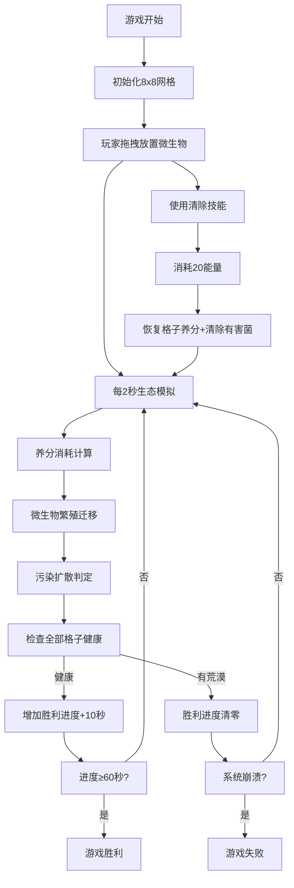

## 1. 产品概述

苔藓微景生态平衡是一款微观生态模拟游戏，玩家在8x8网格的苔藓微景中扮演生态守护者，通过放置和移动三种微生物来维持养分循环，防止有害菌群过度繁殖导致系统崩溃。

- 核心目标：通过策略性放置和管理微生物，维持全部格子的绿色健康状态超过60秒
- 目标用户：休闲益智游戏爱好者，对生态模拟感兴趣的玩家
- 产品价值：寓教于乐，在游戏中了解微观生态系统的平衡原理

## 2. 核心功能

### 2.1 用户角色
| 角色 | 注册方式 | 核心权限 |
|------|----------|----------|
| 玩家 | 无需注册，直接进入游戏 | 进行游戏操作、查看得分、重新开始 |

### 2.2 功能模块
1. **生态模拟系统**：每2秒自动运行一轮，计算养分消耗、微生物繁殖、污染扩散
2. **玩家操作交互**：拖拽放置微生物、点击移动棋子、释放清除技能
3. **游戏状态判定**：胜利进度条、得分系统、胜负判定
4. **技能能量系统**：能量获取与消耗管理
5. **视觉反馈系统**：拖拽反馈、放置动画、技能特效、胜利烟花

### 2.3 页面详情
| 页面名称 | 模块名称 | 功能描述 |
|----------|----------|----------|
| 游戏主页面 | 8x8网格区域 | 显示生态格子状态，支持拖拽和点击交互 |
| 游戏主页面 | 左侧信息面板 | 显示当前回合数、胜利进度条、得分 |
| 游戏主页面 | 右侧控制面板 | 显示微生物库存、能量条、技能CD状态 |

## 3. 核心流程

游戏开始后，玩家从右侧面板拖拽微生物到网格上放置，系统每2秒自动模拟一轮生态周期。玩家通过管理微生物分布、使用清除技能来维持生态平衡。当全部格子保持健康状态超过60秒时玩家胜利，若系统崩溃则游戏结束。

## 4. 用户界面设计

### 4.1 设计风格
- **整体风格**：微观苔藓微景风格，暗绿色调，营造神秘微观世界氛围
- **主色调**：深绿渐变背景（#1A2E1A → #2A4A2A）
- **格子状态色**：深绿（正常）、嫩绿（高养分）、黄绿（中养分）、暗褐（低养分）、灰色（荒漠）
- **微生物色**：蓝绿藻#1E90FF、霉菌#228B22、纤毛虫#FFD700
- **字体**：采用现代无衬线字体，标题加粗，正文清晰易读
- **动效风格**：流畅的过渡动画、微交互动效、粒子特效

### 4.2 页面设计概述
| 页面名称 | 模块名称 | UI元素 |
|----------|----------|--------|
| 游戏主页面 | 8x8网格 | 64px格子、圆角4px、悬停放大到68px、虚线边框、微生物圆形图标小簇排列 |
| 游戏主页面 | 左侧面板 | 220px宽、半透明深绿背景rgba(20,40,20,0.7)、圆角12px、回合数白色24px、胜利进度条红到绿渐变、得分金色22px |
| 游戏主页面 | 右侧面板 | 180px宽、半透明深绿背景、微生物库存带图标数字、能量条橙色、技能CD环形倒计时 |

### 4.3 响应式
桌面端优先，固定视口布局，网格占视口宽65%居中，左右面板固定宽度。

### 4.4 动画效果
- 拖拽时微生物图标跟随指针带半透明阴影
- 放置成功时格子闪烁0.3秒
- 技能释放时绿色波纹扩散0.5秒
- 胜利时金色绿色粒子烟花升空3秒
- 悬停放大过渡0.2秒
