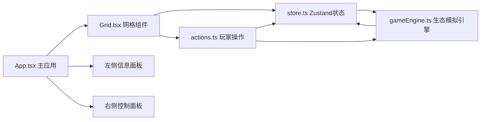

## 1. 架构设计

项目采用纯前端架构，使用 React + TypeScript + Vite 构建，Zustand 进行全局状态管理，Framer Motion 实现动画效果。



**数据流向说明：**
- `src/store.ts`：全局状态管理，存储网格数据、回合计数、分数、胜利状态
- `src/gameEngine.ts`：核心模拟逻辑，接收状态计算新的网格数据
- `src/actions.ts`：玩家操作处理，调用 store 更新并影响下一轮模拟
- `src/Grid.tsx`：网格渲染，从 store 读数据，调用 actions 处理交互
- `src/App.tsx`：主应用，组合各组件

## 2. 技术描述

- **前端框架**：React@18 + TypeScript
- **构建工具**：Vite@5 + @vitejs/plugin-react
- **状态管理**：Zustand
- **动画库**：framer-motion
- **工具库**：uuid
- **初始化方式**：vite-init react-ts 模板

## 3. 文件结构

| 文件路径 | 职责说明 |
|----------|----------|
| `package.json` | 项目依赖与脚本配置 |
| `vite.config.js` | Vite构建配置，启用React插件 |
| `tsconfig.json` | TypeScript配置，严格模式，target ES2020 |
| `index.html` | 入口页面，标题：苔藓微景生态平衡 |
| `src/main.tsx` | 应用入口文件 |
| `src/App.tsx` | 主应用组件，组合布局 |
| `src/store.ts` | Zustand全局状态管理 |
| `src/gameEngine.ts` | 生态模拟核心逻辑 |
| `src/actions.ts` | 玩家操作处理 |
| `src/Grid.tsx` | 8x8网格渲染组件 |
| `src/types.ts` | TypeScript类型定义 |

## 4. 数据模型

### 4.1 类型定义

```typescript
// 微生物类型
type MicrobeType = 'cyanobacteria' | 'mold' | 'ciliate';

// 格子状态
interface Cell {
  id: string;
  x: number;
  y: number;
  nutrient: number;      // 0-100 养分值
  ph: number;            // 5.0-9.0 pH值
  isDesert: boolean;     // 是否为荒漠
  microbes: {
    cyanobacteria: number;  // 0-10 蓝绿藻数量
    mold: number;           // 0-10 霉菌数量
    ciliate: number;        // 0-10 纤毛虫数量
  };
}

// 游戏状态
interface GameState {
  grid: Cell[][];           // 8x8 网格
  turn: number;             // 回合计数
  score: number;            // 得分
  victoryProgress: number;  // 胜利进度 0-60秒
  isVictory: boolean;       // 是否胜利
  isGameOver: boolean;      // 是否游戏结束
  energy: number;           // 能量值 0-100+
  inventory: {              // 微生物库存
    cyanobacteria: number;
    mold: number;
    ciliate: number;
  };
  skillCooldown: number;    // 技能CD 0-3轮
}
```

### 4.2 微生物参数

| 微生物类型 | 颜色 | 直径 | 养分产量/轮 | 养分消耗/轮 | 繁殖速度 |
|-----------|------|------|------------|------------|----------|
| 蓝绿藻（生产者） | #1E90FF | 12px | +5 | -1 | 慢 |
| 霉菌（分解者） | #228B22 | 10px | +3 | -2 | 中 |
| 纤毛虫（消费者） | #FFD700 | 8px | +1 | -3 | 快 |

## 5. 生态模拟算法

### 5.1 每轮计算步骤
1. **养分消耗**：每个格子基础消耗3点养分
2. **微生物作用**：
   - 蓝绿藻：养分+5/个，消耗养分-1/个
   - 霉菌：养分+3/个，消耗养分-2/个
   - 纤毛虫：养分+1/个，消耗养分-3/个
3. **pH值变化**：根据微生物种群调整
4. **荒漠判定**：养分归零或pH超出范围 → 变为荒漠
5. **微生物繁殖**：数量>4时向相邻空位迁移1个
6. **污染扩散**：荒漠格子20%概率感染相邻格子
7. **胜利检查**：全部格子健康则增加10秒进度

### 5.2 性能约束
- 每轮计算时间 ≤ 10ms（64个格子）
- 使用 requestAnimationFrame 驱动回合计时
- 动画帧率 ≥ 50fps

## 6. 性能优化策略

1. 使用 Immutable 更新模式，避免不必要的重渲染
2. Grid 组件使用 memo 优化，单个格子更新不影响全部
3. requestAnimationFrame 替代 setInterval 保证流畅性
4. 动画使用 CSS transform 和 opacity 触发 GPU 加速
5. 粒子效果使用 Canvas 或 framer-motion 的 AnimatePresence
