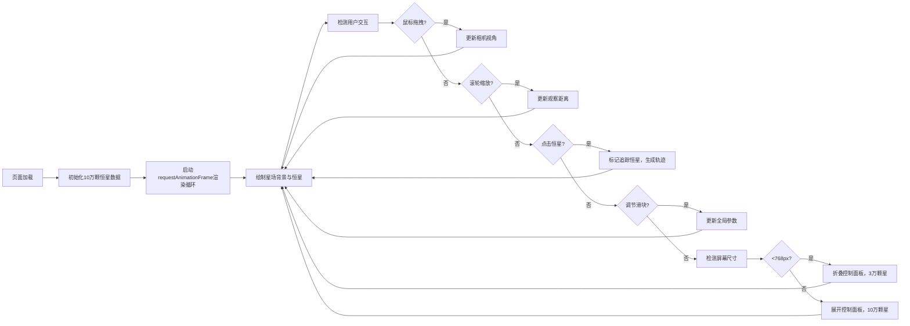

## 1. 产品概述

星尘轨迹是一个沉浸式的三维交互式星图可视化项目，在浏览器中模拟螺旋星系中数十万颗恒星的分布与运动。用户可以自由探索宇宙空间，标记并追踪特定恒星的运行轨迹，获得直观的天体运动体验。

- 核心价值：将抽象的天文数据转化为直观可交互的视觉体验，让用户沉浸式感受星系的动态之美
- 目标用户：天文爱好者、教育工作者、视觉艺术爱好者
- 产品定位：轻量级Web端3D天文可视化应用，兼具教育意义与艺术观赏性

## 2. 核心功能

### 2.1 功能模块

1. **星场渲染模块**：生成并渲染10万颗恒星，实现螺旋星系旋转效果，支持景深与光晕视觉效果
2. **轨迹追踪模块**：点击恒星标记追踪对象，生成3D贝塞尔曲线轨迹，展示未来运动路径与动画节点
3. **交互控制模块**：鼠标拖拽旋转视角、滚轮缩放、点击选中恒星
4. **参数调节模块**：控制面板提供旋转速度、闪烁幅度、轨迹时长三个可调参数
5. **响应式适配模块**：自动适配不同屏幕尺寸，移动端优化恒星数量与控制面板布局

### 2.2 页面详情

| 页面名称 | 模块名称 | 功能描述 |
|---------|---------|---------|
| 主页面 | 3D星场画布 | 全屏Canvas渲染星系，支持鼠标拖拽旋转、滚轮缩放、点击选星 |
| 主页面 | 轨迹绘制层 | 在恒星上叠加3D贝塞尔轨迹线与滑动光效节点 |
| 主页面 | 控制面板 | 左下角半透明面板，包含三个参数调节滑块 |
| 主页面 | 移动端适配层 | 小屏幕下控制面板折叠为图标按钮，恒星数量降至3万颗 |

## 3. 核心流程

### 3.1 用户操作流程

用户进入页面后，首先看到深邃的螺旋星系在缓慢旋转。可以通过鼠标拖拽改变观察视角，滚轮缩放观察距离。当发现感兴趣的恒星时，点击该恒星即可标记为追踪对象，此时会从恒星位置延伸出一条带渐变尾迹的红色轨迹线，展示该恒星未来的运行路径，轨迹线上有发光圆点沿路径滑行。用户可以通过左下角控制面板调整星系旋转速度、恒星闪烁幅度和轨迹预测时长。在移动端，控制面板会自动折叠为图标按钮以节省屏幕空间。

### 3.2 流程图

## 4. 用户界面设计

### 4.1 设计风格

- **设计主题**：深邃太空科幻风
- **主色调**：纯黑 `#000000` 到深蓝 `#0B1D3A` 径向渐变背景
- **强调色**：珊瑚红 `#FF6B6B`（用于轨迹线、滑块圆点、发光节点）
- **恒星色**：白色 `#FFFFFF`、淡蓝 `#9AC4F8`
- **UI色**：半透明深蓝面板 `rgba(10,20,40,0.7)`，边框 `#1A3A5C`
- **文字色**：浅灰白 `#E0E0E0`
- **光晕效果**：近处恒星 `boxShadow: 0 0 6px rgba(255,255,255,0.4)`，轨迹节点 `boxShadow: 0 0 10px #FF6B6B`
- **交互反馈**：滑块悬停、拖拽时的微动画，恒星选中时的闪烁增强

### 4.2 页面设计概览

| 页面名称 | 模块名称 | UI元素 |
|---------|---------|---------|
| 主页面 | 3D星场 | 径向渐变背景、10万颗大小2-5px的恒星、螺旋旋转运动、近处2px光晕、深度分层 |
| 主页面 | 轨迹系统 | 1.5px宽3D贝塞尔曲线、`#FF6B6B`到透明渐变、6px发光圆点沿轨迹每2秒出现 |
| 主页面 | 控制面板 | 240×200px圆角16px半透明面板、1px深蓝边框、三个细长滑块(180×6px)、14px珊瑚红滑块圆点、右侧12px数值显示 |
| 主页面 | 移动端面板 | 圆形折叠按钮、点击展开浮窗模式、3万颗恒星优化 |

### 4.3 响应式设计

- **设计策略**：桌面端优先，移动端自适应
- **断点**：768px
- **桌面端（≥768px）**：完整展示控制面板，10万颗恒星，完整交互体验
- **移动端（<768px）**：控制面板折叠为右下角圆形图标按钮，点击后以浮窗形式展开；恒星数量动态降至3万颗以保证流畅度；支持触摸手势操作
- **触摸优化**：支持双指缩放、单指拖拽旋转

### 4.4 3D场景指引

- **环境氛围**：纯黑到深蓝径向渐变，模拟深邃宇宙空间，无额外光源，恒星自发光
- **相机设置**：透视投影，初始距离居中，可通过交互在合理范围内缩放
- **运动系统**：每颗恒星以0.01-0.03rad/s极慢角速度绕中心旋转，形成螺旋星系效果
- **景深效果**：近处恒星带柔和光晕，远处恒星无光晕，通过大小差异强化空间感
- **交互反馈**：鼠标悬停恒星时轻微放大，点击选中时高亮闪烁
- **性能优化**：使用Canvas 2D模拟3D透视，requestAnimationFrame渲染循环，目标帧率≥45FPS
