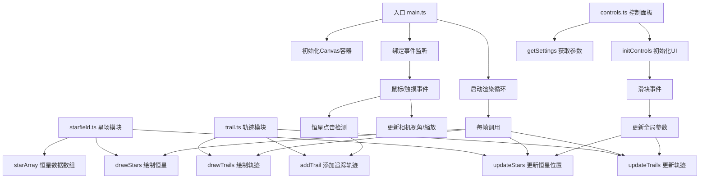

## 1. 架构设计

本项目采用纯前端Canvas 2D实现3D透视效果的模块化架构，通过requestAnimationFrame驱动高效渲染循环，各模块职责单一，数据流向清晰。



## 2. 技术描述

- **前端框架**：无框架，原生TypeScript + HTML5 Canvas 2D API
- **构建工具**：Vite 5.x（esbuild目标es2020）
- **开发语言**：TypeScript 5.x（严格模式，target ES2020）
- **包管理器**：npm
- **核心依赖**：
  - `vite` - 构建工具与开发服务器
  - `typescript` - 类型系统
  - `@types/node` - Node.js类型定义

**技术选型说明**：
- 采用Canvas 2D而非WebGL/Three.js：10万级粒子在Canvas 2D上通过优化可以达到45+FPS，且开发成本更低，兼容性更好
- 3D效果通过透视投影算法手动实现：每颗恒星维护3D坐标，渲染时通过焦距和Z轴深度计算屏幕坐标与缩放比例
- 无额外UI框架：控制面板使用原生DOM + CSS实现，减少包体积与运行时开销

## 3. 核心数据结构

### 3.1 恒星数据结构

```typescript
interface Star {
  id: number;           // 唯一标识符
  x: number;            // 3D X坐标
  y: number;            // 3D Y坐标
  z: number;            // 3D Z坐标
  radius: number;       // 原始半径 (2-5px)
  color: string;        // 颜色: #FFFFFF 或 #9AC4F8
  angularSpeed: number; // 角速度 (0.01-0.03 rad/s)
  angle: number;        // 当前旋转角度
  orbitRadius: number;  // 轨道半径
  height: number;       // 星系盘高度偏移
  twinklePhase: number; // 闪烁相位
}
```

### 3.2 轨迹数据结构

```typescript
interface Trail {
  starId: number;           // 关联恒星ID
  controlPoints: {          // 贝塞尔曲线控制点 (3D坐标)
    p0: { x: number; y: number; z: number };
    p1: { x: number; y: number; z: number };
    p2: { x: number; y: number; z: number };
    p3: { x: number; y: number; z: number };
  };
  duration: number;         // 预测时长 (秒)
  startTime: number;        // 创建时间戳
  nodes: TrailNode[];       // 轨迹节点
}

interface TrailNode {
  offset: number;           // 时间偏移 (秒)
  progress: number;         // 沿轨迹进度 (0-1)
}
```

### 3.3 全局设置

```typescript
interface Settings {
  rotationSpeed: number;    // 星图旋转速度 (0-0.1 rad/s, 默认0.03)
  twinkleAmount: number;    // 恒星闪烁幅度 (0-5px, 默认2px)
  trailDuration: number;    // 轨迹预测时长 (2-20秒, 默认12秒)
  starCount: number;        // 恒星数量 (桌面100000, 移动30000)
  isMobile: boolean;        // 是否移动端
}
```

### 3.4 相机状态

```typescript
interface Camera {
  rotationX: number;        // X轴旋转角度
  rotationY: number;        // Y轴旋转角度
  zoom: number;             // 缩放系数
  focalLength: number;      // 焦距
}
```

## 4. 核心算法

### 4.1 3D透视投影

```
屏幕X = 中心X + (X * 焦距) / (Z + 焦距) * 缩放
屏幕Y = 中心Y + (Y * 焦距) / (Z + 焦距) * 缩放
屏幕大小 = 原始大小 * 焦距 / (Z + 焦距) * 缩放
```

### 4.2 三维旋转变换

```
绕Y轴旋转:
x' = x * cos(θ) - z * sin(θ)
z' = x * sin(θ) + z * cos(θ)

绕X轴旋转:
y' = y * cos(φ) - z' * sin(φ)
z'' = y * sin(φ) + z' * cos(φ)
```

### 4.3 三次贝塞尔曲线

```
B(t) = (1-t)³·P0 + 3(1-t)²t·P1 + 3(1-t)t²·P2 + t³·P3, t∈[0,1]
```

### 4.4 螺旋星系分布算法

```
// 基于斐波那契螺旋分布生成恒星初始位置
for each star:
  angle = index * 2.39996 (黄金角)
  radius = sqrt(index) * scale
  x = radius * cos(angle)
  y = (random - 0.5) * height
  z = radius * sin(angle)
```

## 5. 文件结构

```
d:\Pro\tasks\auto231\
├── .trae\
│   └── documents\
│       ├── PRD-星尘轨迹交互式星图.md
│       └── TECH-星尘轨迹技术架构.md
├── package.json          # 依赖与脚本配置
├── vite.config.js        # Vite构建配置
├── tsconfig.json         # TypeScript配置
├── index.html            # HTML入口
└── src\
    ├── main.ts           # 应用入口，渲染循环
    ├── starfield.ts      # 星场数据管理与更新
    ├── trail.ts          # 轨迹生成、更新与绘制
    └── controls.ts       # 控制面板UI与事件绑定
```

## 6. 性能优化策略

### 6.1 渲染优化

1. **分层渲染**：先绘制背景渐变，再按Z轴深度从远到近绘制恒星，最后绘制轨迹线
2. **离屏缓冲**：背景渐变使用离屏Canvas预渲染，避免每帧重复计算
3. **批量绘制**：相同颜色的恒星批量调用fillRect减少API调用次数
4. **视野剔除**：Z轴深度超过阈值的恒星不渲染

### 6.2 计算优化

1. **对象池**：轨迹节点复用对象，避免频繁GC
2. **三角函数缓存**：预计算旋转矩阵，每帧只计算一次
3. **简化碰撞检测**：点击检测使用网格空间划分，减少遍历次数

### 6.3 移动端优化

1. **恒星数量降级**：从10万降至3万
2. **轨迹复杂度降低**：贝塞尔曲线采样点减少
3. **光晕效果简化**：移动端禁用部分光晕效果

### 6.4 帧率保障

- 目标帧率：≥45FPS
- 监控策略：每5秒统计平均帧率
- 动态降级：帧率持续低于45FPS时自动减少恒星数量10%
- 使用`performance.now()`实现高精度时间步进，保证动画速度一致

## 7. 性能预算

| 资源 | 预算 |
|------|------|
| 首屏加载 | < 200KB |
| JavaScript | < 50KB |
| 内存占用 | < 100MB |
| 桌面端帧率 | ≥ 60FPS |
| 移动端帧率 | ≥ 45FPS |
