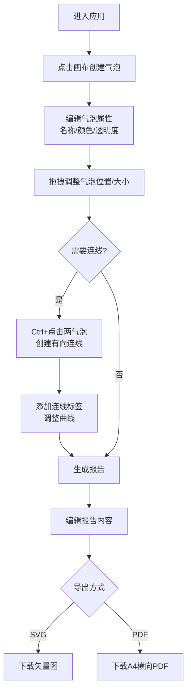

## 1. 产品概述

SiteBubble 是一款面向建筑师与景观设计师的场地分析气泡图编辑器，解决概念设计阶段手动绘制气泡图精度低、方案调整后报告需重写、图与报告缺乏联动的核心痛点。

- **核心价值**：快速可视化场地分区、自动生成关联分析报告、图-文联动同步更新
- **目标用户**：建筑师、景观设计师、城市规划师、设计专业学生
- **市场定位**：轻量级概念设计工具，替代传统手绘气泡图与 Word 报告的分散工作流

## 2. 核心功能

### 2.1 用户角色

| 角色 | 注册方式 | 核心权限 |
|------|----------|----------|
| 设计师用户 | 无需注册，浏览器直用 | 创建/编辑气泡、绘制连线、生成报告、导出文件 |

### 2.2 功能模块

1. **气泡图画布编辑器**：无限延展网格画布、气泡创建与属性编辑、气泡拖拽与缩放、选中状态与旋转手柄
2. **关联连线与标注系统**：有向箭头连线创建、连线标签编辑、贝塞尔曲线控制点调节、样式配置
3. **场地适应性报告生成器**：一键生成200-300字报告、分区建议/动线评价/生态敏感性分析、卡片式可编辑展示
4. **文件导出模块**：SVG矢量图导出、A4横向PDF导出（画布60%+报告40%）

### 2.3 页面详情

| 页面名称 | 模块名称 | 功能描述 |
|----------|----------|----------|
| 主工作台 | 左侧工具栏 | 工具选择（选择/气泡/连线/导出SVG/导出PDF）、图标悬停放大动画 |
| 主工作台 | 中央画布区 | 浅灰网格背景、无限延展、气泡渲染、连线渲染、鼠标交互 |
| 主工作台 | 右侧面板区 | 气泡属性编辑（名称/颜色/透明度）、报告生成按钮、报告卡片展示与编辑 |
| 主工作台 | 气泡组件 | 名称显示、拖拽移动、尺寸手柄、颜色选择弹窗、选中边框与旋转手柄 |
| 主工作台 | 连线组件 | 有向箭头渲染、贝塞尔曲线、标签弹窗、Shift拖拽控制点调节 |

## 3. 核心流程

### 3.1 主工作流程

用户进入应用 → 在画布上点击创建气泡 → 编辑气泡名称/颜色/透明度 → Ctrl+点击两个气泡创建连线 → 添加连线标签 → 拖拽调整布局 → 点击生成报告 → 编辑报告内容 → 导出SVG或PDF

## 4. 用户界面设计

### 4.1 设计风格

- **主色调**：深蓝 `#1A365D` 用于主按钮与工具栏、浅灰 `#F8F9FA` 用于页面底色
- **强调色**：墨绿 `#2F855A` 用于功能强调按钮
- **辅助色板**：12色气泡调色板 `#4A90D9 #50C878 #FF6B6B #FFD93D #C084FC #FF8C42 #6BCB77 #A0D2DB #F4A261 #E76F51 #264653 #2A9D8F`
- **画布背景**：`#F0F2F5` 带 1px `#DADDE1` 网格线，间距 40px
- **按钮样式**：18px 字号深蓝背景白色文字，悬停 `#2B6CB0`，圆角设计
- **字体**：使用现代无衬线字体，气泡标签11px，报告正文13-14px
- **布局风格**：三栏固定布局（左工具栏60px / 中画布自适应 / 右面板320px），卡片式面板（16px圆角，1px边框）
- **图标风格**：线性简洁图标，24px尺寸

### 4.2 交互动效

- **气泡创建**：0→1 缩放动画 0.25s `cubic-bezier(0.34, 1.56, 0.64, 1)`
- **工具栏图标**：悬停放大1.15倍，0.2s `ease-out`
- **报告生成**：从底部向上淡入 0.4s
- **拖拽响应**：≤16ms 延迟，流畅承载50气泡+80连线

### 4.3 页面设计概览

| 页面区域 | 模块名称 | UI 元素 |
|----------|----------|---------|
| 左侧工具栏 | 工具按钮 | 60px宽固定、24px图标、悬停放大过渡、深蓝`#1A365D`底色 |
| 中央画布 | 网格背景 | `#F0F2F5`底、40px间距网格、1px`#DADDE1`线 |
| 中央画布 | 气泡组件 | 圆形、名称8字符上限、右下尺寸手柄、选中2px深灰虚线边框 |
| 中央画布 | 连线组件 | 1.5px`#6C757D`实线、箭头指向目标、白色半透明圆角标签 |
| 右侧面板 | 属性编辑 | 名称输入框、12色调色板、20%-80%透明度滑块 |
| 右侧面板 | 报告区域 | 18px深蓝"生成报告"按钮、浅色卡片展示、支持段落编辑 |

### 4.4 响应式适配

- **设计优先**：桌面端优先（Desktop-first）
- **宽屏适配**：1920px以上画布区域自动扩展，工具栏与面板尺寸固定
- **标准屏**：1440px正常显示，画布比例保持
- **最小宽度**：建议最小视口1280px以保证三栏布局可用

## 5. 性能指标

| 指标 | 目标值 |
|------|--------|
| 最大气泡数 | 50个流畅渲染 |
| 最大连线数 | 80条流畅渲染 |
| 拖拽响应延迟 | ≤16ms |
| 报告生成时间 | ≤300ms |
| 首次加载时间 | ≤2s |
