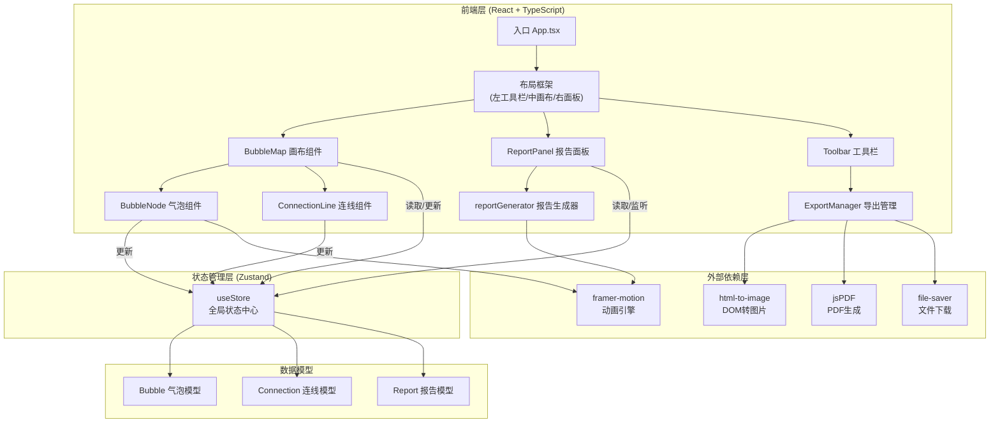

## 1. 架构设计



## 2. 技术说明

| 分类 | 技术选型 | 版本 | 用途说明 |
|------|----------|------|----------|
| **核心框架** | React | ^18.2 | UI组件化开发 |
| **类型系统** | TypeScript | ^5.0 | 静态类型检查 |
| **构建工具** | Vite | ^5.0 | 快速构建与开发服务器 |
| **Vite插件** | @vitejs/plugin-react | ^4.0 | React JSX支持 |
| **状态管理** | Zustand | ^4.4 | 轻量级全局状态，气泡/连线数据 |
| **动画引擎** | framer-motion | ^11.0 | 拖拽、缩放、过渡动画 |
| **图片渲染** | html-to-image | ^1.11 | 导出SVG/PDF时捕获画布DOM |
| **PDF生成** | jspdf | ^2.5 | A4横向PDF文档生成 |
| **文件下载** | file-saver | ^2.0 | 触发浏览器文件下载 |
| **类型定义** | @types/react | ^18.2 | React类型 |
| **类型定义** | @types/react-dom | ^18.2 | ReactDOM类型 |

### 初始化方式
```bash
npm create vite@latest . -- --template react-ts
npm install zustand framer-motion html-to-image jspdf file-saver
npm install -D @types/file-saver
```

## 3. 路由定义

本项目为单页应用（SPA），无前端路由跳转，单页面完成全部功能。

| 路径 | 用途 |
|------|------|
| `/` (根路径) | 主工作台页面，三栏布局完整功能页 |

## 4. 数据模型

### 4.1 气泡 (Bubble)

```typescript
interface Bubble {
  id: string;            // UUID 唯一标识
  x: number;             // 画布坐标 X
  y: number;             // 画布坐标 Y
  diameter: number;      // 直径 (60-160px)
  name: string;          // 名称 (最多8字符)
  color: string;         // 填充色 (12色调色板中)
  opacity: number;       // 透明度 (0.2-0.8)
  rotation: number;      // 旋转角度 (预留)
  createdAt: number;     // 创建时间戳
}
```

### 4.2 连线 (Connection)

```typescript
interface Connection {
  id: string;                        // UUID
  sourceId: string;                  // 源气泡ID
  targetId: string;                  // 目标气泡ID
  label: string;                     // 标签文字 (强相关/弱链接/冲突等)
  style: 'straight' | 'bezier';      // 线型
  controlPointOffset?: {             // 贝塞尔控制点偏移
    x1: number;
    y1: number;
    x2: number;
    y2: number;
  };
  color: string;                     // 线条颜色 (默认#6C757D)
  width: number;                     // 线宽 (默认1.5px)
}
```

### 4.3 报告 (Report)

```typescript
interface Report {
  id: string;
  content: {
    zoning: string;       // 场地分区建议
    circulation: string;  // 动线组织评价
    ecology: string;      // 生态敏感性初判
  };
  generatedAt: number;    // 生成时间
  manuallyEdited: boolean;
}
```

### 4.4 拖拽/交互状态

```typescript
interface InteractionState {
  mode: 'select' | 'create' | 'connect';
  selectedBubbleId: string | null;
  selectedConnectionId: string | null;
  isDragging: boolean;
  isResizing: boolean;
  connectingFromId: string | null;
}
```

## 5. 文件组织结构

```
d:\Pro\tasks\auto232\
├── index.html                          # Vite 入口 HTML
├── package.json                        # 依赖与脚本
├── vite.config.js                      # Vite 配置（含@路径别名）
├── tsconfig.json                       # TypeScript 配置（严格模式 ES2020）
└── src/
    ├── main.tsx                        # React 挂载入口
    ├── App.tsx                         # 应用根组件（布局框架）
    ├── store.ts                        # Zustand 全局状态管理
    ├── types.ts                        # TypeScript 类型定义
    ├── constants.ts                    # 常量（调色板、默认值）
    ├── reportGenerator.ts              # 报告生成纯函数模块
    ├── exportUtils.ts                  # SVG/PDF 导出工具函数
    ├── BubbleMap.tsx                   # 气泡图主画布组件
    ├── BubbleNode.tsx                  # 单个气泡组件
    ├── ConnectionLine.tsx              # 连线组件
    ├── ReportPanel.tsx                 # 右侧报告面板组件
    ├── Toolbar.tsx                     # 左侧工具栏组件
    ├── Tooltip.tsx                     # 颜色选择器等通用弹窗
    └── index.css                       # 全局样式与 CSS 变量
```

## 6. 核心算法与规则

### 6.1 报告生成规则 (reportGenerator)

| 规则项 | 计算方式 |
|--------|----------|
| **面积占比分析** | 每个气泡直径对应的圆面积 / 所有气泡面积之和 → 判定主要功能区与次要功能区 |
| **关联强度分析** | 连线标签含"强相关"/"高"→+2分，含"中"→+1分，含"弱"/"冲突"→-1分 → 分区联动评级 |
| **情感指数映射** | 蓝色→理性/秩序、绿色→生态/自然、红色→警示/冲突、黄色→活力/公共、紫色→文化/艺术、橙色→商业/活力 → 分区性格标签 |
| **动线组织评价** | 连线总数 / 气泡数 ≥1.5 → 动线丰富，<0.8 → 动线不足，含"冲突"标签 → 存在交叉风险 |
| **生态敏感性初判** | 绿色系气泡面积占比 ≥30% → 生态基底好，红色系占比高且与绿色相连 → 生态冲突风险 |

### 6.2 交互事件映射

| 事件 | 触发条件 | 行为 |
|------|----------|------|
| 创建气泡 | 画布空区域 单击 | 在坐标处生成直径默认值的气泡，播放创建动画，自动选中 |
| 移动气泡 | 气泡内 左键拖拽 | 实时更新x/y坐标，所有关联连线端点跟随更新 |
| 调整大小 | 右下角手柄 拖拽 | 限制直径60-160px，等比例缩放 |
| 选中气泡 | 气泡 单击 | 显示2px深灰虚线边框+旋转手柄 |
| 建立连线 | Ctrl+单击源气泡 → Ctrl+单击目标气泡 | 绘制有向箭头连线，自动计算箭头落点 |
| 编辑连线标签 | 连线 单击 | 在中点显示标签编辑框 |
| 调整贝塞尔 | Shift+拖拽连线上任意点 | 显示两个控制点并实时更新曲线 |
| 删除元素 | 选中后按 Delete 键 | 气泡删除时级联删除所有关联连线 |

## 7. 性能优化策略

1. **Canvas/SVG 混合渲染**：气泡用 DOM(motion.div) 保证交互丰富，连线用 SVG `<path>` 保证绘制性能
2. **状态批量更新**：拖拽过程中使用 `requestAnimationFrame` 节流，单次 RAF 内批量更新所有坐标
3. **Selector 精确订阅**：Zustand 使用 `useStore(selector)` 减少不必要重渲染
4. **连线缓存**：贝塞尔曲线路径字符串 memoized，仅控制点变化时重算
5. **虚拟边界限制**：画布设置合理边界（如 ±10000px），防止过度平移导致性能下降
