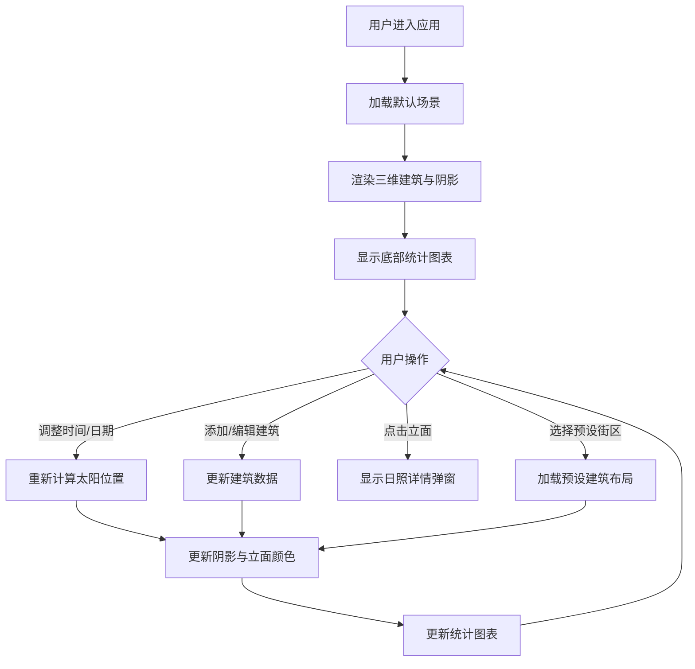

## 1. 产品概述

本应用是一个面向城市设计专业学生的三维城市日照模拟与街区阴影分析工具，帮助用户直观理解不同建筑布局下的日照时长与遮挡关系，辅助优化建筑布局和公共空间设计。

- 核心价值：将复杂的日照模拟计算转化为直观的三维可视化结果，支持实时交互调整
- 目标用户：城市设计、建筑学专业学生及设计师
- 市场价值：填补教学与设计实践中日照分析可视化工具的空白

## 2. 核心功能

### 2.1 用户角色

| 角色 | 注册方式 | 核心权限 |
|------|---------|---------|
| 普通用户 | 无需注册 | 使用全部模拟与分析功能 |

### 2.2 功能模块

1. **三维场景模块**：建筑体块渲染、阴影投影、地面网格、相机交互
2. **建筑编辑模块**：预设街区选择、自由放置建筑、高度调整、删除操作
3. **日照模拟模块**：太阳位置计算、外立面日照时长计算、颜色渐变可视化
4. **统计分析模块**：街区平均日照柱状图、阴影覆盖率饼图
5. **控制面板模块**：日期时间调整、经纬度设置、建筑参数控制

### 2.3 页面详情

| 页面名称 | 模块名称 | 功能描述 |
|---------|---------|---------|
| 主页面 | 三维场景 | 渲染建筑体块、阴影、地面网格，支持旋转缩放交互 |
| 主页面 | 左侧控制面板 | 预设街区选择、建筑添加工具、操作说明 |
| 主页面 | 右侧控制面板 | 日期滑块、时间滑块、经纬度输入、建筑高度调整 |
| 主页面 | 底部统计栏 | 平均日照柱状图、阴影覆盖率饼图 |
| 主页面 | 立面信息弹窗 | 显示选中外立面的日照小时数和光照曲线 |

## 3. 核心流程

用户进入应用后，默认加载预设的城市街区场景。用户可以：
1. 通过左侧面板选择不同的预设街区布局
2. 在地面上点击放置新建筑
3. 选中建筑后通过右侧滑块调整高度或删除
4. 调整日期和时间滑块，实时观察阴影变化
5. 点击建筑立面查看详细日照数据
6. 底部图表自动更新统计数据

## 4. 用户界面设计

### 4.1 设计风格

- **设计基调**：深色科技风，营造专业数据可视化氛围
- **主背景**：#0F141E 深海军蓝
- **面板背景**：#1A2236 半透明玻璃效果（rgba(26,34,54,0.85)）
- **主题色**：#4FC3F7 亮青色（滑块、按钮、高亮）
- **文字颜色**：#E0E6F0 浅蓝灰色
- **日照渐变色**：#1A1A40（0小时，深紫）→ #FFD700（12小时，亮黄）
- **边框颜色**：#2A3A5C 深灰蓝
- **字体**：JetBrains Mono（等宽字体，用于图表数值），系统无衬线字体（界面文字）

### 4.2 页面设计概述

| 页面名称 | 模块名称 | UI元素 |
|---------|---------|--------|
| 主页面 | 三维场景 | 建筑体块（混凝土纹理）、半透明阴影多边形、地面网格、选中高亮轮廓 |
| 主页面 | 左侧控制面板 | 220px宽，圆角12px，1px边框，预设街区按钮组，放置模式切换 |
| 主页面 | 右侧控制面板 | 280px宽，日期滑块（1月1日-12月31日），时间滑块（6:00-18:00），经纬度输入框，高度滑块（1-10），删除按钮 |
| 主页面 | 底部统计栏 | 220px高，左侧柱状图（recharts），右侧饼图，8px圆角分割 |
| 主页面 | 立面弹窗 | 显示日照小时数（精确到0.1），24小时光照强度折线图 |

**滑块样式**：
- 轨道：高4px，圆角2px，颜色#2A3A5C
- 手柄：14px圆形，#4FC3F7，带2px白色内圈

**按钮样式**：
- 默认背景：#2A3A5C
- 悬停：#4FC3F7
- 点击：亮度降低20%
- 过渡动画：0.2s ease

### 4.3 响应式设计

- **桌面端（≥1024px）**：左侧面板220px，右侧面板280px，底部统计栏220px
- **平板端（<1024px）**：左侧面板收窄为图标式折叠面板，底部统计栏高度150px，支持横向滚动
- **触摸优化**：按钮最小点击区域44px，滑块手柄增大

### 4.4 3D场景设计

- **环境**：深色背景，轻微雾化效果增强空间感
- **光照**：平行光模拟太阳光，根据计算的太阳高度角和方位角实时调整
- **相机**：透视相机，初始位置(30, 25, 30)，目标点(0, 0, 0)，支持OrbitControls旋转缩放
- **材质**：建筑使用MeshStandardMaterial模拟混凝土效果，立面颜色根据日照时长动态调整
- **阴影**：地面接收阴影，建筑投射阴影，阴影多边形半透明黑色#00000040，重叠处加深
- **性能**：帧率保持30fps以上，建筑数量建议控制在50个以内
