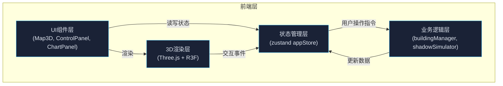

## 1. 架构设计



## 2. 技术描述

- **前端框架**：React@18 + TypeScript@5 + Vite@5
- **3D渲染**：Three.js@0.160 + @react-three/fiber@8 + @react-three/drei@9
- **状态管理**：zustand@4
- **动画**：framer-motion@10
- **图表**：recharts@2
- **构建工具**：Vite@5，配置路径别名@指向src

## 3. 文件结构与调用关系

```
src/
├── main.tsx                    # React入口，挂载App组件
├── App.tsx                     # 根组件，布局组合
├── styles/
│   └── theme.css              # 全局样式，暗色主题
├── store/
│   └── appStore.ts            # zustand全局状态
├── model/
│   ├── buildingManager.ts     # 建筑管理：增删改查
│   └── shadowSimulator.ts     # 阴影与日照计算
├── ui/
│   ├── Map3D.tsx              # 3D场景组件（R3F Canvas）
│   ├── ControlPanel.tsx       # 右侧控制面板
│   ├── LeftToolbar.tsx        # 左侧工具栏
│   ├── ChartPanel.tsx         # 底部统计图表
│   └── FacadePopup.tsx        # 立面详情弹窗
└── types/
    └── index.ts               # TypeScript类型定义
```

**数据流向**：
1. 用户操作（ControlPanel/LeftToolbar/Map3D）→ dispatch action → appStore
2. appStore 状态变化 → 触发 buildingManager 或 shadowSimulator 计算
3. 计算结果 → 写回 appStore
4. appStore 状态变化 → Map3D/ChartPanel 重新渲染

## 4. 数据模型

### 4.1 核心类型定义

```typescript
// 建筑数据
interface Building {
  id: string;
  position: { x: number; y: number; z: number };
  size: { width: number; height: number; depth: number };
  rotation: number; // Y轴旋转角（弧度）
  blockId: string; // 所属街区ID
}

// 立面子数据
interface FacadeData {
  buildingId: string;
  facadeIndex: number; // 0-3: 东南西北
  sunlightHours: number; // 0-12
  hourlyIntensity: number[]; // 24小时光照强度
  color: string; // 渐变颜色
}

// 阴影多边形
interface ShadowPolygon {
  buildingId: string;
  points: { x: number; z: number }[];
}

// 街区统计
interface BlockStats {
  blockId: string;
  blockName: string;
  avgSunlightHours: number;
  shadowCoverage: number; // 0-1
  totalArea: number;
}

// 太阳位置
interface SunPosition {
  altitude: number; // 高度角（弧度）
  azimuth: number; // 方位角（弧度）
}

// 应用状态
interface AppState {
  buildings: Building[];
  selectedBuildingId: string | null;
  selectedFacadeId: string | null;
  date: Date;
  time: number; // 0-24小时
  latitude: number; // 默认31
  longitude: number; // 默认121
  sunPosition: SunPosition;
  facadeData: FacadeData[];
  shadowPolygons: ShadowPolygon[];
  blockStats: BlockStats[];
  isPlacingMode: boolean;
}
```

## 5. 核心算法

### 5.1 太阳位置计算

```
基于日期、时间、经纬度计算：
1. 计算儒略日
2. 计算太阳赤纬角
3. 计算时角
4. 计算太阳高度角 altitude = arcsin(sin(φ)sin(δ) + cos(φ)cos(δ)cos(H))
5. 计算太阳方位角 azimuth
```

### 5.2 立面日照时长计算

```
对每个建筑的每个立面（东南西北）：
1. 逐小时（日出到日落）计算太阳位置
2. 判断该立面是否朝向太阳（法线与太阳方向夹角 < 90°）
3. 检查是否被其他建筑遮挡（射线检测）
4. 累计无遮挡的日照小时数
5. 根据时长映射到颜色渐变
```

### 5.3 阴影多边形计算

```
对每个建筑：
1. 获取建筑底部四个角点
2. 根据太阳高度角和方位角计算投影
3. 生成阴影多边形顶点
4. 支持多边形叠加显示
```

## 6. 性能优化策略

1. **阴影计算缓存**：建筑数据不变时，缓存日照计算结果
2. **Web Worker**：复杂计算（逐小时日照采样）在Worker中执行
3. **渲染优化**：使用InstancedMesh渲染大量建筑
4. **节流处理**：滑块拖动时使用requestAnimationFrame节流
5. **LOD**：远景建筑使用简化模型

## 7. 性能指标

- 三维场景帧率：≥30fps
- 阴影计算更新：≤100ms
- 图表数据更新：≤50ms
- 建筑数量支持：≤50个建筑流畅运行
