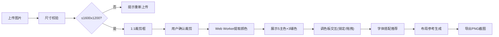

## 1. 产品概述

书籍装帧设计灵感板与配色提取应用，为设计师和出版从业者提供从书籍封面图片中自动提取配色方案，并生成字体搭配、排版示例的一站式视觉参考工具。

- 核心功能：图片上传裁剪 → 颜色智能提取 → 调色板交互管理 → 字体搭配推荐 → 排版布局参考 → 灵感板导出
- 目标用户：书籍设计师、封面设计师、出版编辑、视觉设计师
- 产品价值：将配色提取、字体选择、排版参考整合为高效工作流，大幅缩短书籍装帧设计前期的灵感搜集时间

## 2. 核心功能

### 2.1 用户角色
| 角色 | 注册方式 | 核心权限 |
|------|---------|----------|
| 访客用户 | 无需注册 | 上传图片、提取颜色、调整调色板、查看灵感板、导出PNG |

### 2.2 功能模块
1. **图片上传与裁剪模块**：拖拽/点击上传、1:1比例裁剪、尺寸限制校验
2. **颜色提取模块**：ColorThief算法提取5主色+3辅色、Web Worker异步处理
3. **调色板交互模块**：色块锁定、拖拽排序、HEX/CMYK值显示
4. **字体搭配模块**：冷暖色调智能推荐3组字体、50字示例渲染
5. **布局参考模块**：3种封面布局缩略图、点击放大预览、左右切换
6. **导出模块**：整板PNG截图、自动命名时间戳

### 2.3 页面详情
| 页面名称 | 模块名称 | 功能描述 |
|---------|---------|----------|
| 主工作区 | 导航栏 | 应用名称展示、导出按钮 |
| 主工作区 | 图片上传区 | 拖拽上传、尺寸校验、进度反馈 |
| 主工作区 | 裁剪预览区 | 1:1裁剪框、拖动调整、确认/取消 |
| 右侧面板 | 调色板区域 | 5主色+3辅色展示、锁定/解锁、拖拽排序 |
| 右侧面板 | 字体搭配区 | 3组字体卡片、渐变背景、悬停动效 |
| 右侧面板 | 布局参考区 | 3种布局缩略图、点击放大、左右切换 |

## 3. 核心流程

用户上传书籍封面图片 → 系统校验尺寸并弹出1:1裁剪框 → 用户调整裁剪范围确认 → Web Worker异步提取5主色3辅色 → 调色板展示支持锁定和拖拽 → 系统根据主色冷暖推荐字体搭配 → 生成3种布局参考缩略图 → 用户调整满意后点击导出 → 生成带时间戳的PNG文件

## 4. 用户界面设计

### 4.1 设计风格
- 主色调：科技蓝 `#4A90D9`（用于主题色、边框高亮）
- 辅助色：珊瑚红 `#FF6B6B`（用于按钮、强调元素）
- 背景色：浅灰 `#F5F5F5`（右侧面板）、米白 `#FAFAFA`（导出背景）、深灰 `#2C2C2C`（导航栏）
- 按钮风格：圆角4px、实心填充、悬停微透明
- 字体：Google Fonts - Playfair Display / Lora / Roboto / Open Sans / Merriweather
- 布局：左右分栏（左65%工作区，右360px面板），桌面端优先
- 图标风格：线性简约图标，SVG实现

### 4.2 页面设计概述
| 页面区域 | 模块名称 | UI元素 |
|---------|---------|--------|
| 顶部导航 | 导航栏 | 深灰背景、白色文字、应用标题居左、导出按钮居右、高度20px |
| 左侧工作区 | 图片上传区 | 虚线边框、拖拽时变实线#4A90D9、背景微亮、过渡0.2s |
| 左侧工作区 | 裁剪预览区 | 1:1裁剪框、拖动手柄、确认/取消按钮 |
| 右侧面板 | 调色板 | 320px宽、主色5个在上辅色3个在下、20x20px圆角色块、HEX+CMYK标注 |
| 右侧面板 | 字体卡片 | 220x180px、12px圆角、渐变背景、悬停上浮8px、0.3s ease-out |
| 右侧面板 | 布局缩略图 | 150x200px、提取色填充背景、白色文字模拟标题、点击放大至70%视口宽 |

### 4.3 响应式
- 桌面端（≥1024px）：左右分栏布局，右侧固定360px宽度
- 平板/移动端（<1024px）：右侧面板变为底部抽屉式，固定高度350px，支持向上滑动展开
- 触摸优化：拖拽区域扩大，点击目标最小44x44px

### 4.4 动效规范
- 色块悬停：放大1.1倍，0.15s过渡
- 字体卡片悬停：上浮8px + 阴影加深，0.3s ease-out
- 上传区拖拽：虚线变实线 + 背景亮度提升，0.2s过渡
- 色块拖拽：半透明克隆跟随指针，松开自动排列
- 抽屉面板：上下滑动动效，0.3s cubic-bezier(0.4, 0, 0.2, 1)
