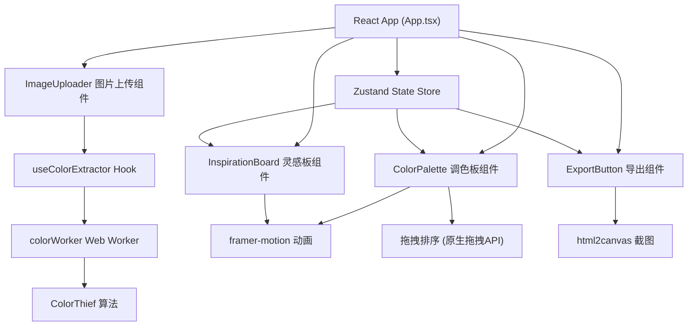

## 1. 架构设计



## 2. 技术描述

- **前端框架**：React@18 + TypeScript@5 + Vite@5
- **状态管理**：Zustand@4（轻量级、无Provider包裹、支持中间件）
- **动画库**：framer-motion@11（React动画、拖拽、过渡效果）
- **颜色提取**：color-thief-react@2（封装ColorThief算法）+ 自定义Web Worker
- **截图导出**：html2canvas@1（DOM转Canvas转PNG）
- **构建工具**：Vite@5 + @vitejs/plugin-react@4
- **类型检查**：TypeScript@5 严格模式（strict: true）
- **样式方案**：原生CSS + CSS变量（避免Tailwind，保持样式语义化）
- **字体加载**：Google Fonts API 动态加载

## 3. 目录结构

```
auto235/
├── package.json
├── vite.config.js
├── tsconfig.json
├── index.html
├── public/
└── src/
    ├── App.tsx              # 主组件，状态管理，组件集成
    ├── main.tsx             # 应用入口
    ├── vite-env.d.ts
    ├── components/
    │   ├── ColorPalette.tsx      # 调色板展示，锁定/拖拽排序
    │   ├── ImageUploader.tsx     # 图片上传，1:1裁剪预览
    │   ├── InspirationBoard.tsx  # 字体搭配，排版布局参考
    │   └── ExportButton.tsx      # PNG导出功能
    ├── hooks/
    │   └── useColorExtractor.ts  # 颜色提取Hook，封装Worker通信
    ├── workers/
    │   └── colorWorker.ts        # Web Worker，异步颜色提取
    ├── store/
    │   └── useDesignStore.ts     # Zustand全局状态管理
    ├── utils/
    │   ├── colorUtils.ts         # HEX转CMYK、冷暖色判断
    │   └── fontUtils.ts          # 字体搭配推荐逻辑
    └── styles/
        └── global.css            # CSS变量、全局样式、布局
```

## 4. 状态管理（Zustand Store）

```typescript
// 颜色项类型
interface ColorItem {
  hex: string;
  cmyk: [number, number, number, number];
  locked: boolean;
  id: string;
}

// 字体搭配类型
interface FontPair {
  titleFont: string;
  bodyFont: string;
  id: string;
}

// 布局类型
interface LayoutOption {
  type: 'text-center' | 'image-top' | 'image-bg';
  id: string;
}

// Store状态
interface DesignState {
  // 图片
  originalImage: string | null;
  croppedImage: string | null;
  
  // 颜色
  primaryColors: ColorItem[];    // 5个主色
  accentColors: ColorItem[];     // 3个辅色
  isExtracting: boolean;
  
  // 字体
  fontPairs: FontPair[];
  
  // 布局
  selectedLayout: string | null;
  expandedLayout: boolean;
  
  // Actions
  setOriginalImage: (img: string | null) => void;
  setCroppedImage: (img: string | null) => void;
  setColors: (primary: ColorItem[], accent: ColorItem[]) => void;
  toggleLockColor: (id: string, type: 'primary' | 'accent') => void;
  reorderColors: (type: 'primary' | 'accent', fromIndex: number, toIndex: number) => void;
  setFontPairs: (pairs: FontPair[]) => void;
  setSelectedLayout: (id: string | null) => void;
  setExpandedLayout: (expanded: boolean) => void;
  reset: () => void;
}
```

## 5. 核心算法

### 5.1 HEX转CMYK算法
```typescript
function hexToCMYK(hex: string): [number, number, number, number] {
  // 1. HEX → RGB (0-255)
  // 2. RGB → CMY (0-1): C=1-R, M=1-G, Y=1-B
  // 3. 计算K = min(C, M, Y)
  // 4. CMYK归一化: C=(C-K)/(1-K), 以此类推
  // 5. 转换为百分比，保留一位小数
}
```

### 5.2 冷暖色判断
```typescript
function isWarmColor(hex: string): boolean {
  // 转为RGB后，计算 (R - B) 的值
  // > 20 判定为暖色（红橙黄调）
  // < -20 判定为冷色（蓝绿紫调）
  // 中间值看 R+G 与 B 的比例
}
```

### 5.3 字体推荐策略
| 主色属性 | 标题字体 | 正文字体 |
|---------|---------|----------|
| 暖色 | Playfair Display | Lora |
| 暖色 | Merriweather | Open Sans |
| 暖色 | Lora | Roboto |
| 冷色 | Roboto | Open Sans |
| 冷色 | Playfair Display | Roboto |
| 冷色 | Open Sans | Merriweather |

### 5.4 颜色提取性能保障
- Web Worker 独立线程运行 ColorThief 算法
- 图片裁剪后压缩至最大 400x400px 再送入提取
- 提取目标：5主色 + 3辅色，quality 参数设为 5
- 超时保护：800ms 未返回则使用降级算法

## 6. 性能指标

| 指标 | 目标值 | 实现方案 |
|------|--------|----------|
| 颜色提取耗时 | ≤ 500ms | Web Worker + 图片压缩 |
| 首屏加载 | ≤ 2s | 代码分割、字体按需加载 |
| 截图导出耗时 | ≤ 3s | html2canvas 优化 scale=2 |
| 交互响应 | ≤ 100ms | framer-motion GPU加速 |
| 包体大小 | ≤ 300KB gzip | 按需引入、Tree Shaking |

## 7. 关键依赖版本

```json
{
  "react": "^18.2.0",
  "react-dom": "^18.2.0",
  "zustand": "^4.5.2",
  "framer-motion": "^11.0.0",
  "color-thief-react": "^2.1.0",
  "html2canvas": "^1.4.1",
  "vite": "^5.2.0",
  "typescript": "^5.4.0"
}
```
