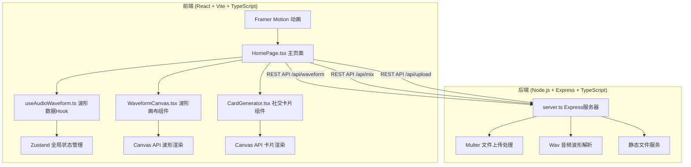
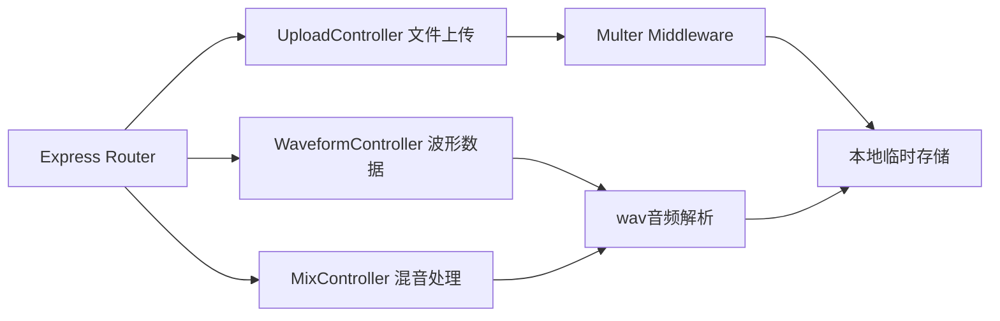

## 1. 架构设计



## 2. 技术说明

- **前端**：React 18 + TypeScript + Vite + Zustand(状态管理) + Framer Motion(动画) + React Router DOM
- **构建工具**：Vite，配置代理转发至后端3001端口
- **后端**：Node.js + Express + TypeScript + Multer(文件上传) + wav(音频解析) + qrcode(二维码生成)
- **前后端通信**：Axios HTTP客户端
- **无数据库设计**：文件临时存储在内存或本地临时目录

## 3. 路由定义

| 路由 | 用途 |
|------|------|
| / | 主工作台页面，包含所有核心功能 |

## 4. API 定义

### 4.1 类型定义

```typescript
// 波形数据点
interface WaveformData {
  amplitude: number[];  // 归一化振幅值数组 0-1
  duration: number;     // 音频时长(秒)
  sampleRate: number;   // 采样率
}

// 裁剪片段
interface AudioClip {
  id: string;
  startTime: number;    // 起始时间(秒)
  endTime: number;      // 结束时间(秒)
  color: string;        // 音轨颜色
  audioUrl: string;     // 音频URL
}

// 混音请求
interface MixRequest {
  clips: Array<{
    audioFile: string;
    startTime: number;
    endTime: number;
  }>;
}

// 社交卡片数据
interface SocialCardData {
  title: string;        // 标题(最多20字符)
  author: string;       // 作者名
  shareUrl: string;     // 分享链接(二维码内容)
  waveformData: number[]; // 波形缩略数据
  primaryColor: string; // 主色调
}
```

### 4.2 API 接口

| 方法 | 路径 | 请求 | 响应 | 描述 |
|------|------|------|------|------|
| POST | /api/upload | multipart/form-data (file: audio file, ≤10MB) | `{ fileId, audioUrl, duration }` | 上传音频文件 |
| GET | /api/waveform | `?fileId=xxx&points=1000` | `WaveformData` | 获取波形数据数组 |
| POST | /api/mix | `MixRequest` | `{ mixedUrl, waveformData }` | 混音并返回混合音频URL和波形 |

## 5. 服务端架构图



## 6. 项目文件结构

```
.
├── package.json              # 主项目依赖与脚本
├── vite.config.js            # Vite构建配置
├── tsconfig.json             # TypeScript严格模式配置
├── index.html                # 入口HTML
├── server/
│   └── src/
│       └── server.ts         # 后端Express服务器入口
└── client/
    └── src/
        ├── pages/
        │   └── HomePage.tsx      # 主工作台页面
        ├── hooks/
        │   └── useAudioWaveform.ts  # 波形数据获取与处理Hook
        └── components/
            ├── WaveformCanvas.tsx    # Canvas波形渲染组件
            └── CardGenerator.tsx     # Canvas社交卡片组件
```
