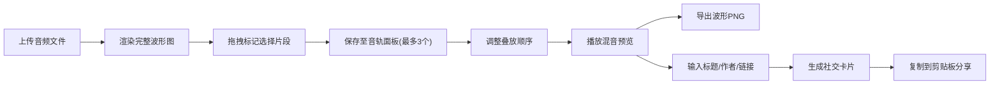

## 1. 产品概述

音频混音与社交卡片生成工具，为音乐爱好者和播客主提供快速制作混音片段、自动生成波形可视化与可分享社交卡片的一站式解决方案。

- 解决手动剪辑音频效率低、单独制作波形图繁琐、分享内容缺乏视觉吸引力导致点击率低的核心痛点
- 目标用户：音乐创作者、播客主播、音频内容创作者、社交媒体运营者

## 2. 核心功能

### 2.1 用户角色

| 角色 | 注册方式 | 核心权限 |
|------|----------|----------|
| 普通用户 | 无需注册 | 上传音频、剪辑混音、导出波形、生成并分享社交卡片 |

### 2.2 功能模块

1. **首页（主工作台）**：音频上传区域、波形预览画布、音轨管理面板、社交卡片生成预览区

### 2.3 页面详情

| 页面名称 | 模块名称 | 功能描述 |
|----------|----------|----------|
| 首页 | 顶部工具栏 | 半透明固定导航栏，展示应用logo和操作快捷入口 |
| 首页 | 音频上传区 | 拖拽上传MP3/WAV文件（≤10MB），上传后即时渲染波形 |
| 首页 | 波形画布 | 渲染完整波形图，支持裁剪标记拖拽、实时播放进度显示、悬停显示时间戳与振幅 |
| 首页 | 音轨面板 | 最多保存3个裁剪片段，支持上下拖拽调整叠放顺序，独立颜色标识，混音播放控制 |
| 首页 | 社交卡片预览 | 输入标题（≤20字符）和作者名，预览600x400px卡片，含渐变背景、波形缩略图、二维码 |
| 首页 | 导出功能 | 一键导出波形PNG（1024x300px）、一键复制社交卡片到剪贴板 |

## 3. 核心流程

用户上传音频文件 → 系统渲染完整波形图 → 用户拖拽标记选择片段 → 保存片段至音轨面板（最多3个） → 调整音轨叠放顺序 → 播放混音预览 → 导出波形PNG → 输入标题、作者、分享链接 → 生成社交卡片 → 复制卡片到剪贴板分享

## 4. 用户界面设计

### 4.1 设计风格

- **主色调**：深色主题，主背景 `#1E1E24`，波形渐变 `#6A5ACD → #FF6347`，金色高亮 `#FFD700`
- **音轨色**：`#4A90D9`、`#50C878`、`#FF6F61`
- **按钮样式**：圆角8px，字体14px，悬停时box-shadow微弱发光效果
- **卡片/对话框**：半透明磨砂玻璃 `rgba(255,255,255,0.08)`，14px圆角
- **字体**：现代无衬线字体，搭配独特显示字体提升视觉品质
- **动效**：所有操作反馈0.2s缓动动画

### 4.2 页面设计概览

| 页面名称 | 模块名称 | UI元素 |
|----------|----------|----------|
| 首页 | 顶部工具栏 | 20px高半透明固定栏，应用标识，无干扰设计 |
| 首页 | 波形区域 | 浅灰`#E0E0E0`背景，渐变柱形波形（2px宽，1px间距），圆形拖拽手柄（16px直径，激活金色），半透明金色选中区 |
| 首页 | 音轨面板 | 3个80px高圆角8px音轨卡片，独立颜色，上下拖拽排序，播放按钮 |
| 首页 | 卡片预览 | 600x400px渐变背景卡片，左上角标题作者，中央波形缩略图，右下角二维码，随机±2°旋转 |

### 4.3 响应式设计

- 桌面端优先：左侧波形区55%，右侧面板35%
- 断点：768px以下自动切换为垂直堆叠布局
- 触摸优化：拖拽区域放大、按钮最小触控尺寸

### 4.4 性能指标

- 波形渲染完成时间 ≤ 1.2秒
- 混音播放时波形更新帧率 ≥ 40fps
