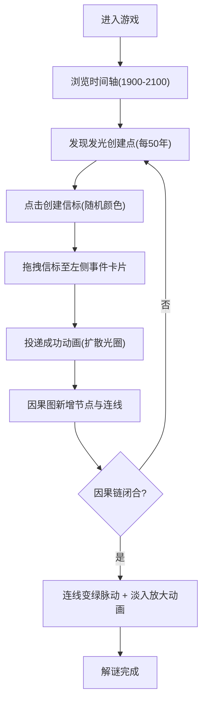

## 1. 产品概述
微型时空裂隙投递与因果重组解谜游戏，玩家扮演时间管理局特工修复错乱历史。通过在时间轴上投递修正信标到历史事件节点，重组因果网络图消除悖论。
- 核心目的：提供基于时间旅行概念的策略解谜体验
- 目标用户：喜欢解谜、策略、时间旅行科幻主题的玩家
- 产品价值：将抽象的因果逻辑通过可视化交互呈现，兼具教育性与娱乐性

## 2. 核心功能

### 2.1 用户角色
| 角色 | 注册方式 | 核心权限 |
|------|---------|----------|
| 时间特工 | 无需注册，直接进入 | 操作时间轴、创建投递信标、调整因果网络 |

### 2.2 功能模块
1. **时间轴模块**：横向时间轴展示1900-2100年，信标创建点，滚动浏览
2. **信标系统**：点击发光点创建信标，拖拽投递到事件节点，投递动画
3. **历史事件列表**：左侧展示可投递的历史事件卡片
4. **因果网络图**：右侧动态生成事件节点与因果连线，力导向布局，可拖拽调整
5. **全局状态管理**：信标状态、投递关系、网络图数据

### 2.3 页面详情
| 页面名称 | 模块名称 | 功能描述 |
|---------|---------|----------|
| 主界面 | 左栏-历史事件列表 | 展示事件卡片，悬停高亮放大，作为信标投递目标 |
| 主界面 | 中栏-时间轴画布 | 年代刻度、发光创建点、水平滚动、缩放、拖拽信标 |
| 主界面 | 右栏-因果网络图 | 力导向布局节点、贝塞尔曲线连线、闭合检测、绿色脉动 |

## 3. 核心流程
玩家进入主界面 → 浏览时间轴找到发光创建点 → 点击创建信标(获得颜色) → 拖拽信标到左侧事件卡片 → 事件加入因果网络图 → 重复投递多个信标 → 因果链闭合时连线变绿脉动 → 完成解谜。

## 4. 用户界面设计
### 4.1 设计风格
- **主色调**：暗色基底 #0A0A23，半透明深灰 #1A1A2E，深蓝 #0F3460、#16213E
- **辅助色**：青蓝 #00D4FF，橙红 #FF6B6B、#FFB347、#FD79A8，淡紫 #6C5CE7，青绿 #4ECDC4、#00B894，淡黄 #FFE66D
- **按钮/节点样式**：圆形、圆角卡片、发光光晕、柔和阴影
- **字体**：系统 sans-serif 字体，字号12px刻度，标题适当放大
- **布局风格**：三栏式固定宽度 + 弹性中间栏，卡片式设计，网格点阵背景
- **动效**：framer-motion 淡入放大、扩散光圈、脉动发光、悬停缩放

### 4.2 页面设计概览
| 页面名称 | 模块名称 | UI元素 |
|---------|---------|--------|
| 主界面 | 左栏事件卡片 | 宽250px，圆角12px，60px行高，边框#2A2A4A，悬停背景#1A1A3E放大1.02 |
| 主界面 | 中栏时间轴 | 深灰背景，白色12px年份，每10年竖线刻度，每50年20px发光圆 |
| 主界面 | 右栏因果图 | 宽400px，点阵pattern背景，50px节点(橙/紫/粉)，贝塞尔曲线，闭合变绿 |
| 主界面 | 分栏线 | 1px半透明白线 #FFFFFF10 |

### 4.3 响应式
桌面端优先设计，视口宽度<1024px时，右侧因果网络图区域折叠到下方独立行，采用上下布局。

### 4.4 性能要求
- 时间轴滚动/信标拖拽延迟 ≤50ms
- 100节点以内因果图重布局 ≤300ms
- 缩放范围 0.5x - 2x
