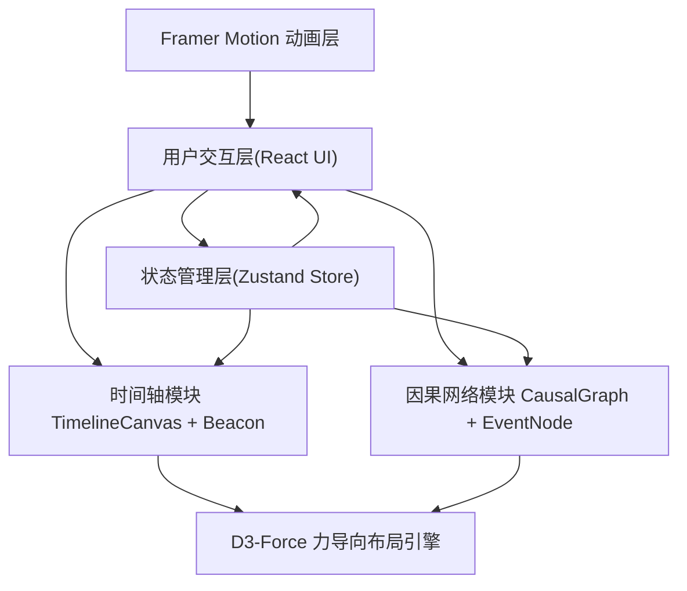

## 1. 架构设计


## 2. 技术描述
- **前端框架**：React@18 + TypeScript (strict模式, target ES2020, jsx: react-jsx)
- **构建工具**：Vite@5 + @vitejs/plugin-react，启动端口 3000
- **状态管理**：Zustand@4，集中管理信标、投递、网络图状态
- **布局引擎**：d3-force@3，力导向自动排布100节点以内高效计算
- **动画库**：framer-motion@11，淡入、扩散、脉动、拖拽动画
- **样式方案**：原生CSS + CSS变量，global.css全局主题

## 3. 路由定义
| 路由 | 用途 |
|-----|------|
| / | 主游戏界面，包含三栏布局和全部交互功能 |

## 4. 数据模型
### 4.1 核心类型定义
```typescript
interface Beacon {
  id: string;
  createdAt: number; // 创建年份 (1900-2100)
  color: string;     // #FF6B6B | #4ECDC4 | #FFE66D
  x: number;         // 当前拖拽位置x
  y: number;         // 当前拖拽位置y
  isDragging: boolean;
  isDelivered: boolean;
  deliveredTo?: string; // 事件ID
}

interface HistoryEvent {
  id: string;
  title: string;
  year: number;
  type: 'major' | 'minor' | 'turning'; // 橙#FFB347 / 紫#6C5CE7 / 粉#FD79A8
  description: string;
}

interface GraphNode {
  id: string;
  eventId: string;
  title: string;
  type: 'major' | 'minor' | 'turning';
  x: number;
  y: number;
  fx?: number | null;
  fy?: number | null;
}

interface GraphEdge {
  id: string;
  source: string;
  target: string;
  isCorrect: boolean; // 因果链闭合时为true
}

interface DeliveryRecord {
  id: string;
  beaconId: string;
  eventId: string;
  year: number;
  timestamp: number;
}
```

### 4.2 Store Actions
- `createBeacon(year: number): Beacon` - 点击发光点创建
- `updateBeaconPosition(id, x, y, isDragging)` - 拖拽中更新
- `deliverBeacon(beaconId, eventId)` - 投递完成
- `updateGraphLayout(nodes[])` - d3-force计算后回写
- `checkCausalClosure(): boolean` - 检测因果闭合
- `setNodeFixed(id, fx, fy)` - 用户拖拽节点锁定位置

## 5. 目录结构
```
auto237/
├── index.html
├── package.json
├── tsconfig.json
├── vite.config.js
└── src/
    ├── main.tsx
    ├── App.tsx
    ├── styles/
    │   └── global.css
    ├── store/
    │   └── gameStore.ts
    ├── timeline/
    │   ├── TimelineCanvas.tsx
    │   └── Beacon.tsx
    └── causal-network/
        ├── CausalGraph.tsx
        └── EventNode.tsx
```

## 6. 预置Mock数据
- **历史事件**：12个覆盖1905-2090年的重大/次要/转折事件（相对论、电视发明、登月、互联网、AI觉醒等）
- **初始状态**：空信标列表、空因果图、全部事件待投递
