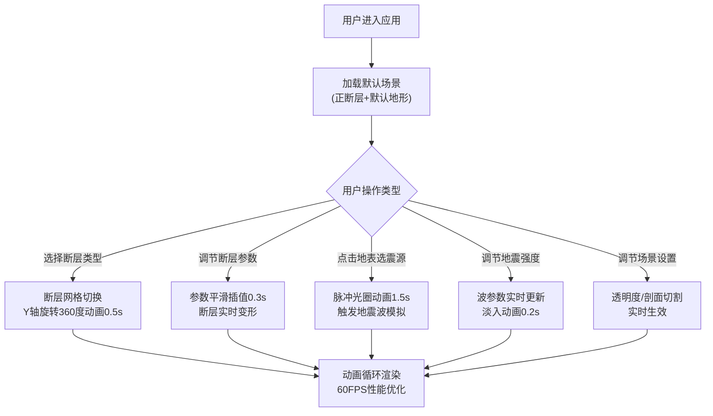

## 1. 产品概述

交互式地质断层与地震波传播可视化应用，面向地质研究人员、教育工作者和学生，提供三维场景下的断层结构观察与地震波传播模拟功能。

- 主要用途：通过交互式三维可视化帮助用户理解地质断层类型（正断层、逆断层、平移断层）及其力学特征，直观展示地震波从震源向外传播的物理过程
- 目标用户：地质科学研究者、大学及中学地球科学教师、相关专业学生、地质科普爱好者
- 产品价值：将抽象的地质力学概念转化为直观的三维可视化交互体验，提升教学效果和科学传播效率

## 2. 核心功能

### 2.1 用户角色

| 角色 | 注册方式 | 核心权限 |
|------|----------|----------|
| 访客用户 | 无需注册，直接访问 | 全部功能使用、参数调节、场景交互 |

### 2.2 功能模块

1. **三维主场景**：地表地形渲染、地下断层模型、剖面切割视图
2. **断层参数控制**：断层类型切换、倾角/走向/位移量实时调节
3. **地震波模拟**：震源点击选择、波前扩散动画、多波叠加显示
4. **场景设置**：地形透明度调节、剖面切割控制、视角重置

### 2.3 页面详情

| 页面名称 | 模块名称 | 功能描述 |
|----------|----------|----------|
| 主页面 | 三维场景区 | 75%屏幕占比，展示地表、断层、地震波，支持鼠标拖拽旋转、缩放、平移 |
| 主页面 | 控制面板 | 280px宽右侧面板，玻璃毛玻璃效果，包含断层参数、地震参数、场景设置三个可折叠卡片 |
| 主页面 | 响应式布局 | 宽度<768px时控制面板收到底部变为横向可滚动条，图标代替文字 |

## 3. 核心流程

## 4. 用户界面设计

### 4.1 设计风格

- **主色调**：深空蓝 `#0a0e27`（背景），青色 `#00d4ff`（高亮/滑块按钮），品红 `#ff00aa`（选中状态/渐变）
- **断层颜色标识**：正断层红色、逆断层蓝色、平移断层绿色
- **按钮风格**：圆角卡片式，选中按钮品红渐变背景，点击水波纹反馈（0.4秒圆形扩散）
- **字体**：深色科幻风格主题，等宽字体用于数值显示
- **布局风格**：左侧3D场景（75%）+ 右侧控制面板（280px，边距16px，圆角12px，半透明rgba(10,14,39,0.85)）
- **动画风格**：所有过渡0.2-0.5秒缓动，控件折叠0.3秒高度过渡，滑块悬停放大1.2倍（0.2秒）

### 4.2 页面设计概览

| 页面名称 | 模块名称 | UI元素 |
|----------|----------|----------|
| 主页面 | 标题区 | 应用标题、断层类型三按钮组（一字排开，当前选中品红渐变） |
| 主页面 | 断层参数卡片 | 可折叠，3个滑块（倾角30-90°、走向0-360°、垂直位移0-200），实时数值显示 |
| 主页面 | 地震参数卡片 | 可折叠，震源选择按钮、强度滑块（1-10级），重置按钮 |
| 主页面 | 场景设置卡片 | 可折叠，地表透明度滑块（0.2-1.0）、剖面切割轴选择、切割位置滑块 |
| 主页面 | 3D场景 | 全屏Canvas，OrbitControls交互，点击地表产生脉冲光圈和地震波 |

### 4.3 响应式设计

- Desktop-first设计，默认桌面端布局
- 断点 < 768px：控制面板收起到屏幕底部，高度60px，横向可滚动，图标替代文字
- 触摸设备优化：支持双指缩放、单指旋转视角

### 4.4 3D场景指导

- **环境氛围**：深空背景，雾效配合场景深度
- **光照设置**：环境光 + 方向光（模拟阳光）+ 点光源（震源脉冲发光）
- **相机设置**：PerspectiveCamera，初始俯视角45°，OrbitControls支持阻尼惯性
- **焦点元素**：断层模型为视觉中心，地震波扩散为动态视觉焦点
- **后处理效果**：半透明波前叠加、颜色混合（红+蓝=黄）、淡出动画
- **性能优化**：BufferGeometry、粒子LOD（5+波前时每波从1000粒子降为500，总粒子≤5000）、几何体合并

## 5. 交互细节规范

| 交互项 | 动画参数 |
|--------|----------|
| 断层类型切换 | Y轴旋转360°，0.5s，缓动函数 easeInOutQuad |
| 断层参数变形 | 0.3s平滑插值，TWEEN.js |
| 滑块数值变化 | 0.2s缓动同步更新 |
| 按钮悬停 | 0.2s过渡，滑块按钮放大1.2倍 |
| 按钮点击 | 水波纹从点击位置扩散，0.4s |
| 脉冲光圈 | 半径0→30，淡出，1.5s |
| 地震波扩散 | 每波持续2s，颜色红→透明蓝渐变 |
| 卡片折叠/展开 | 0.3s高度过渡 |
| 地震强度更新 | 0.2s淡入重算 |
| 控制面板收起(移动端) | 0.3s位置+尺寸过渡 |
