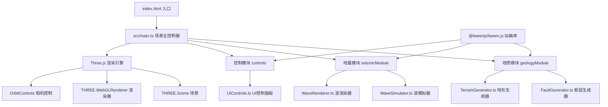

## 1. 架构设计



## 2. 技术描述

- **前端框架**：原生 TypeScript（无React/Vue，按用户需求）
- **3D引擎**：Three.js（版本^0.160.0）
- **构建工具**：Vite（^5.0.0）
- **类型系统**：TypeScript严格模式（strict: true）
- **动画库**：@tweenjs/tween.js（^23.1.1）
- **初始化方式**：Vite vanilla-ts 模板手动配置

## 3. 项目目录结构

```
auto24/
├── index.html              # 入口页面，全屏Canvas
├── package.json            # 依赖与脚本
├── vite.config.js          # Vite构建配置
├── tsconfig.json           # TypeScript严格模式配置
└── src/
    ├── main.ts             # 场景主入口：渲染器/场景/相机/OrbitControls/动画循环
    ├── geologyModule/
    │   ├── FaultGenerator.ts      # 断层程序化生成（正/逆/平移）
    │   └── TerrainGenerator.ts    # 200x200地形网格（海拔颜色+纹理）
    ├── seismicModule/
    │   ├── WaveSimulator.ts       # 球面波前扩散算法+粒子系统数据
    │   └── WaveRenderer.ts        # ShaderMaterial半透明波纹环渲染
    └── controls/
        └── UIControls.ts          # 右侧玻璃面板DOM+事件绑定
```

## 4. 核心数据模型与接口

### 4.1 断层参数接口

```typescript
export interface FaultParams {
  type: 'normal' | 'reverse' | 'strike-slip';
  dip: number;          // 倾角 30-90 度
  strike: number;       // 走向 0-360 度
  displacement: number; // 垂直位移量 0-200
}

export interface FaultMeshData {
  mesh: THREE.Mesh;
  params: FaultParams;
}
```

### 4.2 地形参数接口

```typescript
export interface TerrainParams {
  amplitude: number;   // 地形起伏幅度
  opacity: number;     // 透明度 0.2-1.0
}
```

### 4.3 地震波参数接口

```typescript
export interface EarthquakeParams {
  intensity: number;   // 1-10级
  frequency: number;   // 频率
  attenuation: number; // 衰减系数
}

export interface WaveSource {
  id: number;
  position: THREE.Vector3;
  params: EarthquakeParams;
  startTime: number;
  waveCount: number;   // 3-10个，随强度
  speed: number;       // 速度，强度每级+20%
  maxRadius: number;   // 50-150，随强度
}

export interface ParticleData {
  positions: Float32Array;
  colors: Float32Array;
  sizes: Float32Array;
  count: number;
}
```

### 4.4 场景设置接口

```typescript
export interface SceneSettings {
  terrainOpacity: number;     // 0.2-1.0
  clipAxis: 'x' | 'z' | null; // 切割轴
  clipPosition: number;       // 切割位置
}
```

## 5. 性能优化策略

| 优化项 | 策略 |
|--------|------|
| 几何体 | BufferGeometry 替代 Geometry，合并静态几何体 |
| 粒子系统 | 总粒子数上限 5000；波前数>5时每波粒子 1000→500 |
| LOD | 波前粒子距离相机越远尺寸越小、数量越少 |
| 渲染 | ShaderMaterial 替代普通材质，GPU 计算粒子颜色/大小 |
| 动画 | TWEEN.js 统一管理插值动画，避免每帧创建对象 |
| 内存 | 复用 BufferAttribute 数组，位移而非重建 |
| 交互 | Raycaster 仅在鼠标点击时触发，避免每帧检测 |

## 6. UI样式规范

```css
:root {
  --bg-deep: #0a0e27;
  --accent-cyan: #00d4ff;
  --accent-magenta: #ff00aa;
  --track-gray: #2a2a4a;
  --panel-bg: rgba(10, 14, 39, 0.85);
  --fault-normal: #ff3355;    /* 正断层红 */
  --fault-reverse: #3366ff;   /* 逆断层蓝 */
  --fault-strike: #33dd66;    /* 平移断层绿 */
  --radius-panel: 12px;
  --blur-panel: 12px;
  --transition-fast: 0.2s;
  --transition-mid: 0.3s;
  --transition-slow: 0.5s;
}
```

滑块自定义：轨道 #2a2a4a，滑块按钮青色圆形直径16px，悬停 transform: scale(1.2) 0.2s。
面板：backdrop-filter: blur(12px) + rgba(10,14,39,0.85) + border-radius:12px + margin:16px。
水波纹按钮：点击后通过伪元素或 canvas 绘制从点击坐标向外扩散的 rgba(0,212,255,0.5) 圆形，0.4s 后移除。
