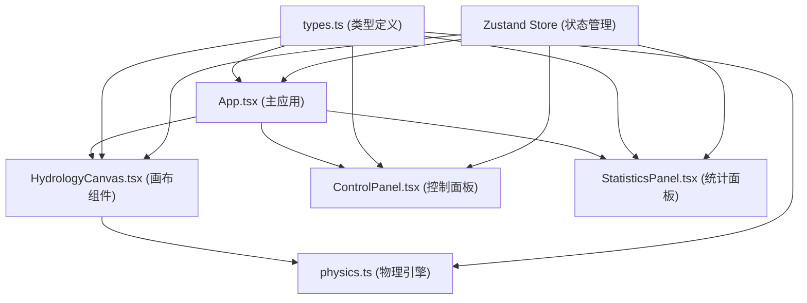

## 1. 架构设计



## 2. 技术描述
- **前端框架**：React 18 + TypeScript 5
- **构建工具**：Vite 5
- **状态管理**：Zustand 4
- **动画库**：Framer Motion 11
- **渲染方式**：Canvas 2D API 进行粒子和地形渲染
- **UI 样式**：内联样式 + CSS 变量，不使用 Tailwind

## 3. 项目结构
```
├── package.json
├── index.html
├── tsconfig.json
├── vite.config.js
└── src/
    ├── App.tsx              # 主应用组件，布局、状态管理、事件调度
    ├── types.ts             # 类型定义（Particle, Terrain, Statistics 等）
    ├── canvas/
    │   └── HydrologyCanvas.tsx  # 画布组件，物理模拟、渲染
    ├── components/
    │   ├── ControlPanel.tsx     # 控制面板，三个滑块
    │   └── StatisticsPanel.tsx  # 统计面板，数据展示
    └── utils/
        └── physics.ts           # 物理引擎工具函数
```

## 4. 状态管理设计

### 4.1 Zustand Store 状态
```typescript
interface SimulationState {
  // 参数设置
  permeability: number;      // 0.1-1.0，全局渗透率基准值
  evaporationRate: number;   // 0-0.2，蒸发概率倍率
  rainfallIntensity: number; // 1-5，降雨强度
  
  // 统计数据
  totalRainfall: number;     // 累计降水量
  totalEvaporated: number;   // 已蒸发量
  totalInfiltrated: number;  // 已渗透量
  activeParticles: number;   // 当前存留粒子数
  
  // 视图模式
  viewMode: 'normal' | 'heightmap' | 'vector';
  
  // 操作方法
  setPermeability: (v: number) => void;
  setEvaporationRate: (v: number) => void;
  setRainfallIntensity: (v: number) => void;
  triggerRainfall: () => void;
  updateStats: (stats: Partial<Statistics>) => void;
  setViewMode: (mode: 'normal' | 'heightmap' | 'vector') => void;
  reset: () => void;
}
```

## 5. 核心数据模型

### 5.1 粒子 (Particle)
```typescript
interface Particle {
  id: number;
  x: number;           // X 坐标
  y: number;           // Y 坐标
  vx: number;          // X 方向速度
  vy: number;          // Y 方向速度
  diameter: number;    // 直径
  color: string;       // 颜色
  opacity: number;     // 不透明度
  isEvaporating: boolean;  // 是否正在蒸发
  isInfiltrated: boolean;  // 是否已渗透
  terrainType: 'mountain' | 'plain' | 'depression' | null;
  trail: { x: number; y: number; width: number }[];  // 流动轨迹
  createdAt: number;
}
```

### 5.2 地形 (Terrain)
```typescript
interface TerrainCell {
  type: 'mountain' | 'plain' | 'depression';
  height: number;      // 0-1，高度值
  permeability: number; // 0.2 / 0.5 / 0.9
}

type TerrainMap = TerrainCell[][];  // 二维网格地形数据
```

### 5.3 统计数据 (Statistics)
```typescript
interface Statistics {
  totalRainfall: number;
  totalEvaporated: number;
  totalInfiltrated: number;
  activeParticles: number;
}
```

## 6. 核心算法

### 6.1 坡度计算
根据相邻像素的颜色深浅计算坡度，深色为低处。使用 Sobel 算子或简单的邻域高度差计算。

### 6.2 渗透判定
粒子碰到地形时，根据地形渗透率 × 全局渗透率基准值，与随机数比较决定是否渗透。

### 6.3 蒸发触发
每 3 秒检查一次，每颗粒子有 10% × 蒸发速率倍率 的概率触发蒸发。

### 6.4 粒子运动
- 重力：每帧施加向下的速度增量
- 坡度力：根据地形坡度施加水平方向的力
- 速度限制：每帧 2-4px 的移动速度

## 7. 渲染循环
使用 requestAnimationFrame 实现：
1. 更新所有粒子状态（位置、速度、状态变化）
2. 检查渗透、蒸发条件
3. 更新统计数据
4. 绘制地形背景
5. 绘制粒子轨迹
6. 绘制粒子本身
7. 根据视图模式绘制高度图或矢量图

## 8. 性能优化
- 粒子池复用，避免频繁创建销毁对象
- 离屏 Canvas 预渲染地形纹理
- 限制最大粒子数为 200
- 轨迹点数量限制，超出时移除旧点
- 使用 requestAnimationFrame 的时间戳进行帧率控制
