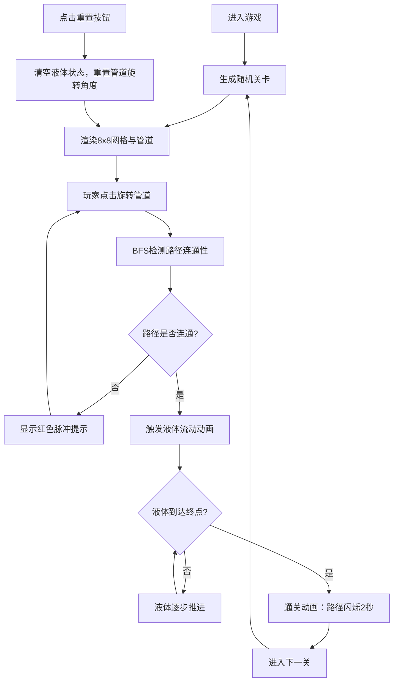

## 1. 产品概述

本项目是一款基于浏览器的实时交互解谜游戏，原型为桌面管道铺设游戏。玩家通过旋转管道引导发光液体从起点流向终点，实现流量平衡解谜。

- 核心玩法：在8x8网格上旋转管道，构建连通路径，引导霓虹青色发光液体从起点流向目标容器
- 目标用户：休闲解谜游戏爱好者，桌面游戏数字化体验用户
- 市场价值：将小众桌面游戏转化为可在浏览器中即时体验的数字版本，结合霓虹美学与流体动画带来独特视觉体验

## 2. 核心特性

### 2.1 用户角色

| 角色 | 注册方式 | 核心权限 |
|------|----------|----------|
| 游戏玩家 | 无需注册，直接进入 | 游戏游玩、关卡挑战、重置操作 |

### 2.2 功能模块

1. **游戏主界面**：8x8游戏网格、管道渲染、液体流动动画
2. **关卡系统**：随机关卡生成、关卡编号显示、步数统计
3. **交互控制**：点击旋转管道、重置按钮、胜利检测
4. **视觉反馈**：发光效果、错误提示、通关动画

### 2.3 页面详情

| 页面名称 | 模块名称 | 功能描述 |
|----------|----------|----------|
| 游戏主页面 | 游戏网格模块 | 8x8网格渲染、管道绘制、液体流动动画、点击旋转交互 |
| 游戏主页面 | 信息展示模块 | 关卡编号、步数统计、重置按钮、状态提示 |
| 游戏主页面 | 路径检测模块 | BFS连通性检测、自动流动触发、胜利条件判断 |

## 3. 核心流程

## 4. 用户界面设计

### 4.1 设计风格

- **整体风格**：深色霓虹风格，赛博朋克美学
- **主色调**：深紫色渐变背景（#1A1A2E → #16213E），霓虹青色液体（#00FFCC），浅蓝色管道（#4A90D9）
- **字体**：采用现代无衬线字体，霓虹青色文字与深色背景形成高对比度
- **按钮样式**：圆角按钮，悬停放大（scale:1.05），点击收缩（scale:0.95），过渡0.2s ease-out
- **网格样式**：半透明灰色格子背景（rgba(255,255,255,0.05)），圆角6px，格子间距2px
- **发光效果**：充液管道带0 0 8px #00FFCC发光阴影

### 4.2 页面设计概述

| 页面名称 | 模块名称 | UI元素 |
|----------|----------|----------|
| 游戏主页面 | 游戏网格 | 8x8格子矩阵，管道SVG渲染，液体流动动画，旋转交互 |
| 游戏主页面 | 信息栏（左侧/顶部） | 关卡编号显示、步数计数器、重置按钮（带旋转动画） |
| 游戏主页面 | 反馈层 | 红色半透明错误遮罩、通关闪烁效果、红色错误高亮 |

### 4.3 响应式设计

- **桌面端**：左侧垂直信息栏，右侧游戏网格
- **移动端**（<600px）：顶部水平信息栏，网格宽度320px自适应
- **触摸优化**：增大点击区域，确保管道旋转操作流畅

### 4.4 动画设计

- **管道旋转**：点击后顺时针90度平滑旋转
- **液体流动**：每秒前进2格，霓虹青色发光填充效果
- **错误提示**：未连通时液体边缘红色高亮闪烁0.5秒
- **通关效果**：完整路径淡蓝色填充并闪烁2秒
- **按钮交互动画**：悬停放大、点击收缩，过渡0.2s
