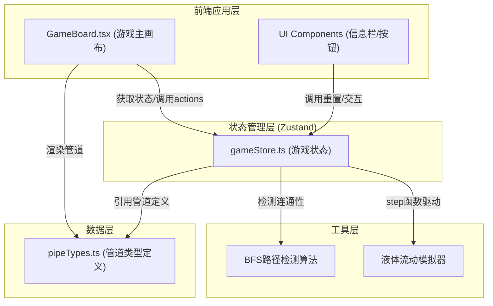
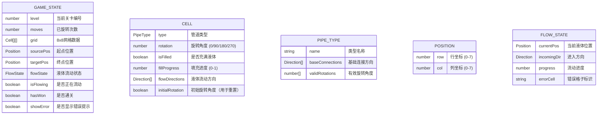

## 1. 架构设计



## 2. 技术描述

- **前端框架**：React 18 + TypeScript
- **构建工具**：Vite 5 + @vitejs/plugin-react
- **状态管理**：Zustand 4
- **动画库**：Framer Motion 11
- **初始化方式**：Vite脚手架（react-ts模板）

## 3. 依赖说明

| 依赖包 | 版本 | 用途 |
|--------|------|------|
| react | ^18.2.0 | UI框架 |
| react-dom | ^18.2.0 | DOM渲染 |
| typescript | ^5.4.0 | 类型安全 |
| @types/react | ^18.2.0 | React类型定义 |
| @types/react-dom | ^18.2.0 | React DOM类型定义 |
| vite | ^5.2.0 | 构建工具 |
| @vitejs/plugin-react | ^4.2.0 | Vite React插件 |
| zustand | ^4.5.0 | 状态管理 |
| framer-motion | ^11.0.0 | 动画效果 |

## 4. 启动脚本

```json
{
  "scripts": {
    "dev": "vite",
    "build": "tsc && vite build",
    "preview": "vite preview"
  }
}
```

## 5. 文件结构与调用关系

```
├── package.json              # 项目配置与依赖
├── vite.config.js            # Vite构建配置（启用React插件）
├── tsconfig.json             # TypeScript配置（严格模式，ES2020）
├── index.html                # 应用入口，加载主组件
└── src/
    ├── main.tsx              # React入口文件，渲染App组件
    ├── App.tsx               # 根组件，组合GameBoard和UI
    ├── gameBoard.tsx         # 主游戏画布组件
    │   ├── 数据流向：通过useGameStore获取网格状态、液体状态
    │   ├── 调用：rotatePipe、resetLevel等actions
    │   └── 渲染：8x8网格、管道SVG、液体流动动画
    ├── gameStore.ts          # Zustand状态管理
    │   ├── 状态：grid、level、moves、flowState、sourcePos、targetPos
    │   ├── Actions：rotatePipe、resetLevel、checkWin、flowStep
    │   └── 驱动：setInterval调用step函数实现液体流动
    └── pipeTypes.ts          # 管道类型与渲染配置
        ├── 6种管道类型：CROSS、ELBOW、STRAIGHT、TEE、START、END
        ├── 旋转角度集合：[0, 90, 180, 270]
        ├── 连接方向规则：每种管道在各旋转角度下的连通方向
        └── 颜色常量：GLOW_COLOR (#00FFCC)、BG_COLOR (#2A2A3E)
```

## 6. 数据模型

### 6.1 核心数据结构



### 6.2 方向枚举

```typescript
type Direction = 'top' | 'right' | 'bottom' | 'left';
type PipeType = 'CROSS' | 'ELBOW' | 'STRAIGHT' | 'TEE' | 'START' | 'END';
```

## 7. 核心算法

### 7.1 BFS路径检测算法

- **触发时机**：玩家每次旋转管道后
- **输入**：当前网格状态、起点位置、终点位置
- **输出**：是否存在连通路径、路径格子集合
- **性能约束**：5ms内完成计算

### 7.2 液体流动模拟

- **驱动方式**：setInterval，每秒前进2格（每500ms调用一次step）
- **帧率目标**：30fps以上
- **流动规则**：沿管道连接方向推进，遇未连通管口停止并报错

### 7.3 随机关卡生成

- **起点固定**：左侧中间位置
- **终点固定**：右侧中间位置
- **路径保证**：预先生成有效路径，再随机填充其余管道
- **旋转随机**：每个管道初始旋转角度随机
