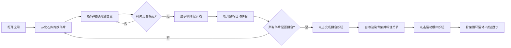

## 1. 产品概述

古生物化石碎片虚拟拼合与运动模拟应用，面向古生物爱好者与博物馆策展人，解决真实化石脆弱、展陈空间有限的问题，让观众可近距离观察骨骼结构并理解活体运动方式。

- **核心价值**：将零散化石碎片在三维空间中虚拟拼合，自动生成复原生物骨架透视图与动态运动轨迹模拟
- **目标用户**：古生物爱好者、博物馆策展人、教育工作者
- **市场价值**：数字化展陈解决方案，降低化石损耗风险，提升科普教育效果

## 2. 核心功能

### 2.1 功能模块

1. **化石碎片3D摆放与拼合**：拖拽、旋转、缩放骨骼碎片，智能吸附拼合
2. **自动骨骼复原与关键点标注**：拼合完成后自动渲染半透明骨架，标注关节关键点
3. **动态运动轨迹模拟**：预设步态周期循环运动，实时显示关节角度，生成足迹轨迹

### 2.2 页面详情

| 页面名称 | 模块名称 | 功能描述 |
|-----------|-------------|---------------------|
| 主页面 | 化石库面板 | 侧边栏展示可拖拽的骨骼碎片列表（头骨、肋骨、股骨等） |
| 主页面 | 3D场景区域 | 化石碎片的摆放、旋转、缩放、拼合交互区域 |
| 主页面 | 底部工具栏 | 撤销、重置、完成拼合、运动模拟/暂停按钮 |
| 主页面 | 关节标注层 | 拼合完成后显示黄色发光关节点及角度标签 |
| 主页面 | 运动轨迹层 | 运动模拟时显示足迹轨迹虚线 |

## 3. 核心流程

### 3.1 用户操作流程

用户打开应用 → 从化石库拖拽骨骼碎片到3D场景 → 使用鼠标右键旋转、滚轮缩放调整碎片位置 → 碎片接近时显示青色吸附提示线 → 松开鼠标自动对齐拼合 → 重复操作直到所有碎片拼合 → 点击"完成拼合"按钮 → 系统自动渲染半透明骨架并标注关节点 → 点击"运动模拟"按钮 → 骨架开始循环运动并显示关节角度和足迹轨迹。

## 4. 用户界面设计

### 4.1 设计风格

- **主色调**：深灰蓝 `#1A2333`（背景）、骨白色 `#F5F5DC`（骨架）
- **强调色**：金色 `#FFD700`（选中高亮）、淡青色 `#00FFFF`（吸附提示）、青绿色 `#00CED1`（拼合光带）、黄色 `#FFFF00`（关节标注）
- **中性色**：淡灰色 `#808080`（足迹轨迹）、深蓝灰 `#2C3E50`（按钮背景）、悬浮蓝 `#3D566E`（按钮悬浮）
- **按钮风格**：圆角 8px，背景 `#2C3E50`，悬浮变 `#3D566E`，0.2s ease-out 过渡
- **字体**：现代无衬线字体，清晰易读，适配深色背景
- **布局风格**：左侧化石库面板（280px 宽，毛玻璃效果）+ 中央3D场景 + 底部工具栏
- **动效风格**：所有交互 0.2s ease-out 过渡，关节点脉冲动画（周期 2s）

### 4.2 页面设计概述

| 页面名称 | 模块名称 | UI Elements |
|-----------|-------------|-------------|
| 主页面 | 化石库面板 | 半透明毛玻璃效果 `backdrop-filter: blur(10px)`，宽度 280px，灰色低多边形骨骼缩略图 |
| 主页面 | 3D场景区域 | 深灰蓝背景，半透明极坐标网格（间距 20 单位），碎片选中金色边框 2px |
| 主页面 | 底部工具栏 | 四个按钮水平排列，圆角 8px，间距适中 |
| 主页面 | 吸附提示线 | 2px 宽淡青色 `#00FFFF`，半透明 0.6 |
| 主页面 | 关节标注点 | 半径 8px 黄色发光点，脉冲动画周期 2s，带文字标签 |
| 主页面 | 足迹轨迹线 | 淡灰色虚线，宽度 2px，步长间距 30px |

### 4.3 响应式设计

- **桌面优先**：主场景区域自适应窗口大小，左侧面板固定宽度 280px
- **窗口缩放**：3D画布自动适应容器尺寸，保持正确的宽高比
- **性能适配**：碎片数量 ≤ 15 时保持 60FPS，> 15 时允许降帧但 ≥ 30FPS

### 4.4 3D场景指导

- **环境与氛围**：深灰蓝科幻博物馆风格，低多边形美学，营造专业古生物研究氛围
- **光照设置**：柔和的环境光 + 方向性主光源，确保骨骼碎片层次分明，边缘清晰
- **相机设置**：透视相机，初始距离适中，可通过鼠标拖拽旋转视角，滚轮缩放场景
- **构图与焦点**：极坐标网格作为空间参照，拼合后的骨架位于场景中心
- **交互与动画**：拖拽碎片有吸附反馈，拼合时有对齐动画，运动模拟采用贝塞尔曲线平滑旋转
- **后期处理**：轻微泛光效果增强关节点发光，柔和阴影提升空间感
- **性能预算**：每个骨骼碎片使用低多边形模型（< 1000 面），总面数控制在合理范围

