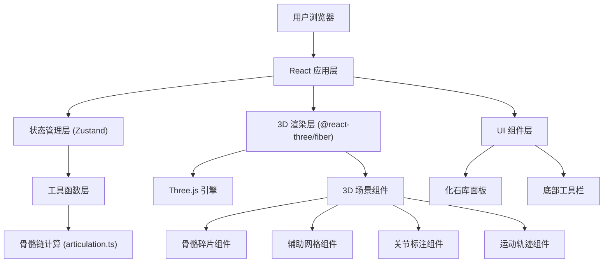
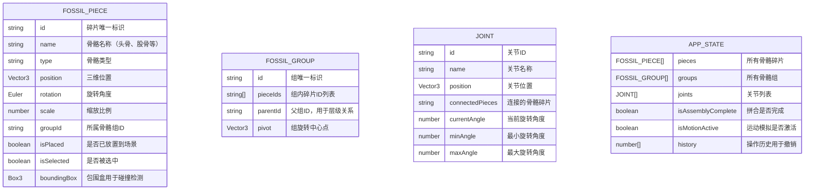

## 1. 架构设计



## 2. 技术描述

- **前端框架**：React@18 + TypeScript@5
- **构建工具**：Vite@5 + @vitejs/plugin-react@4
- **3D 渲染**：Three@0.160 + @react-three/fiber@8 + @react-three/drei@9
- **状态管理**：Zustand@4
- **动画库**：Framer Motion@11
- **类型定义**：@types/react@18 + @types/react-dom@18 + @types/three@0.160

## 3. 项目文件结构

| 文件路径 | 用途 |
|---------|------|
| `/package.json` | 项目依赖与脚本配置 |
| `/index.html` | 应用入口 HTML |
| `/vite.config.js` | Vite 构建配置 |
| `/tsconfig.json` | TypeScript 配置 |
| `/src/main.tsx` | React 应用入口 |
| `/src/style.css` | 全局样式与动画定义 |
| `/src/store/useFossilStore.ts` | Zustand 状态管理 |
| `/src/components/FossilViewer.tsx` | Three.js 3D 场景主组件 |
| `/src/components/FossilPiece.tsx` | 单个骨骼碎片组件 |
| `/src/components/ControlPanel.tsx` | 底部工具栏组件 |
| `/src/utils/articulation.ts` | 骨骼链计算与运动学工具 |

## 4. 核心数据模型

### 4.1 数据模型定义



### 4.2 TypeScript 类型定义

```typescript
// 化石碎片类型
interface FossilPiece {
  id: string;
  name: string;
  type: 'skull' | 'vertebra' | 'rib' | 'femur' | 'tibia' | 'humerus' | 'scapula';
  position: [number, number, number];
  rotation: [number, number, number];
  scale: number;
  groupId: string | null;
  isPlaced: boolean;
  isSelected: boolean;
}

// 骨骼组类型
interface FossilGroup {
  id: string;
  pieceIds: string[];
  parentId: string | null;
  pivot: [number, number, number];
}

// 关节类型
interface Joint {
  id: string;
  name: string;
  position: [number, number, number];
  pieceA: string;
  pieceB: string;
  currentAngle: number;
  minAngle: number;
  maxAngle: number;
}

// 应用状态类型
interface FossilState {
  pieces: FossilPiece[];
  groups: FossilGroup[];
  joints: Joint[];
  isAssemblyComplete: boolean;
  isMotionActive: boolean;
  history: HistoryAction[];
  selectedPieceId: string | null;
  snappingTarget: { pieceA: string; pieceB: string } | null;
}
```

## 5. 核心算法与交互

### 5.1 吸附检测算法

```
输入：两个骨骼碎片 A 和 B
输出：是否可以吸附拼合

1. 计算 A 和 B 接触面的法向量夹角（欧拉角差异）
2. 计算 A 和 B 最近点之间的欧氏距离
3. 如果 角度差 < 15° 且 距离 < 5 单位：
   - 返回 true，显示吸附提示线
   - 否则返回 false
```

### 5.2 骨骼链层级计算

```
输入：所有已拼合的骨骼组
输出：从脊椎到四肢的层级关系

1. 识别脊椎骨作为根节点
2. 广度优先搜索连接的骨骼
3. 构建父子关系树（脊椎 → 肋骨/四肢骨）
4. 计算每个关节的旋转限制范围
```

### 5.3 步态动画算法

```
输入：当前时间 t（毫秒）
输出：各关节旋转角度

1. 归一化时间到周期 [0, 1]，周期 = 2000ms
2. 对每个关节应用贝塞尔曲线插值：
   - 前腿相位偏移 0.5
   - 后腿与前腿交错
3. 计算足迹位置，绘制虚线轨迹
```

## 6. 性能优化策略

1. **模型优化**：所有骨骼使用低多边形几何体（< 1000 面）
2. **实例化渲染**：重复骨骼使用 InstancedMesh
3. **碰撞检测优化**：使用包围盒（Box3）而非精确几何检测
4. **帧率控制**：使用 `useFrame` 限制渲染频率，碎片 > 15 时降为 30FPS
5. **状态更新优化**：Zustand 使用 selectors 避免不必要重渲染
6. **内存管理**：及时释放未使用的 Three.js 对象

