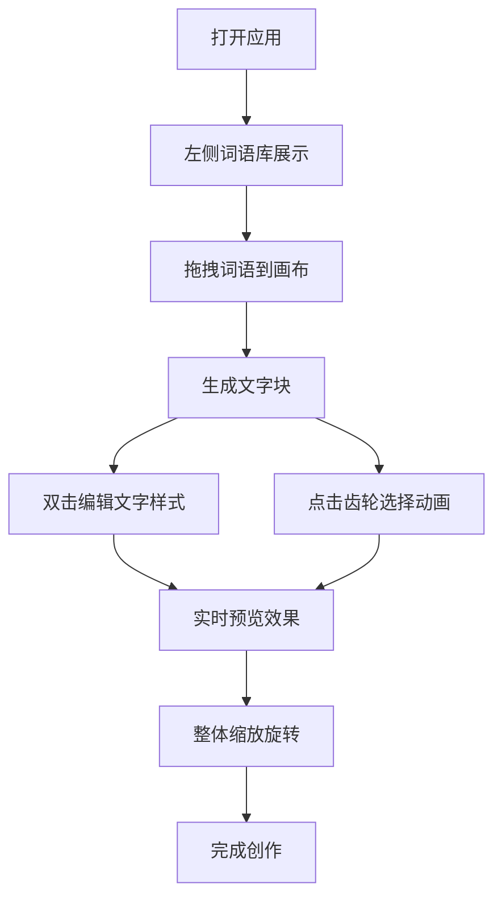

## 1. 产品概述

微型动态字体排印与情绪表达画布是一款交互式文字艺术创作工具，用户通过拖拽词语、调节字体参数和排列位置，创作出随时间缓慢呼吸和变化的动态文字艺术作品。

- 主要用途：创意文字艺术创作、情绪可视化表达、动态排版设计
- 目标用户：设计师、创意工作者、文字艺术爱好者
- 核心价值：低门槛创作高质感动态文字艺术，通过字体参数与动效表达情绪

## 2. 核心功能

### 2.1 功能模块

1. **画布区域**：深灰蓝色背景，中央径向渐变柔光，支持文字块渲染、拖拽、缩放、旋转
2. **左侧控制面板**：词语库展示、选中文字块参数调节
3. **文字块交互**：拖拽定位、双击编辑、动画设置
4. **动画系统**：脉动、漂浮、呼吸、流动四种缓动动画
5. **整体变换**：三指捏合/ Ctrl+右键拖拽进行缩放和旋转

### 2.3 页面详情

| 页面名称 | 模块名称 | 功能描述 |
|---------|---------|---------|
| 主画布页 | 画布区域 | 深灰蓝背景(#1B2838)，中央径向渐变(#3A506B→#1B2838)，2px柔光白边边界 |
| 主画布页 | 文字块 | 可拖拽、双击编辑、支持颜色/字号/字重调节、右下角齿轮设置动画 |
| 主画布页 | 左侧面板 | 20个情感词词语库，按暖/冷/中性分类带圆点标记 |
| 主画布页 | 动画轮盘 | 半透明扇形选择器，悬停高亮显示动画名称 |

## 3. 核心流程

用户从左侧词语库拖拽词语到画布 → 文字块自动匹配情绪颜色 → 双击文字进入编辑模式调整颜色/字号/字重 → 点击齿轮图标选择动画效果 → 通过手势/快捷键整体缩放旋转 → 创作完成动态文字作品

## 4. 用户界面设计

### 4.1 设计风格

- **主色调**：深灰蓝 #1B2838（背景）、金属灰 #8B9DC3（控件）、高亮金 #C9A96E（强调）
- **情绪色**：暖色 #F3A683、冷色 #78D1E1、中性 #A5B1C2
- **控件风格**：圆角12px毛玻璃效果（backdrop-filter: blur(8px)），半透明深色背景 rgba(27, 40, 56, 0.85)
- **字体**：Noto Sans SC（Google Fonts）
- **动效**：spring 动画（stiffness 200, damping 20），柔和过渡

### 4.2 页面设计概述

| 页面名称 | 模块名称 | UI 元素 |
|---------|---------|---------|
| 主画布页 | 画布背景 | 径向渐变柔光、2px边界白线、超出边界文字半透明抖动 |
| 主画布页 | 词语库 | 三列布局、16px圆点颜色标记、拖拽反馈 |
| 主画布页 | 文字块 | 可拖拽、双击编辑、右下角16px齿轮图标（悬停旋转15deg） |
| 主画布页 | 动画轮盘 | 四扇形分布、半透明、悬停高亮、动画名称提示 |
| 主画布页 | 调节控件 | 滑杆（字号16-72px、字重300-900）、颜色选择器 |

### 4.3 响应式

- 桌面端优先，适配横屏和竖屏
- 窗口缩小时文字块自动减小间距并重新排列
- 触屏支持三指捏合缩放手势
- 桌面端支持 Ctrl + 鼠标右键拖拽旋转

### 4.4 性能要求

- 动画运行保持 50fps 以上
- 拖拽和缩放操作响应延迟不超过 50ms
- 使用 requestAnimationFrame 和 CSS transform 优化性能
