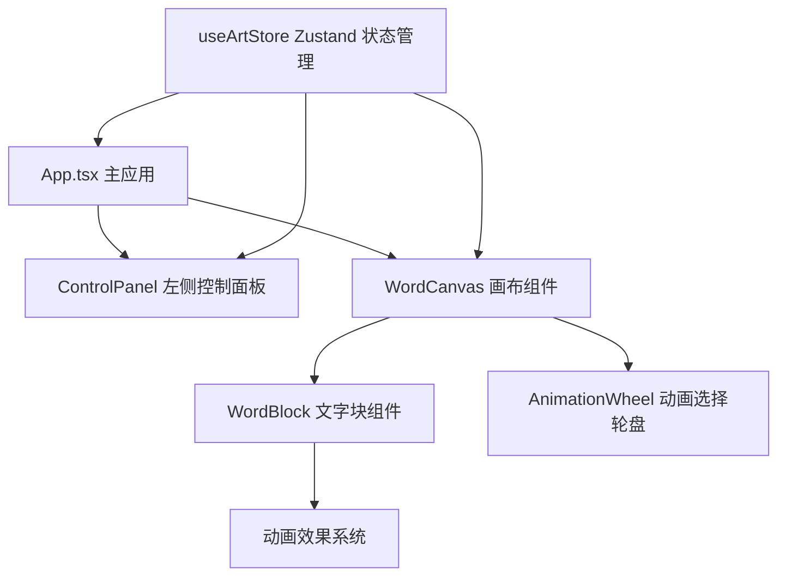

## 1. 架构设计



## 2. 技术描述

- **前端框架**：React 18 + TypeScript
- **构建工具**：Vite
- **状态管理**：Zustand
- **动画库**：Framer Motion
- **颜色选择**：react-color
- **字体**：Google Fonts - Noto Sans SC

## 3. 项目结构

```
src/
├── App.tsx                    # 主应用组件
├── components/
│   ├── WordCanvas.tsx         # 画布组件
│   ├── ControlPanel.tsx       # 左侧控制面板
│   ├── WordBlock.tsx          # 文字块组件
│   └── AnimationWheel.tsx     # 动画选择轮盘
├── store/
│   └── useArtStore.ts         # Zustand 状态管理
└── types/
    └── index.ts               # 类型定义
```

## 4. 数据模型

### 4.1 文字块数据结构

```typescript
interface WordBlock {
  id: string;
  text: string;
  x: number;
  y: number;
  color: string;
  fontSize: number;
  fontWeight: number;
  animation: 'pulse' | 'float' | 'breathe' | 'flow' | null;
  emotionCategory: 'warm' | 'cool' | 'neutral';
}
```

### 4.2 画布变换参数

```typescript
interface CanvasTransform {
  scale: number;
  rotation: number;
  offsetX: number;
  offsetY: number;
}
```

### 4.3 词语库预设

```typescript
interface PresetWord {
  text: string;
  category: 'warm' | 'cool' | 'neutral';
}
```

## 5. 状态管理（Zustand）

- `wordBlocks`: 文字块列表
- `selectedBlockId`: 当前选中的文字块ID
- `canvasTransform`: 画布变换参数（缩放、旋转、偏移）
- `isEditing`: 是否处于编辑模式
- `activeAnimationWheel`: 当前打开的动画轮盘所属文字块ID

## 6. 性能优化策略

1. **动画优化**：使用 Framer Motion 的 transform 和 opacity 动画，触发 GPU 加速
2. **拖拽优化**：使用 useMotionValue 和 useTransform 减少重渲染
3. **批量更新**：Zustand 状态批量更新，避免频繁渲染
4. **will-change**：对动画元素设置 will-change 属性
5. **requestAnimationFrame**：复杂计算使用 rAF 节流

## 7. 核心交互实现

### 7.1 拖拽交互
- 词语库 → 画布：HTML5 Drag and Drop API
- 画布内文字块移动：鼠标/触摸事件 + Framer Motion drag

### 7.2 整体缩放旋转
- 触屏：三指捏合手势检测
- 桌面：Ctrl + 鼠标右键 + 拖拽

### 7.3 动画效果
- 脉动：scale 1.0 → 1.05，周期 2s
- 漂浮：y -3px → +3px，周期 4s
- 呼吸：opacity 0.7 → 1.0，周期 3s
- 流动：字符逐字变色，周期 6s
