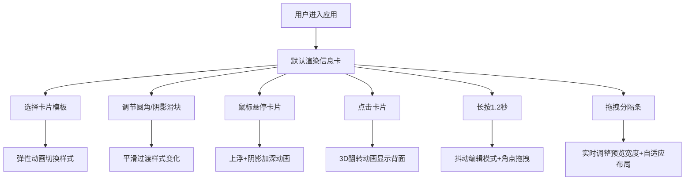

## 1. 产品概述

动态卡片组件库与交互预览沙盒，帮助设计师快速预览和调试卡片组件在不同交互状态下的视觉表现，支持实时参数调节和多模板切换。

- 解决用户界面设计师在卡片组件设计中无法直观预览交互效果、难以快速验证配色方案与动画参数的痛点
- 目标用户：UI设计师、前端开发工程师、交互设计师
- 产品价值：提供可视化的卡片设计调试环境，缩短设计到开发的沟通周期

## 2. 核心功能

### 2.1 用户角色
| 角色 | 注册方式 | 核心权限 |
|------|----------|----------|
| 设计师用户 | 无需注册 | 使用所有卡片模板、调节样式参数、预览交互效果 |

### 2.2 功能模块
1. **控制面板**：卡片模板选择按钮、圆角半径调节滑块、阴影强度调节滑块
2. **卡片预览区**：实时渲染卡片、响应悬停/点击/长按交互、3D翻转动画、抖动编辑模式
3. **分隔条拖拽**：垂直分隔条、实时调整预览区宽度、卡片布局自适应

### 2.3 页面详情
| 页面名称 | 模块名称 | 功能描述 |
|-----------|-------------|---------------------|
| 主页面 | 控制面板 | 四种卡片模板切换按钮，圆角和阴影参数滑块，实时更新预览 |
| 主页面 | 卡片预览区 | 支持悬停上浮、点击翻转、长按抖动编辑，拖拽角点调整内部布局 |
| 主页面 | 分隔条 | 拖拽调整预览区宽度，范围280px-800px，悬停高亮 |

## 3. 核心流程

用户进入应用后，默认展示信息卡模板。用户可点击左侧面板切换卡片类型，通过滑块调节圆角和阴影参数，在右侧预览区实时查看效果。悬停卡片观察上浮动画，点击卡片体验3D翻转，长按1.2秒进入编辑模式拖拽角点调整布局。拖拽中间分隔条可调整预览区宽度。

## 4. 用户界面设计

### 4.1 设计风格
- 主色调：根据卡片类型动态变化（信息卡#1976D2、商品卡#C2185B、人物卡#FF8F00、里程碑卡#00796B）
- 背景色：左侧#FAFAFA，右侧#F0F0F0，预览容器#EEEEEE
- 按钮样式：圆角矩形，悬停200ms背景加深，选中时2px主题色边框
- 字体：系统字体 -apple-system, BlinkMacSystemFont
- 布局：固定左侧240px面板，右侧自适应，中间6px分隔条
- 图标风格：简洁线性风格，使用lucide-react图标库

### 4.2 页面设计概述
| 页面名称 | 模块名称 | UI元素 |
|-----------|-------------|-------------|
| 主页面 | 控制面板 | 标题、模板按钮组（4个）、圆角滑块组、阴影滑块组 |
| 主页面 | 卡片预览区 | 容器背景、卡片正面/背面、角点拖拽手柄、浮动文字标签 |
| 主页面 | 分隔条 | 垂直条、悬停高亮、左右箭头光标 |

### 4.3 响应性
- Desktop-first 设计，最小宽度900px
- 左侧面板固定240px宽度
- 预览区宽度范围280px-800px，通过分隔条拖拽调节
- 卡片内部使用响应式flex布局，文字对齐和图片大小自适应宽度变化
- 触摸设备优化：长按手势支持，触摸目标最小40x40px

### 4.4 动画规范
- 模板切换：600ms弹性过渡（type: "spring", stiffness: 300, damping: 30）
- 样式调节：200ms平滑过渡（easeOut）
- 悬停动画：300ms上浮8px + 阴影加深
- 点击翻转：800ms 3D翻转（perspective: 1000px）
- 长按抖动：±3px位移，100ms间隔快速抖动
- 分隔条拖拽：实时响应，无过渡延迟
