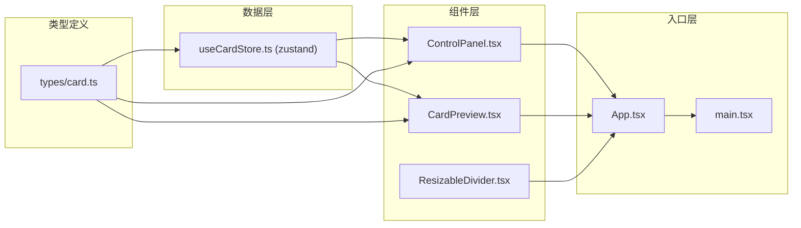

## 1. 架构设计



## 2. 技术描述

- **前端框架**: React 18 + TypeScript 5
- **构建工具**: Vite 5
- **状态管理**: Zustand 4 (精确selector订阅，避免不必要重渲染)
- **动画库**: Framer Motion 11 (60FPS流畅动画，spring物理动画)
- **样式方案**: 原生CSS + CSS变量 + inline style（动态样式）
- **图标库**: lucide-react
- **项目初始化**: vite-init react-ts 模板

## 3. 路由定义

| 路由 | 用途 |
|-------|---------|
| / | 主应用页面，包含控制面板和卡片预览区 |

## 4. 核心数据模型

### 4.1 卡片类型定义

```typescript
// src/types/card.ts
export type CardType = 'info' | 'product' | 'person' | 'milestone';

export interface CardTemplate {
  type: CardType;
  name: string;
  title: string;
  description: string;
  backDescription: string;
  imageUrl: string;
  bgColor: string;
  primaryColor: string;
  buttonText: string;
}

export interface CardStyleParams {
  borderRadius: number;      // 8-32px, step 2
  shadowIntensity: number;   // 0-20px, step 1
}

export interface LayoutOffsets {
  top: number;     // 0-20px
  right: number;   // 0-20px
  bottom: number;  // 0-20px
  left: number;    // 0-20px
}

export interface CardInteractionState {
  isHovered: boolean;
  isFlipped: boolean;
  isEditMode: boolean;
}

export const CARD_TEMPLATES: Record<CardType, CardTemplate> = {
  info: {
    type: 'info',
    name: '信息卡',
    title: '系统通知',
    description: '您有新的消息需要查看',
    backDescription: '消息详情：您的账户安全等级已更新，请及时确认。',
    imageUrl: 'https://trae-api-cn.mchost.guru/api/ide/v1/text_to_image?prompt=abstract%20blue%20tech%20illustration&image_size=square',
    bgColor: '#E3F2FD',
    primaryColor: '#1976D2',
    buttonText: '查看详情'
  },
  product: {
    type: 'product',
    name: '商品卡',
    title: '精选商品',
    description: '限时特惠，立享8折优惠',
    backDescription: '商品详情：采用优质材料，做工精细，提供一年质保服务。',
    imageUrl: 'https://trae-api-cn.mchost.guru/api/ide/v1/text_to_image?prompt=elegant%20product%20display%20pink&image_size=square',
    bgColor: '#FCE4EC',
    primaryColor: '#C2185B',
    buttonText: '立即购买'
  },
  person: {
    type: 'person',
    name: '人物卡',
    title: '张明',
    description: '高级产品设计师 / UI专家',
    backDescription: '个人简介：10年设计经验，曾主导多个千万级用户产品的设计工作。',
    imageUrl: 'https://trae-api-cn.mchost.guru/api/ide/v1/text_to_image?prompt=professional%20portrait%20warm%20tone&image_size=square',
    bgColor: '#FFF8E1',
    primaryColor: '#FF8F00',
    buttonText: '查看主页'
  },
  milestone: {
    type: 'milestone',
    name: '里程碑卡',
    title: '项目里程碑',
    description: 'Q2目标已完成90%',
    backDescription: '具体日期：2024年6月30日完成全部交付，团队绩效评级A+。',
    imageUrl: 'https://trae-api-cn.mchost.guru/api/ide/v1/text_to_image?prompt=milestone%20achievement%20green&image_size=square',
    bgColor: '#F5F5F5',
    primaryColor: '#00796B',
    buttonText: '查看报告'
  }
};
```

### 4.2 Store 状态结构

```typescript
// src/store/useCardStore.ts
interface CardState {
  currentCardType: CardType;
  styleParams: CardStyleParams;
  layoutOffsets: LayoutOffsets;
  interactionState: CardInteractionState;
  previewWidth: number;  // 280-800px
  
  // Actions
  setCardType: (type: CardType) => void;
  setBorderRadius: (value: number) => void;
  setShadowIntensity: (value: number) => void;
  setLayoutOffset: (key: keyof LayoutOffsets, value: number) => void;
  setHovered: (value: boolean) => void;
  toggleFlip: () => void;
  setEditMode: (value: boolean) => void;
  setPreviewWidth: (value: number) => void;
}
```

## 5. 文件结构与调用关系

```
auto250/
├── package.json              # 项目依赖与脚本
├── vite.config.js            # 构建配置，路径别名@指向src
├── tsconfig.json             # TypeScript严格模式配置
├── index.html                # 入口HTML，容器div#root
└── src/
    ├── main.tsx              # React根渲染，全局字体样式
    ├── App.tsx               # 应用根组件，布局组合
    ├── types/
    │   └── card.ts           # 卡片类型定义、模板常量
    ├── store/
    │   └── useCardStore.ts   # Zustand全局状态管理
    ├── components/
    │   ├── ControlPanel.tsx  # 左侧控制面板（被App.tsx调用）
    │   ├── CardPreview.tsx   # 卡片预览组件（被App.tsx调用）
    │   └── ResizableDivider.tsx  # 分隔条组件（被App.tsx调用）
    └── styles/
        └── global.css        # 全局样式
```

**数据流向：**
1. `ControlPanel` → 用户操作 → `useCardStore.setXxx()` → 更新状态
2. `useCardStore` → selector订阅 → `CardPreview` 获取最新状态 → 重新渲染
3. `CardPreview` → 交互事件 → `useCardStore.setXxx()` → 更新交互状态
4. `ResizableDivider` → 拖拽事件 → `useCardStore.setPreviewWidth()` → 更新宽度

## 6. 性能优化策略

1. **Zustand Selector 精确订阅**：
   - `CardPreview` 只订阅需要的状态切片，避免无关状态变化导致重渲染
   - 使用 `shallow` 比较对象类型订阅

2. **Framer Motion 性能优化**：
   - 使用 `motion` 组件而非手动 `animate`
   - 启用 `layout` 动画时使用 `layoutId` 复用元素
   - 复杂动画使用 `will-change: transform` 提示浏览器

3. **React 重渲染优化**：
   - 使用 `React.memo` 包裹纯展示组件
   - 事件处理函数使用 `useCallback` 缓存
   - 避免在render中创建新对象/数组

4. **动画性能**：
   - 只使用 `transform` 和 `opacity` 属性做动画（触发GPU加速）
   - 避免动画期间改变 `width`/`height`/`top`/`left` 等触发布局的属性
   - 使用 `transform3d` 开启硬件加速
