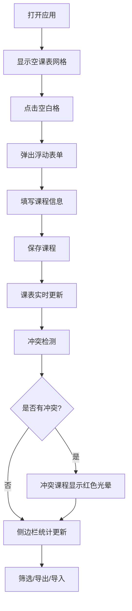

## 1. 产品概述

课表精灵是一款面向大学生和研究生的智能课表管理工具，帮助用户快速创建美观的周课表，自动分析课程冲突与负荷分布，并支持多格式导出。

- 核心价值：简化课表创建流程，提供智能冲突检测与数据分析，支持打印和壁纸导出
- 目标用户：大学生、研究生等有课程管理需求的群体

## 2. 核心功能

### 2.1 功能模块

1. **课表网格主界面**：7列（周一至周日）× 26行（08:00-21:00每30分钟一格）的课程网格
2. **课程管理**：新增、编辑、删除课程，支持周次（单周/双周/全周）设置
3. **冲突检测**：实时检测课程时间重叠，冲突课程显示红色警示光晕
4. **智能统计侧边栏**：课时统计、类型占比饼图、每日负荷高峰分析
5. **快速筛选器**：按日期（周一三五/周二四）和课程类型筛选
6. **文件导入**：支持iCal/CSV格式课表导入
7. **导出功能**：A4打印版导出、手机壁纸版导出

### 2.2 页面详情

| 页面名称 | 模块名称 | 功能描述 |
|-----------|-------------|---------------------|
| 主界面 | 顶部导航栏 | 毛玻璃效果，展示应用标题和导入按钮 |
| 主界面 | 课表网格 | 7列×26行时间网格，渲染课程卡片，点击空白格新增课程 |
| 主界面 | 课程卡片 | 圆角矩形，左侧彩色竖条，悬停上浮阴影效果，冲突时红色光晕 |
| 主界面 | 浮动表单 | 毛玻璃背景，新增/编辑课程信息 |
| 主界面 | 侧边栏 | 课时统计、Canvas饼图、每日负荷高峰、导出按钮 |
| 主界面 | 底部筛选器 | 周一三五/周二四/课程类型快速筛选开关 |
| 主界面 | 通知条 | 底部红色通知，导入失败提示带撤销按钮 |

## 3. 核心流程

### 3.1 主要用户流程

1. 用户打开应用 → 看到空课表网格
2. 点击空白时间格 → 弹出浮动表单 → 填写课程信息 → 保存
3. 课表实时更新 → 自动检测冲突 → 冲突课程显示警示
4. 侧边栏同步更新统计数据
5. 可使用底部筛选器过滤课程
6. 可导出打印版或壁纸版课表
7. 可导入iCal/CSV文件自动填充课表

### 3.2 流程图

## 4. 用户界面设计

### 4.1 设计风格

- **主色调**：浅米色背景 #F9F6F0
- **课程颜色**：专业必修 #5B86E5、通识选修 #A66CFF、体育 #FF8A5C、实验 #4ECDC4
- **分隔线**：淡灰色 #E8E3D9（2px）
- **导航栏**：半透明毛玻璃效果（backdrop-filter: blur(12px)）
- **按钮**：圆角12px，2px边框
- **动效**：framer-motion 0.2s ease-in-out过渡

### 4.2 页面设计概述

| 页面名称 | 模块名称 | UI元素 |
|-----------|-------------|-------------|
| 主界面 | 课表网格 | 7列布局，30分钟时间格，浅米色背景 |
| 主界面 | 课程卡片 | 圆角矩形，左侧4px彩色竖条，悬停上浮4px+12px阴影 |
| 主界面 | 浮动表单 | 毛玻璃背景，居中弹窗 |
| 主界面 | 侧边栏 | Canvas饼图带百分比标注，负荷时段橙色高亮 |
| 主界面 | 筛选器 | 底部一排开关，带0.3s退场动画 |
| 主界面 | 通知条 | 底部红色通知，带撤销按钮 |

### 4.3 响应式设计

- 桌面端优先设计
- 侧边栏在小屏幕可折叠
- 课程卡片自适应宽度
