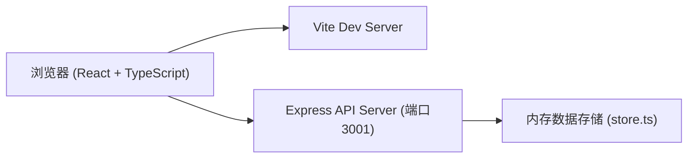
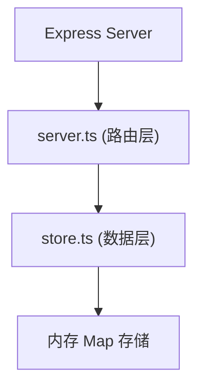
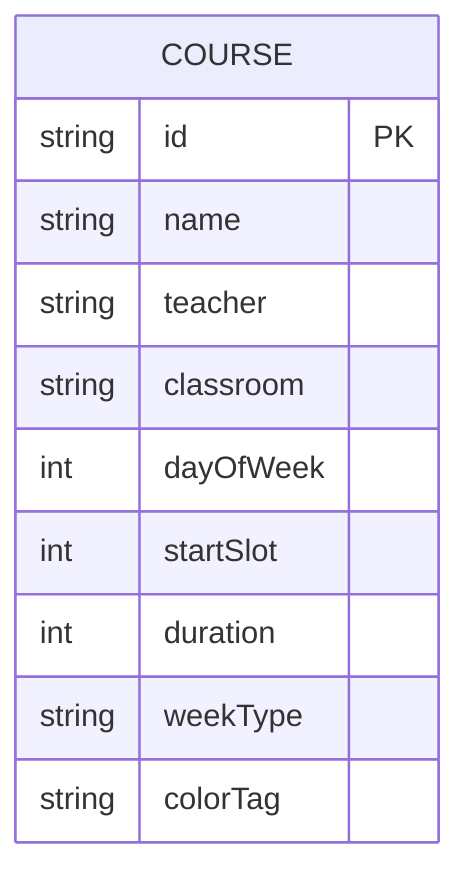

## 1. 架构设计



## 2. 技术栈描述

- **前端框架**：React 18 + TypeScript
- **构建工具**：Vite
- **状态管理**：Zustand
- **动画库**：framer-motion
- **图表绘制**：原生 Canvas API
- **导出功能**：html2canvas
- **后端**：Express 4
- **跨域**：cors
- **ID生成**：uuid

## 3. 项目文件结构

| 文件路径 | 用途 |
|----------|------|
| package.json | 项目依赖和脚本配置 |
| vite.config.js | Vite构建配置 |
| tsconfig.json | TypeScript严格模式配置 |
| index.html | 应用入口HTML |
| src/frontend/App.tsx | 主应用组件，状态管理与布局整合 |
| src/frontend/Grid.tsx | 课表网格组件，时间格渲染与冲突检测 |
| src/frontend/Sidebar.tsx | 侧边栏统计，饼图与导出功能 |
| src/frontend/CourseForm.tsx | 浮动课程表单组件 |
| src/backend/server.ts | Express服务，REST API接口 |
| src/backend/store.ts | 内存数据存储模块 |

## 4. API 定义

### 4.1 类型定义

```typescript
interface Course {
  id: string;
  name: string;
  teacher: string;
  classroom: string;
  dayOfWeek: number; // 0-6 (周一到周日)
  startSlot: number; // 0-25 (对应08:00-21:00的30分钟格)
  duration: number; // 持续的slot数量
  weekType: 'all' | 'odd' | 'even';
  colorTag: 'major' | 'elective' | 'pe' | 'lab';
}
```

### 4.2 接口定义

| 方法 | 路径 | 用途 | 请求体 | 响应 |
|------|------|------|--------|------|
| GET | /api/courses | 获取所有课程 | - | Course[] |
| POST | /api/courses | 新增课程 | Course (无id) | Course |
| PUT | /api/courses/:id | 更新课程 | Course | Course |
| DELETE | /api/courses/:id | 删除课程 | - | { success: boolean } |

## 5. 服务端架构



## 6. 数据模型

### 6.1 实体关系图



### 6.2 课程颜色映射

| colorTag | 颜色值 | 说明 |
|----------|--------|------|
| major | #5B86E5 | 专业必修 |
| elective | #A66CFF | 通识选修 |
| pe | #FF8A5C | 体育 |
| lab | #4ECDC4 | 实验 |

## 7. 性能要求

- 课表渲染：≤ 50ms
- 拖拽帧率：≥ 55fps
- 动画过渡：0.2s ease-in-out
- 筛选动画：0.3s退场
