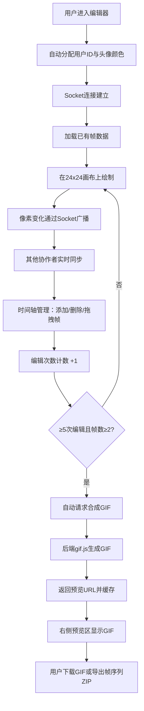

## 1. 产品概述

面向独立游戏开发者的在线协作式像素动画编辑器，支持多人协同绘制24x24像素精灵动画，自动合成GIF预览并支持导出，快速完成游戏开发大赛所需的角色与场景素材。

## 2. 核心功能

### 2.1 用户角色
| 角色 | 注册方式 | 核心权限 |
|------|----------|----------|
| 协作者 | 自动分配临时身份 | 编辑帧、添加/删除帧、合成GIF、下载导出 |

### 2.2 功能模块
1. **主编辑器页面**：像素画布、调色板、放大镜、在线用户列表、动画预览
2. **时间轴模块**：帧缩略图、添加/删除帧、拖拽排序、当前帧高亮
3. **GIF预览模块**：自动/手动合成GIF、下载GIF、导出帧序列ZIP
4. **实时协作模块**：帧锁定标记、用户头像、实时同步

### 2.3 页面详情
| 页面名称 | 模块名称 | 功能描述 |
|----------|----------|----------|
| 主编辑器 | 像素画布 | 24x24网格，点击/拖动涂色，右键擦除，放大镜显示 |
| 主编辑器 | 调色板 | 16色调色板（含透明色），圆角面板 |
| 主编辑器 | 用户列表 | 顶部圆形头像，随机饱和色，tooltip显示用户名 |
| 主编辑器 | 动画预览 | 画布右侧循环播放预览（160x160） |
| 时间轴 | 帧管理 | 底部120px高度，帧缩略图64x64，间距4px，拖拽虚线占位 |
| GIF预览 | 合成控制 | 自动（5次编辑）/手动合成，帧延迟100ms，无限循环 |
| GIF预览 | 下载导出 | 下载animation.gif，导出帧序列ZIP（内含每帧PNG） |

## 3. 核心流程

用户进入编辑器 → 自动分配临时身份与头像颜色 → 在24x24画布上绘制像素 → 完成当前帧后在时间轴添加新帧 → 多人可同时编辑不同帧（帧右下角显示协作者标记）→ 帧数≥2时每5次编辑自动合成GIF → 预览区显示GIF → 可下载GIF或导出帧序列ZIP。

## 4. 用户界面设计

### 4.1 设计风格
- 主色：深色主题背景#1E1E2E，画布区域#2D2D44
- 强调色：创建帧#6C5CE7，删除#FF6B6B，合成#00B894，拖拽占位#4FC3F7
- 按钮：圆角胶囊（半径20px），hover上移2px加深阴影
- 字体：白色文字，清晰可读
- 整体：游戏开发者工具风格，暗色系减少眼部疲劳，高对比像素渲染

### 4.2 页面设计概览
| 页面名称 | 模块名称 | UI元素 |
|----------|----------|--------|
| 主编辑器 | 顶部栏 | 在线用户圆形头像列表（32px直径，饱和随机色，tooltip） |
| 主编辑器 | 左侧调色板 | 圆角矩形（半径8px），16色格子，含透明色选项 |
| 主编辑器 | 中央画布 | 24x24网格，#2D2D44背景，放大镜悬浮角落2倍放大 |
| 主编辑器 | 右侧预览 | 160x160动画循环播放，1px浅灰边框，下载/导出按钮 |
| 主编辑器 | 底部时间轴 | 高120px，帧缩略图64x64，间距4px，当前帧#FF6B6B高亮边框 |

### 4.3 响应式
桌面优先设计：
- ≥768px：调色板竖排贴画布左侧，时间轴高120px
- <768px：调色板横排画布上方，时间轴高压缩至80px

## 5. 性能约束
- 画布每帧渲染延迟 < 16ms（60fps）
- GIF合成 ≤ 20帧时 5秒内完成
- Socket消息延迟控制在 < 100ms
