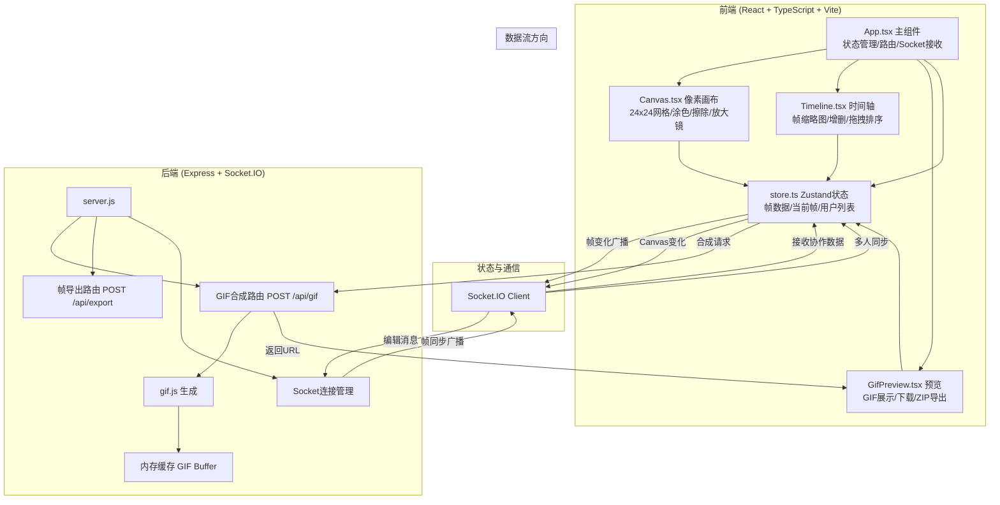
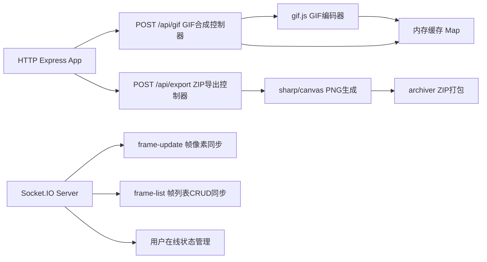

## 1. 架构设计



## 2. 技术描述
- 前端：React 18 + TypeScript + Vite 5 + Zustand 4 + Socket.IO Client 4
- 后端：Express 4 + Socket.IO 4 + gif.js 0.2 + cors 2
- 状态管理：Zustand（帧数据、当前帧、在线用户、编辑计数）
- 构建工具：Vite，代理/api到后端端口
- 像素渲染：Canvas 2D API
- ZIP导出：JSZip（浏览器端生成）

## 3. 路由定义
| 路由 | 用途 |
|------|------|
| / | 主编辑器页面（单页应用） |
| POST /api/gif | 接收帧数据，合成GIF，返回Base64或缓存URL |
| POST /api/export | 接收帧数据，返回ZIP下载流 |
| GET /api/gif/:id | 获取缓存的GIF |
| Socket: frame-update | 帧像素变化广播 |
| Socket: frame-list | 帧列表增删改同步 |
| Socket: user-join/leave | 在线用户同步 |
| Socket: frame-lock | 某帧被某用户编辑标记 |

## 4. API 定义

```typescript
// 共享类型
type PixelColor = string | null; // null表示透明
type FrameData = PixelColor[][]; // 24x24二维数组

interface Frame {
  id: string;
  data: FrameData;
  editorId?: string; // 当前编辑该帧的用户
}

interface User {
  id: string;
  name: string;
  color: string;
}

// Zustand Store
interface AppState {
  frames: Frame[];
  currentFrameId: string;
  currentColor: PixelColor;
  onlineUsers: User[];
  editCount: number;
  gifUrl: string | null;
  isPlaying: boolean;
  setFrames: (f: Frame[]) => void;
  setCurrentFrame: (id: string) => void;
  setCurrentColor: (c: PixelColor) => void;
  updatePixel: (x: number, y: number, color: PixelColor) => void;
  addFrame: () => void;
  removeFrame: (id: string) => void;
  reorderFrames: (from: number, to: number) => void;
  setGifUrl: (url: string | null) => void;
  incrementEditCount: () => void;
}

// GIF合成请求
interface GifRequest {
  frames: { data: FrameData }[];
  delay?: number; // 默认100ms
}

// GIF合成响应
interface GifResponse {
  success: boolean;
  url?: string; // /api/gif/:id
  base64?: string;
  error?: string;
}
```

## 5. 服务端架构



## 6. 文件结构与调用关系

```
auto253/
├── package.json          # 依赖与脚本
├── vite.config.js        # Vite配置 + API代理
├── tsconfig.json         # TS严格模式 + @/别名
├── index.html            # 入口HTML
├── server.js             # Express + Socket.IO后端
└── src/
    ├── main.tsx          # React入口
    ├── App.tsx           # 主组件（组合Canvas/Timeline/GifPreview，管理Socket，状态）
    ├── Canvas.tsx        # 像素画布（24x24网格、涂色、橡皮擦、放大镜；依赖App状态，emit Socket事件）
    ├── Timeline.tsx      # 时间轴（帧缩略图、增删、拖拽；触发GIF合成请求）
    ├── GifPreview.tsx    # GIF预览（显示、下载、导出ZIP；请求后端API）
    ├── store.ts          # Zustand全局状态（App/Canvas/Timeline/GifPreview共用）
    ├── socket.ts         # Socket.IO客户端封装（App调用，向Canvas/Timeline推送协作数据）
    ├── types.ts          # 共享TypeScript类型
    ├── utils/
    │   ├── palette.ts    # 16色调色板常量
    │   ├── frame.ts      # 帧数据工具（新建空帧、canvas渲染、缩略图生成）
    │   └── zip.ts        # ZIP打包工具（GifPreview调用）
    └── styles.css        # 全局样式
```

**数据流向说明**：
1. 用户操作Canvas → 调用store.updatePixel → Zustand状态更新 → Socket广播frame-update → 其他用户store更新
2. Timeline添加/删除/重排帧 → store方法 → Socket广播frame-list → 全局同步 → editCount递增 → 达到5次且帧≥2 → GifPreview触发POST /api/gif
3. 后端接收帧数据 → gif.js合成GIF → 内存缓存 → 返回URL → store.setGifUrl → GifPreview显示
4. GifPreview下载 → 直接fetch URL保存；导出ZIP → JSZip在浏览器生成每帧PNG并打包下载
