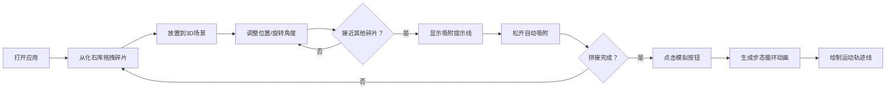

## 1. 产品概述

古生物化石骨骼三维拼合与运动轨迹模拟器，让用户通过拖拽拼接化石碎片还原完整古生物骨架，并自动生成运动动画模拟。

- 核心价值：将古生物学研究可视化，提供沉浸式的化石拼接体验，结合科学的运动模拟
- 目标用户：古生物爱好者、学生、科普教育工作者
- 市场定位：交互式科普教育工具，兼具专业性与趣味性

## 2. 核心功能

### 2.1 Feature Module

1. **3D场景交互**：化石碎片的拖拽、旋转、缩放、平移操作
2. **智能吸附系统**：实时检测碎片间的距离和角度，自动吸附对齐
3. **化石库面板**：左侧可拖拽的化石碎片列表
4. **碎片微调控制**：三按钮旋转控制（X/Y/Z轴）、位置微调
5. **编组系统**：支持碎片选中、编组操作
6. **运动模拟**：拼接完成后生成步态循环动画和运动轨迹线
7. **实时反馈区**：显示选中碎片的名称、位置、旋转角度信息

### 2.2 Page Details

| 页面名称 | 模块名称 | 功能描述 |
|---------|---------|---------|
| 主页面 | 3D场景 | 化石碎片的摆放、拼接、吸附，相机交互控制 |
| 主页面 | 左侧化石库 | 展示可用化石碎片，支持拖拽到场景 |
| 主页面 | 底部控制栏 | 碎片旋转/位置微调按钮、编组操作 |
| 主页面 | 左下角反馈区 | 实时显示选中碎片的状态信息 |
| 主页面 | 右下角模拟按钮 | 触发运动动画模拟 |

## 3. 核心流程

用户从左侧化石库拖拽化石碎片到3D场景中，通过鼠标交互和微调按钮调整碎片位置和角度，当两个碎片接近时系统自动提示吸附可能性，用户松开后自动吸附对齐。所有碎片拼接完成后，点击模拟按钮，系统自动生成古生物的步态循环动画，并绘制半透明运动轨迹线。

## 4. 用户界面设计

### 4.1 Design Style

- **主色调**：浅沙色（#F5E6C8）背景、灰色（#B0B0B0）化石、金色（#FFD700）高亮
- **强调色**：淡青色（#00FFFF）吸附提示、浅蓝色（#87CEEB）轨迹线
- **整体风格**：科学严谨的博物馆风格，简洁专业，突出3D场景
- **字体**：使用无衬线字体，标题加粗，正文清晰可读
- **按钮**：圆角矩形按钮，悬停有阴影和缩放效果，点击有反馈动画

### 4.2 Page Design Overview

| 页面名称 | 模块名称 | UI Elements |
|---------|---------|-------------|
| 主页面 | 3D场景 | 浅沙色地面、1px浅灰网格、柔和光照、45度俯视相机 |
| 主页面 | 左侧化石库 | 半透明深色侧边栏，化石卡片带拖拽效果，悬停高亮 |
| 主页面 | 底部控制栏 | 三列旋转按钮（X/Y/Z）、位置微调按钮（±0.1）、编组按钮 |
| 主页面 | 反馈区 | 左下角半透明面板，显示碎片名称、坐标、欧拉角 |
| 主页面 | 模拟按钮 | 右下角醒目的橙色按钮，带脉冲动画 |

### 4.3 3D Scene Guidance

- **环境**：浅沙色（#F5E6C8）地面平面，1px间距的浅灰色网格线
- **光照**：柔和的环境光 + 方向光，模拟室内博物馆光照，避免强烈阴影
- **相机**：初始位置45度俯视，PerspectiveCamera，fov=60
- **相机控制**：左键旋转、滚轮缩放、右键平移
- **材质**：化石使用低多边形灰色（#B0B0B0）MeshStandardMaterial
- **选中效果**：金色（#FFD700）2px边框高亮，使用EdgesGeometry实现
- **吸附提示**：淡青色（#00FFFF）2px宽Line连接两个碎片中心
- **轨迹线**：半透明浅蓝色（#87CEEB）TubeGeometry，透明度从0.8衰减到0.1
- **后处理**：轻微抗锯齿，保持画面清晰流畅

### 4.4 Animation

- **页面加载**：场景淡入，化石库从左侧滑入，按钮依次出现
- **拖拽反馈**：拖拽时光标变化，碎片半透明跟随鼠标
- **吸附抖动**：满足吸附条件时，碎片轻微抖动（±0.5单位）
- **按钮交互**：悬停缩放1.05倍，点击缩放0.95倍
- **轨迹淡出**：轨迹线生成后3秒内透明度从0.8衰减到0.1
- **步态循环**：基于关节角度变化的正弦函数动画，循环播放

## 5. 性能要求

- 操作帧率 ≥ 50fps
- 吸附计算延迟 ≤ 30ms
- 最大同时显示碎片数 ≥ 20个
- 轨迹线点数 ≥ 100个时仍保持流畅
