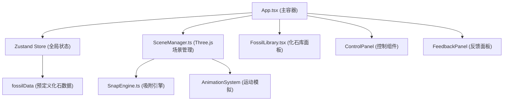

## 1. 架构设计



## 2. 技术描述

- **前端框架**：React 18 + TypeScript 5
- **构建工具**：Vite 5
- **3D引擎**：Three.js 0.160
- **状态管理**：Zustand 4
- **动画库**：Framer Motion 11
- **类型定义**：@types/three, @types/react, @types/react-dom

## 3. 核心模块设计

### 3.1 类型定义 (types.ts)

```typescript
interface FossilFragment {
  id: string;
  name: string;
  geometryType: 'box' | 'cylinder' | 'sphere' | 'cone' | 'custom';
  dimensions: { x: number; y: number; z: number };
  position: { x: number; y: number; z: number };
  rotation: { x: number; y: number; z: number };
  snapPoints: Array<{ x: number; y: number; z: number }>;
  connectedTo?: string;
  groupId?: string;
}

interface BoneGroup {
  id: string;
  name: string;
  fragmentIds: string[];
}

interface SnapInfo {
  fragmentIdA: string;
  fragmentIdB: string;
  distance: number;
  angleDiff: number;
  snapPointA: { x: number; y: number; z: number };
  snapPointB: { x: number; y: number; z: number };
}
```

### 3.2 SceneManager 职责

- 初始化 Three.js 场景、相机、灯光、渲染器
- 创建地面网格（浅沙色 #F5E6C8，1px 浅灰网格线）
- 设置相机初始位置（45度俯视）和控制器
- 提供 addFragment、removeFragment、highlightFragment 方法
- 管理渲染循环，保持 50+ fps
- 处理拖拽放置逻辑

### 3.3 SnapEngine 职责

- 每帧检测所有碎片间的接触面距离
- 计算欧拉角差异（阈值 20 度）
- 当距离 < 2 单位且角度差 < 20 度时返回 SnapInfo
- 触发吸附动画和抖动反馈
- 性能优化：空间分区、增量检测，确保延迟 < 30ms

### 3.4 FossilLibrary 职责

- 从预定义 fossilData 数组渲染化石列表
- 支持 HTML5 Drag and Drop 拖拽行为
- onDragStart 回调传递碎片 ID 给 SceneManager
- 卡片悬停效果和拖拽视觉反馈

### 3.5 AnimationSystem 职责

- 预设关节角度变化的步态循环动画
- 基于正弦函数的平滑运动插值
- 生成半透明浅蓝色（#87CEEB）运动轨迹
- 轨迹透明度衰减（0.8 → 0.1，3秒）
- 轨迹线随骨架移动逐渐延伸

## 4. 状态管理 (Zustand Store)

```typescript
interface AppState {
  fragments: FossilFragment[];
  groups: BoneGroup[];
  selectedFragmentId: string | null;
  selectedGroupId: string | null;
  isSimulating: boolean;
  snapInfo: SnapInfo | null;
  addFragment: (fragment: FossilFragment) => void;
  updateFragment: (id: string, updates: Partial<FossilFragment>) => void;
  removeFragment: (id: string) => void;
  selectFragment: (id: string | null) => void;
  createGroup: (name: string, fragmentIds: string[]) => void;
  setSimulating: (value: boolean) => void;
  setSnapInfo: (info: SnapInfo | null) => void;
}
```

## 5. 目录结构

```
├── index.html
├── package.json
├── tsconfig.json
├── vite.config.js
└── src/
    ├── App.tsx          # 主容器组件
    ├── types.ts         # 类型定义
    ├── SceneManager.ts  # Three.js 场景管理
    ├── SnapEngine.ts    # 吸附检测引擎
    ├── FossilLibrary.tsx # 左侧化石库面板
    ├── styles.css       # 全局样式
    └── store/
        └── useStore.ts  # Zustand 状态管理
```

## 6. 关键技术点

### 6.1 拖拽实现

- HTML5 Drag and Drop 用于从面板拖拽到场景
- Three.js Raycaster 用于 3D 空间中的点击检测
- 鼠标位置到 3D 空间的坐标转换（使用 Plane 交点）

### 6.2 吸附算法

```
1. 遍历所有碎片对 (O(n²)，n≤20 可接受)
2. 计算碎片中心点距离
3. 若距离 < 阈值，计算吸附点对的距离
4. 计算欧拉角差异（四元数差值转换为角度）
5. 若满足条件，创建吸附提示线
6. 拖拽结束时，平滑插值到目标位置和角度
```

### 6.3 性能优化

- 使用 InstancedMesh 渲染多个相同几何体
- 吸附计算限制在 requestAnimationFrame 中，每帧最多一次
- 轨迹线使用 BufferGeometry，动态更新顶点
- 远离相机的对象降低细节层次

## 7. 预定义化石数据

```typescript
const fossilData = [
  {
    id: 'skull',
    name: '恐龙头骨',
    geometryType: 'sphere',
    dimensions: { x: 2, y: 1.8, z: 2.5 },
    snapPoints: [{ x: 0, y: -1, z: 1 }]
  },
  {
    id: 'neck1',
    name: '颈椎第一节',
    geometryType: 'cylinder',
    dimensions: { x: 0.8, y: 1.2, z: 0.8 },
    snapPoints: [{ x: 0, y: 0.6, z: 0 }, { x: 0, y: -0.6, z: 0 }]
  },
  // ... 更多化石碎片
];
```
