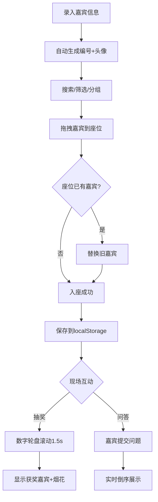

## 1. 产品概述
面向小型活动策划团队的在线嘉宾管理与现场互动应用，解决宴会/论坛中手动排座效率低、易出错，以及现场抽奖与问答缺乏数字化互动工具的问题。目标用户为活动策划人员，核心价值在于可视化拖拽排座与沉浸式现场互动体验。

## 2. 核心功能

### 2.1 用户角色
| 角色 | 注册方式 | 核心权限 |
|------|----------|----------|
| 策划人员 | 无需注册，直接使用 | 管理嘉宾、分配座位、操控抽奖与问答墙 |
| 嘉宾（隐式） | 无需注册 | 通过页面提交问答 |

### 2.2 功能模块
1. **主页面**：嘉宾列表（左面板）、可视化座次表（右面板）、互动控制栏（底部）
2. **抽奖模态窗**：数字轮盘滚动动画 + 粒子烟花效果
3. **问答墙**：实时问题提交与倒序展示

### 2.3 页面详情
| 页面名称 | 模块名称 | 功能描述 |
|----------|----------|----------|
| 主页面 | 嘉宾信息管理 | 录入嘉宾（姓名/公司/职位/电话），自动生成四位数字+一位校验码编号；按公司/VIP等级分组筛选；圆形头像（40px首字母+预设色板）；搜索框模糊搜索（防抖300ms）；分页显示（每页20条） |
| 主页面 | 可视化拖拽座次表 | 12×8网格座位卡片（80×80px圆角矩形）；从嘉宾列表拖拽入座；VIP等级背景色区分（普通#ECF0F1、银牌#FDEBD0、金牌#FAD25C）；邻座虚线连接；右键清空座位 |
| 主页面 | 互动控制工具栏 | 固定底部，包含"开始抽奖"和"开启问答墙"两个按钮 |
| 抽奖模态窗 | 数字轮盘 | 半透明全屏遮罩；数字滚动（快→慢，1.5秒）；停止后金色大字显示嘉宾信息（48px，#F1C40F）；50个金色粒子烟花（0.8秒扩散） |
| 问答墙 | 问答提交与展示 | 输入框提交问题（最大200字）；按时间倒序排列；自动滚动 |

## 3. 核心流程

嘉宾管理流程：录入嘉宾信息 → 自动生成编号与头像 → 搜索/筛选/分组浏览 → 拖拽分配座位 → 座位可替换或清空

现场互动流程：点击"开始抽奖" → 全屏遮罩 + 数字轮盘滚动 → 停止显示获奖嘉宾 → 粒子烟花效果；点击"开启问答墙" → 嘉宾提交问题 → 实时倒序展示

## 4. 用户界面设计

### 4.1 设计风格
- 主色调：深蓝灰（#2C3E50）+ 白色（#FFFFFF）
- 按钮/卡片：圆角设计（border-radius: 8px）
- 悬停效果：上移3px + 阴影加深（ease-out 0.2s）
- 搜索框聚焦：outline 3px #3498DB 光晕
- 互动工具栏背景：#1A252F
- 抽奖轮盘：深色渐变（#0F171E → #1A252F）+ 金色粗体数字
- 座位连接线：浅灰色#E0E0E0，1px虚线

### 4.2 页面设计概览
| 页面名称 | 模块名称 | UI元素 |
|----------|----------|--------|
| 主页面 | 嘉宾列表（左面板30%） | 搜索框+分组筛选+列表行（编号/姓名/公司/圆形头像）+分页按钮 |
| 主页面 | 座次表（右面板70%） | 12×8网格+虚线连接+VIP色卡片+1px #34495E分隔条 |
| 主页面 | 互动控制栏（固定底部） | 深色背景+两个功能按钮 |
| 抽奖模态窗 | 数字轮盘 | 半透明遮罩+深色渐变轮盘+金色数字+粒子烟花 |
| 问答墙 | 问答列表 | 问题卡片倒序+底部输入框 |

### 4.3 响应式设计
- 桌面优先（≥1280px正常显示）
- 1024px以下：嘉宾列表收窄为可展开侧边栏（左边缘悬浮图标）
- 列表渲染>100条时分页（每页20条，#3498DB边框分页按钮）

### 4.4 性能要求
- 抽奖轮盘动画稳定60fps
- 搜索防抖300ms
- 粒子效果50个粒子，0.8秒持续时间
