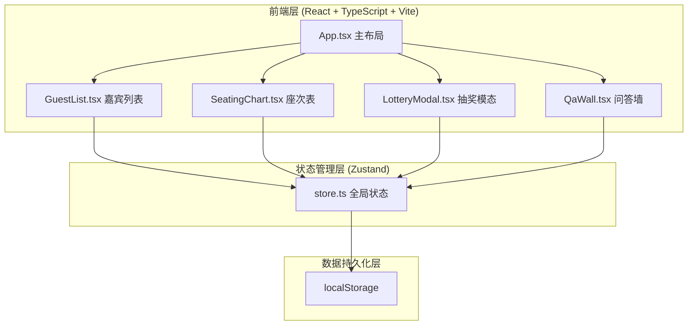
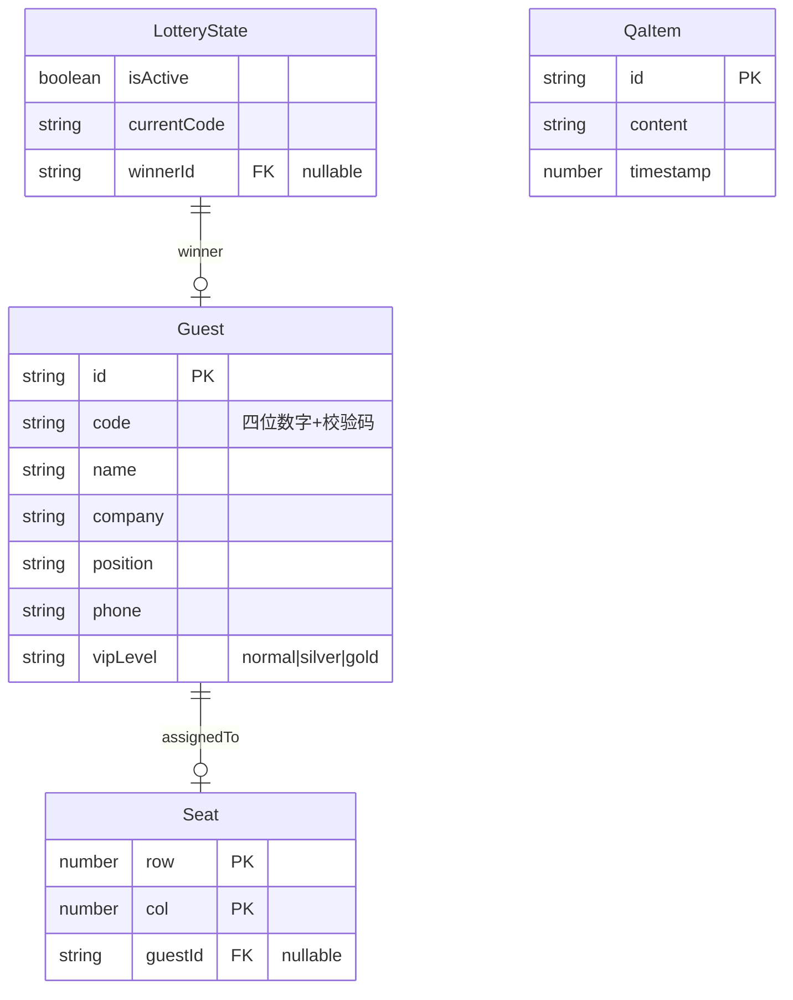

## 1. 架构设计



## 2. 技术说明
- 前端框架：React 18 + TypeScript（严格模式）
- 构建工具：Vite + @vitejs/plugin-react
- 状态管理：Zustand
- 动画库：Framer Motion（拖拽排序、过渡动画、粒子效果）
- 数据持久化：localStorage（页面刷新自动恢复）
- 无后端服务，纯前端应用

## 3. 路由定义
| 路由 | 用途 |
|------|------|
| / | 主页面（嘉宾列表+座次表+互动控制栏） |

单页面应用，无路由切换，所有功能在同一页面内完成。

## 4. API定义
无后端API，所有数据操作通过Zustand store + localStorage完成。

## 5. 数据模型

### 5.1 数据模型定义



### 5.2 文件结构
```
├── package.json
├── vite.config.js
├── tsconfig.json
├── index.html
└── src/
    ├── types.ts        # Guest, Seat, LotteryState, QaItem 类型定义
    ├── store.ts        # Zustand store：嘉宾、座次、抽奖、问答状态与操作
    ├── App.tsx         # 主布局（左面板+右面板+底部工具栏）
    └── components/
        ├── GuestList.tsx      # 嘉宾列表、搜索、分组、拖拽源
        ├── SeatingChart.tsx   # 12×8座次网格、拖拽放置、右键清空
        ├── LotteryModal.tsx   # 数字轮盘动画+粒子烟花
        └── QaWall.tsx         # 问答墙、提交问题、倒序展示
```
