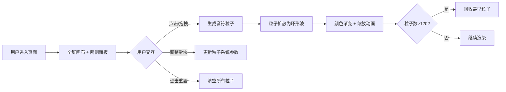

## 1. 产品概述
微型音波足迹与情绪调色盘是一款基于声音可视化与情绪表达的交互艺术应用。用户通过在画布上点击或拖拽，产生音符粒子与扩散声波，颜色在暖色系与冷色系之间渐变，直观呈现情绪流动。
- 目标用户：艺术爱好者、创意工作者、普通用户用于放松和情绪表达
- 产品价值：提供沉浸式的音波视觉体验，让用户通过简单交互创作情绪化的视觉艺术

## 2. 核心特性

### 2.1 用户角色
无需用户角色区分，所有用户可直接使用全部功能。

### 2.2 功能模块
1. **画布交互区**：全屏Canvas画布，支持点击和拖拽生成粒子
2. **左侧控制面板**：三个滑块分别控制粒子生成频率、声波扩散速度、渐变周期
3. **右侧统计面板**：显示当前激活粒子数量，提供重置按钮
4. **粒子系统**：管理粒子创建、更新、渲染、回收的核心逻辑

### 2.3 页面详情
| 页面名称 | 模块名称 | 功能描述 |
|-----------|-------------|---------------------|
| 主页 | 画布交互区 | 纯黑背景全屏画布，点击/拖拽生成12px初始粒子，粒子扩散为环形波（环宽6px），透明度从0.8线性递减至0，颜色按渐变周期平滑过渡，缩放动画1秒循环 |
| 主页 | 左侧控制面板 | 半透明磨砂玻璃面板（240px宽），三个滑块：生成频率（0.5-5秒/个）、扩散速度（0.1-2倍速）、渐变周期（2-10秒） |
| 主页 | 右侧统计面板 | 半透明磨砂玻璃面板（160px宽），显示粒子数量，重置按钮（白底黑字，悬停变灰） |

## 3. 核心流程
用户进入页面，看到全屏纯黑画布和两侧悬浮面板。用户点击或拖动画布，在鼠标位置生成音符粒子，粒子以环形波形式向外扩散，颜色在暖色系（#FF6B6B到#FFD93D）与冷色系（#6BCB77到#4D96FF）之间渐变。用户可通过左侧滑块调整参数，右侧面板实时显示粒子数量，点击重置可清空所有粒子。当粒子数量超过120个时，自动回收最早生成的粒子以保证性能。

## 4. 用户界面设计

### 4.1 设计风格
- **主色调**：纯黑背景 #0A0A0A，营造沉浸式深色氛围
- **暖色系**：#FF6B6B → #FFD93D（红色到黄色，代表温暖、兴奋情绪）
- **冷色系**：#6BCB77 → #4D96FF（绿色到蓝色，代表平静、冷静情绪）
- **面板**：半透明磨砂玻璃效果 rgba(255,255,255,0.08)，圆角12px
- **按钮**：白底 #FFFFFF，黑字 #0A0A0A，圆角8px，悬停变 #F0F0F0
- **文字**：#E0E0E0，14px，字重400
- **滑块**：轨道高4px圆角2px颜色#333，手柄直径14px颜色#888悬停变#FFF
- **字体**：使用现代无衬线字体，保证可读性与艺术感
- **布局**：全屏画布作主视觉，两侧面板悬浮（z-index:10），左侧距左24px、顶部垂直居中，右侧距右24px、顶部垂直居中
- **视觉焦点**：粒子与声波扩散效果为核心视觉元素，面板简洁不喧宾夺主

### 4.2 页面设计概述
| 页面名称 | 模块名称 | UI元素 |
|-----------|-------------|-------------|
| 主页 | 画布交互区 | 全屏Canvas，纯黑背景，居中显示，z-index:1 |
| 主页 | 左侧控制面板 | 240px宽，半透明磨砂玻璃，圆角12px，控件间距16px，三个滑块带标签和数值显示 |
| 主页 | 右侧统计面板 | 160px宽，半透明磨砂玻璃，圆角12px，粒子数数字显示，重置按钮带悬停效果 |

### 4.3 响应式
桌面端优先设计，面板固定在两侧。屏幕宽度较小时，面板可调整为顶部堆叠布局，但以桌面全屏体验为主。拖拽和点击事件同时支持鼠标和触摸操作。

### 4.4 性能优化
- 粒子数量上限120个，超出自动回收最早粒子
- 使用Canvas API直接绘制，避免DOM操作开销
- 采用 requestAnimationFrame 实现60fps流畅动画
- 合理的粒子生命周期管理，及时回收过期粒子
