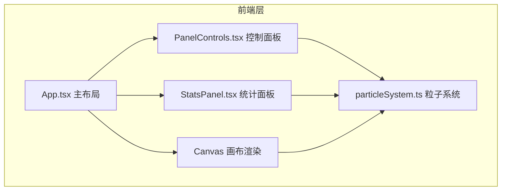

## 1. 架构设计



## 2. 技术说明
- **前端框架**：React 18 + TypeScript（严格模式）
- **构建工具**：Vite 5.x + @vitejs/plugin-react
- **渲染引擎**：Canvas 2D API
- **状态管理**：React useState/useRef（轻量场景无需额外状态库）
- **初始化方式**：使用 vite-init 脚手架创建 React + TypeScript 模板

## 3. 路由定义
| 路由 | 用途 |
|-------|---------|
| / | 主页面，包含画布和两侧控制面板 |

## 4. API定义
本项目为纯前端应用，无后端API。

### 核心类型定义
```typescript
interface Particle {
  id: number;
  x: number;
  y: number;
  radius: number;
  maxRadius: number;
  color: { r: number; g: number; b: number };
  startColor: { r: number; g: number; b: number };
  endColor: { r: number; g: number; b: number };
  alpha: number;
  createdAt: number;
  scale: number;
  scalePhase: number;
  gradientProgress: number;
}

interface ParticleSystemConfig {
  spawnInterval: number;      // 0.5-5 秒
  diffusionSpeed: number;     // 0.1-2 倍速
  gradientPeriod: number;     // 2-10 秒
}

interface ParticleSystem {
  particles: Particle[];
  config: ParticleSystemConfig;
  spawn(x: number, y: number): void;
  update(deltaTime: number): void;
  render(ctx: CanvasRenderingContext2D): void;
  reset(): void;
  getCount(): number;
  setConfig(config: Partial<ParticleSystemConfig>): void;
}
```

## 5. 项目文件结构
```
.
├── package.json
├── vite.config.js
├── tsconfig.json
├── index.html
└── src/
    ├── App.tsx              # 主布局组件
    ├── particleSystem.ts    # 粒子系统核心逻辑
    ├── PanelControls.tsx    # 左侧控制面板
    └── StatsPanel.tsx       # 右侧统计面板
```

## 6. 核心模块说明

### 6.1 particleSystem.ts - 粒子系统
- **Particle类/接口**：存储单个粒子的位置、颜色、生命周期等状态
- **ParticleSystem类**：
  - `spawn(x, y)`: 在指定位置生成新粒子，初始直径12px，颜色取冷暖色系中间值随机
  - `update(deltaTime)`: 更新所有粒子状态（扩散半径、颜色渐变、缩放动画、透明度衰减）
  - `render(ctx)`: 使用Canvas绘制所有粒子（环形波：环宽6px，透明度线性递减）
  - `reset()`: 清空所有粒子
  - `getCount()`: 返回当前粒子数量
  - 性能保护：粒子数>120时自动回收最早粒子

### 6.2 App.tsx - 主组件
- Canvas全屏布局，背景色 #0A0A0A
- 两侧悬浮面板（z-index: 10）
- 处理鼠标/触摸的点击和拖拽事件
- 拖拽生成最小间隔0.15秒
- 使用 requestAnimationFrame 驱动渲染循环

### 6.3 PanelControls.tsx - 控制面板
- 三个受控滑块组件
- 滑块变化通过回调通知 App 再更新粒子系统参数
- 显示当前滑块数值

### 6.4 StatsPanel.tsx - 统计面板
- 显示当前激活粒子数量
- 重置按钮，点击触发粒子系统清空

## 7. 颜色渐变算法
```
暖色系范围：#FF6B6B (255,107,107) → #FFD93D (255,217,61)
冷色系范围：#6BCB77 (107,203,119) → #4D96FF (77,150,255)

每个粒子随机选择起始色系（暖/冷），在渐变周期内平滑过渡到另一色系极值。
颜色插值使用 RGB 线性插值。
```
