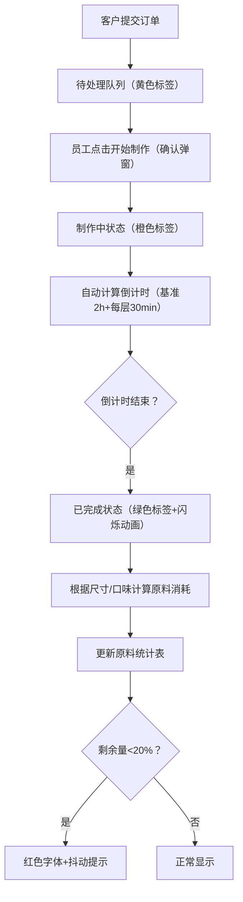

## 1. 产品概述

本产品为小型烘焙工作室定制的蛋糕订单管理与原料消耗预测系统，旨在解决手工记录订单易出错、原料备货依赖经验导致浪费或短缺的问题。通过数字化流程管理，实现订单从提交到完成的全流程跟踪，并基于订单数据自动计算原料消耗，提供库存预警功能。

- **核心目标用户**：烘焙工作室员工及客户
- **核心价值**：提升订单管理效率，降低原料损耗，优化库存管理

## 2. 核心功能

### 2.1 用户角色

| 角色 | 使用方式 | 核心权限 |
|------|----------|----------|
| 客户 | 在线提交订单 | 填写蛋糕定制表单、查看订单状态 |
| 工作室员工 | 管理订单后台 | 切换订单状态、查看原料库存、处理订单制作 |

### 2.2 功能模块

1. **订单提交模块**：客户在线填写蛋糕定制表单
2. **订单列表模块**：展示所有订单卡片，支持状态筛选和倒序排列
3. **订单状态管理模块**：员工切换订单状态，自动计算制作倒计时
4. **原料统计模块**：实时展示原料消耗量与剩余量，低库存预警

### 2.3 页面详情

| 页面名称 | 模块名称 | 功能描述 |
|----------|----------|----------|
| 主界面 | 订单表单 | 客户选择蛋糕尺寸（6/8/10/12英寸）、层数（1-3层）、口味（原味/巧克力/抹茶/红丝绒/芒果）、填写装饰备注（≤100字），提交订单 |
| 主界面 | 订单列表 | 卡片按提交时间倒序排列，卡片左上角颜色标签区分状态（待处理黄色、制作中橙色、已完成绿色），卡片展开带0.3s高度和透明度过渡动画 |
| 主界面 | 订单操作 | 点击订单可切换状态（待处理→制作中需确认弹窗），制作中显示倒计时（HH:MM:SS，每秒更新），基准时间2小时，每增加一层加30分钟，倒计时归零自动变已完成并播放绿色闪烁动画 |
| 主界面 | 原料统计面板 | 表格展示原料名、已消耗量、剩余量，剩余量从初始库存自动扣减，低于初始库存20%时行字体变红并每2秒轻微抖动 |

## 3. 核心流程

客户填写蛋糕定制表单并提交 → 订单进入待处理队列，按时间倒序显示 → 员工点击订单确认开始制作 → 系统自动计算预计完成时间并显示倒计时 → 倒计时结束订单自动变为已完成 → 系统根据订单尺寸和口味计算并累加原料消耗 → 原料库存实时更新，低库存时红色抖动提示

## 4. 用户界面设计

### 4.1 设计风格

- **主背景色**：奶油白 `#FFF8F0`
- **主色调**：暖橙色 `#E8913A`
- **辅助色**：浅紫色 `#F0E6FF`（状态标签点缀）
- **状态色**：待处理黄色、制作中橙色、已完成绿色
- **卡片风格**：柔和圆角 12px，手绘感纹理叠加
- **字体**：手绘感字体，区分标题和正文字体
- **交互**：卡片悬停向上浮动6px并加深阴影（0.3s ease-out）

### 4.2 页面设计概述

| 页面名称 | 模块名称 | UI 元素 |
|----------|----------|----------|
| 主界面 | 订单表单 | 下拉选择框、数字输入、文本域、提交按钮、暖橙色主色调、手绘圆角 |
| 主界面 | 订单卡片 | 颜色标签（左上）、蛋糕规格信息、装饰备注、状态按钮、倒计时显示、展开/收起动画（0.3s高度+透明度） |
| 主界面 | 原料统计面板 | 表格布局、原料名称、已消耗量、剩余量、低库存红色抖动（每2秒） |

### 4.3 响应式设计

- **桌面端**：左右两栏布局，左栏订单列表占60%，右栏原料统计占40%
- **移动端（≤768px）**：自动堆叠为上下布局，订单列表在上，原料统计在下
- **触摸优化**：按钮最小高度44px，触摸区域充足

### 4.4 动画与交互细节

- **卡片展开**：0.3s 高度 + 透明度过渡
- **卡片悬停**：向上浮动 6px，阴影加深，0.3s ease-out
- **订单完成**：短暂绿色闪烁动画
- **低库存提示**：字体变红，每 2 秒轻微抖动
- **倒计时**：每秒更新，格式 HH:MM:SS
