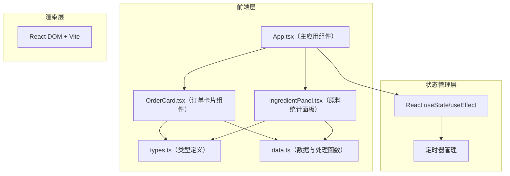
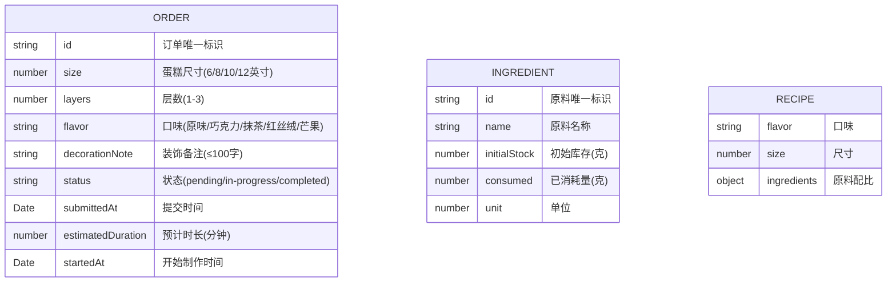

## 1. 架构设计



## 2. 技术描述

- **前端框架**：React 18 + TypeScript 5
- **构建工具**：Vite 5
- **状态管理**：React 内置 useState/useEffect（轻量级场景，无需额外状态管理库）
- **样式方案**：CSS Modules + CSS 变量（遵循用户指定的色彩体系）
- **动画实现**：CSS transitions + keyframes 动画
- **数据持久化**：内存存储（演示版本，可扩展至 localStorage）

### 依赖列表
- react
- react-dom
- vite
- @vitejs/plugin-react
- typescript
- @types/react
- @types/react-dom

## 3. 文件结构

| 文件路径 | 职责描述 |
|----------|----------|
| `package.json` | 项目依赖与脚本配置（npm run dev 启动） |
| `vite.config.ts` | Vite 构建配置，React 插件启用 |
| `tsconfig.json` | TypeScript 严格模式配置 |
| `index.html` | 应用入口页面 |
| `src/main.tsx` | 应用入口，渲染根组件 |
| `src/types.ts` | 定义 Order 和 Ingredient TypeScript 接口 |
| `src/data.ts` | 初始订单数据、原料库存数据、数据处理函数 |
| `src/components/OrderCard.tsx` | 订单卡片组件，渲染单条订单、状态标签、操作按钮 |
| `src/components/IngredientPanel.tsx` | 原料统计面板，表格展示消耗与剩余量 |
| `src/App.tsx` | 主应用组件，组合左右两栏，管理全局状态流转 |

## 4. 数据模型

### 4.1 数据模型定义



### 4.2 核心接口定义

```typescript
// src/types.ts
type OrderStatus = 'pending' | 'in-progress' | 'completed';

interface Order {
  id: string;
  size: number;      // 6, 8, 10, 12
  layers: number;    // 1-3
  flavor: '原味' | '巧克力' | '抹茶' | '红丝绒' | '芒果';
  decorationNote: string;
  status: OrderStatus;
  submittedAt: Date;
  startedAt?: Date;
  estimatedDuration?: number; // 分钟
}

interface Ingredient {
  id: string;
  name: '面粉' | '糖' | '黄油' | '鸡蛋' | '奶油' | '可可粉' | '抹茶粉' | '芒果果泥';
  initialStock: number;
  consumed: number;
  unit: 'g' | '个';
}

interface Recipe {
  [flavor: string]: {
    [size: number]: {
      [ingredient: string]: number;
    };
  };
}
```

## 5. 核心算法

### 5.1 制作时间计算

```
基准时间 = 120分钟（2小时）
每层额外时间 = 30分钟
总预计时间 = 基准时间 + (层数 - 1) × 每层额外时间
```

### 5.2 倒计时更新

- 使用 `setInterval` 每秒更新一次
- 误差控制：通过 `Date.now()` 计算实际 elapsed 时间，避免定时器漂移
- 倒计时格式：`HH:MM:SS`

### 5.3 原料消耗计算

根据口味和尺寸查找配方表，累加对应原料的消耗量：

```typescript
// 每6寸蛋糕基础配方（单位：克）
const baseRecipe = {
  '面粉': 150,
  '糖': 100,
  '黄油': 80,
  '鸡蛋': 4,  // 个
  '奶油': 200,
  '可可粉': 0,
  '抹茶粉': 0,
  '芒果果泥': 0,
};

// 尺寸系数：每增加2寸，用量 × 1.5
const sizeMultiplier = {
  6: 1,
  8: 1.5,
  10: 2.25,
  12: 3.375,
};

// 口味调整
const flavorAdjustments = {
  '巧克力': { '可可粉': 30, '面粉': -20 },
  '抹茶': { '抹茶粉': 15, '面粉': -10 },
  '芒果': { '芒果果泥': 100, '奶油': -50 },
  '红丝绒': { '可可粉': 10, '面粉': -10 },
  '原味': {},
};
```

### 5.4 低库存检测

```
剩余量 = 初始库存 - 已消耗量
if (剩余量 < 初始库存 × 0.2) → 红色字体 + 抖动提示
```

## 6. 性能指标

| 指标 | 目标值 | 实现方案 |
|------|--------|----------|
| 订单列表渲染延迟 | ≤ 200ms | React 列表渲染优化，避免不必要重渲染 |
| 倒计时更新误差 | ≤ 100ms | 基于 Date.now() 计算剩余时间，而非纯定时器累加 |
| 动画流畅度 | 60fps | CSS 硬件加速动画，避免 JS 动画阻塞主线程 |
